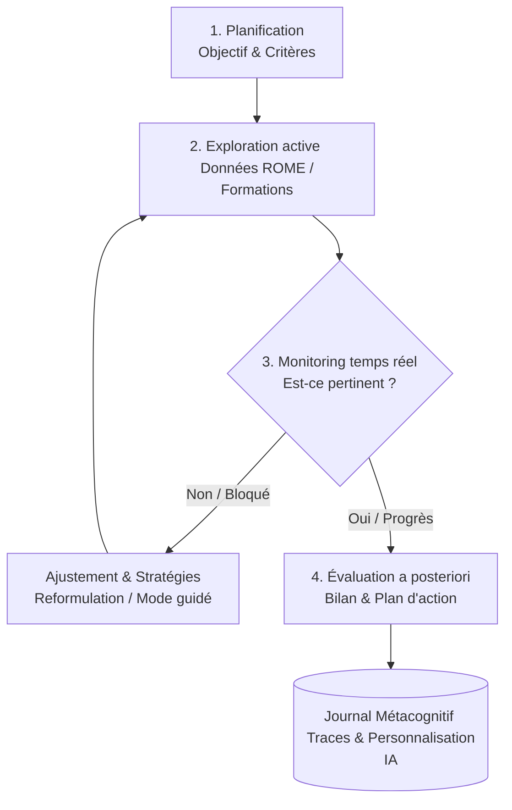

# Cartographie et État de l’Art : Métacognition et Éducation (2025–2026)

> **Date :** 25 août 2026  
> **Domaine :** Psychologie de l'éducation, Psychologie cognitive & Sciences de l'apprentissage  
> **Objectif :** Synthèse exhaustive et catégorisée des modèles, méta-analyses, interventions et implications pratiques pour les environnements numériques et le **Cognitorium**.

---

## 1. Introduction : La métacognition comme levier central

La littérature récente (2025–2026) confirme que la métacognition est l’un des leviers les plus robustes pour améliorer l’apprentissage, l’autonomie et la réussite scolaire, en particulier dans les contextes d’IA générative et de formation à distance [eric.ed, oarep.usim.edu].

---

## 2. Définition opérationnelle pour l’éducation

En contexte éducatif, la métacognition est décomposée en deux dimensions complémentaires [oarep.usim.edu] :

1. **Connaissances métacognitives** (déclaratives, procédurales, conditionnelles) : ce que l’apprenant sait sur ses propres processus cognitifs, les tâches et les stratégies.
2. **Régulation métacognitive** : planification, monitoring (suivi en temps réel), contrôle/ajustement et évaluation a posteriori de l’activité d’apprentissage.

*Travaux récents :* Ces deux dimensions sont distinctes mais synergiques. La régulation (surtout monitoring et contrôle) est plus fortement liée à la performance académique que la simple connaissance [pmc.ncbi.nlm.nih].

---

## 3. Effets sur la performance et l’efficacité éducative

Une revue systématique récente (2025, 15 études, PRISMA) montre que les stratégies métacognitives :
* Améliorent les **résultats d’apprentissage** (performance académique, pensée critique, résolution de problèmes) [oarep.usim.edu].
* Augmentent l’**efficacité éducative** : meilleure gestion du temps, réduction du temps d’instruction nécessaire, plus grande autonomie.
* Bénéficient à la fois aux **STEM** (précision des solutions, auto-efficacité) et aux **humanités** (lecture/écriture réflexives).

### Études empiriques 2025–2026 :
* **Étudiants universitaires :** Corrélation positive entre usage de stratégies métacognitives (planification, évaluation, contrôle) et performance [ve.scielo.org].
* **Formation à distance (Chine, 2026) :** Le monitoring, la régulation et l’auto-efficacité sont positivement associés à la performance, tandis que la planification seule a un effet marginal [pmc.ncbi.nlm.nih].
* **Sciences au lycée (Philippines, 2026) :** C’est spécifiquement le **monitoring** qui prédit le mieux la réussite en sciences [shimej].
* **Neuropsychologie (2025) :** Volume de matière grise dans le précunéus et le cortex frontal supérieur associé aux connaissances et à la régulation métacognitive liées à l’éducation, avec recouvrements partiels avec la métacognition de laboratoire [pubmed.ncbi.nlm.nih].

---

## 4. Métacognition dans les environnements d’IA générative (GenAI)

L'essor de l'IA générative (2025–2026) pose un défi majeur : GenAI facilite la réalisation des tâches mais peut **affaiblir l’auto-régulation** si elle n’est pas encadrée [eric.ed].

* **Étude quasi-expérimentale (68 étudiants, 4 semaines) :**
  - Le **support métacognitif explicite** (prompts de planification, monitoring, auto-évaluation) n’augmente pas nécessairement les notes brutes à court terme, mais :
    - Augmente significativement les capacités d’**auto-régulation** (stratégies de tâche, auto-évaluation).
    - Optimise l’expérience d’apprentissage (charge cognitive, acceptation technologique).
  - *Risque sans support :* diminution notable de l’auto-régulation des étudiants [eric.ed].

* **Implication pour le Cognitorium :** Structurer explicitement des boucles métacognitives encadrant l'usage de l'IA (avant / pendant / après).

---

## 5. Cartographie bibliographique : Les références incontournables par catégorie

### 5.1. Fondations théoriques
* **Flavell, J. H. (1979).** *Metacognition and cognitive monitoring: A new area of cognitive–developmental inquiry.* American Psychologist. (Référence canonique initiale).

### 5.2. Modèles de métacognition et d’apprentissage auto-régulé (SRL)
| Modèle | Publication clé | Citations (approx.) | Description |
| :--- | :--- | :--- | :--- |
| **Zimmerman** | Zimmerman (2000), *Handbook of self-regulation* | ~4 169 | Modèle en 3 phases : Forethought, Performance, Self-reflection. Le plus cité. |
| **Pintrich** | Pintrich (2000), *Handbook of self-regulation* | ~3 416 | Intègre fortement la motivation (orientations de but, auto-efficacité) avec le SRL. |
| **Winne & Hadwin** | Winne & Hadwin (1998) | ~1 037 | Modèle en 4 phases (task definition, goal setting, enacting tactics, adapting) et 4 niveaux. |
| **Boekaerts** | Boekaerts (2000 / 2006) | Très cité | Régulation entre buts d’apprentissage et buts de protection de l’ego. |

### 5.3. Méta-analyses sur l’instruction métacognitive et le SRL
* **de Boer, Donker, Kostons & van der Werf (2018).** *Long-term effects of metacognitive strategy instruction on student academic performance: A meta-analysis.* Educational Research Review. (Effet global à long terme $g \approx 0.63$, bénéfice marqué pour les élèves à bas SES).
* **Donker, de Boer, Kostons, Dignath-van Ewijk & van der Werf (2014).** *Effectiveness of learning strategy instruction on academic performance: A meta-analysis.* Educational Research Review. (Effets importants écriture $g \approx 1.25$, sciences $g \approx 0.73$, maths $g \approx 0.66$, lecture $g \approx 0.36$).
* **Dignath, Büttner & Langfeldt (2008) & Dignath & Büttner (2008).** Méta-analyses sur le primaire et le secondaire ($g \approx 0.69$, combinaison stratégies cognitives + métacognitives + gestion du temps + feedback).

### 5.4. Mesure et évaluation
* **Pintrich et al. (2000).** *Assessing metacognition and self-regulated learning.* In Issues in the Measurement of Metacognition. (Cadre de référence pour l'évaluation).
* **MAI** (Metacognitive Awareness Inventory) & **Meta-Performance Test** (2021).

### 5.5. Technologies et IA
* **Azevedo et al. (2004–2025).** Travaux sur le SRL dans les environnements informatisés assistés par des prompts.
* **Méta-analyse récente (2026) sur IA et gamification :** Effets positifs sur la conscience métacognitive ($d \approx 0.68$) et la persistance ($d \approx 0.64$), médiés par le feedback adaptatif.

---

## 6. Interventions et dispositifs pédagogiques efficaces
* **Ateliers combinés :** “Metacognition + Time Management” (biologie universitaire) → augmentation des notes et persistance [pmc.ncbi.nlm.nih].
* **Activités curriculaires intégrées :** Essais réflexifs, auto-prédiction de notes, plans d'action (impact particulièrement fort sur les étudiants en difficulté) [pmc.ncbi.nlm.nih].
* **Stratégies explicites :** Auto-questionnement, journaux de réflexion, protocoles *think-aloud*.

---

## 7. Facteurs modérateurs et limites
* **Caractéristiques des apprenants :** Âge, genre, culture, motivation, croyances.
* **Non-linéarité :** "Plus n’est pas toujours mieux" ; la régulation doit être adaptée à la complexité de la tâche [pmc.ncbi.nlm.nih].
* **Régulation vs Connaissance :** Le monitoring et le contrôle priment sur la simple connaissance déclarative.

---

## 8. Traduction opérationnelle pour le Cognitorium

### A. Boucle métacognitive intégrée
1. **Planification :** Définition de l’objectif, critères de succès, contraintes avant la session.
2. **Monitoring en temps réel :** Indicateurs de progression, prompts courts (“Est-ce que cette fiche répond à ton objectif ?”).
3. **Contrôle / Ajustement :** Stratégies de reformulation, mode guidé vs libre.
4. **Évaluation a posteriori :** Auto-évaluation de l’atteinte de l’objectif, bilan des préférences, plan d’action concret.

### B. Canevas de Prompts métacognitifs (Avant / Pendant / Après GenAI)
* **Avant la requête IA :**  
  > *"Quel est ton objectif précis ? Quels sont tes 3 critères de succès pour cette recherche de formation/métier ?"*
* **Après la réponse IA :**  
  > *"Qu'est-ce qui est utile dans cette réponse ? Qu'est-ce qui manque ou est ambigu ? Comment reformulerais-tu ta demande pour aller plus loin ?"*

### C. Schéma Mermaid de la Boucle Métacognitive

---
*Document généré pour le projet Cognitorium / État de l'art Métacognition & Éducation (2025–2026).*
