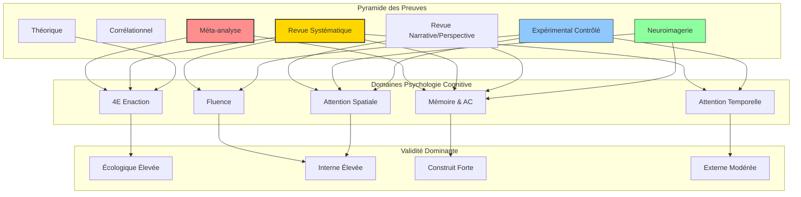
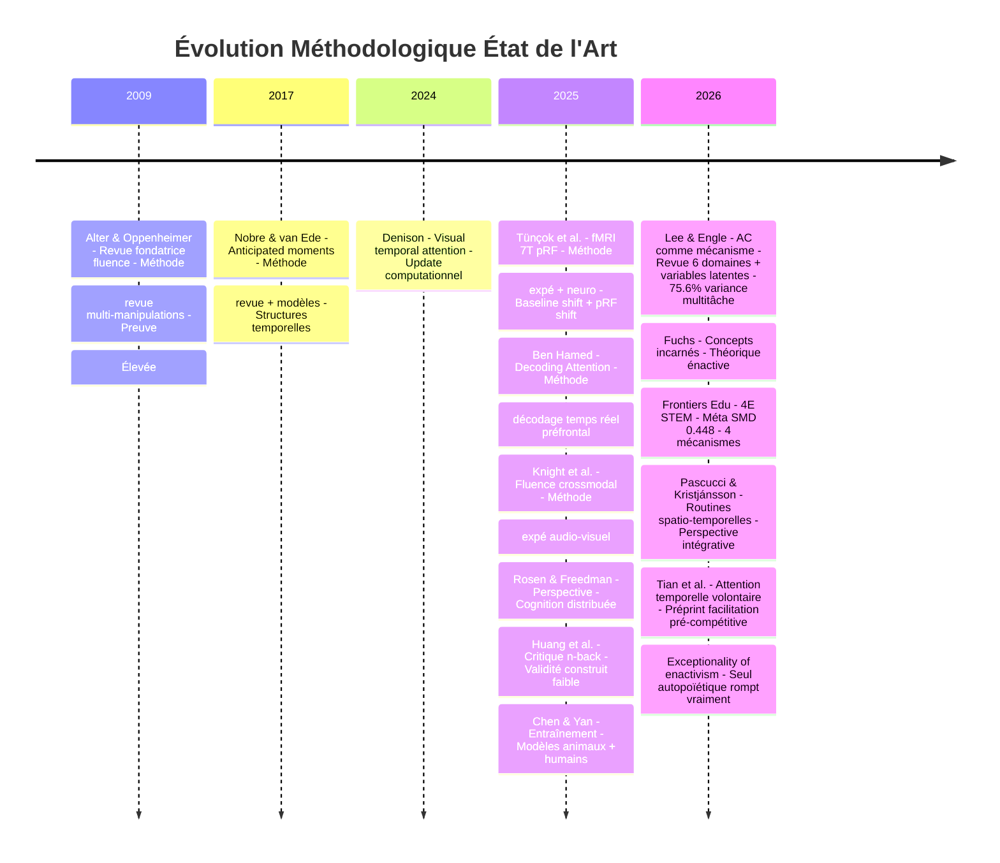
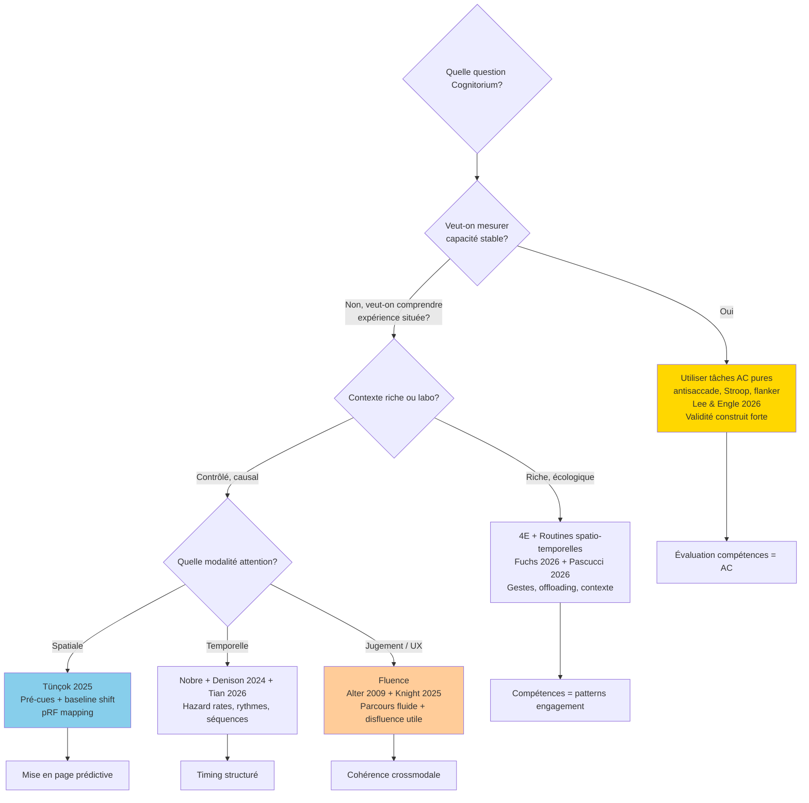

# Diagrammes Méthode Scientifique - Supplément

## Diagramme 1: Classification par Type de Preuve + Domaine (Sankey-like via flowchart)



## Diagramme 2: Timeline Méthodologique 2009-2026



## Diagramme 3: Arbre de Décision Méthodologique pour Cognitorium



## Diagramme 4: Radar Validités par Méthode

```mermaid
radarBeta
    title Radar Validités par Type Méthode
    axis Interne, Construit, Externe, Écologique, Statistique
    curve Théorique 4E{"Interne": 20, "Construit": 40, "Externe": 50, "Écologique": 90, "Statistique": 10}
    curve Expérimental Labo{"Interne": 95, "Construit": 70, "Externe": 40, "Écologique": 30, "Statistique": 85}
    curve Neuroimagerie{"Interne": 80, "Construit": 75, "Externe": 60, "Écologique": 35, "Statistique": 80}
    curve Revue Systématique{"Interne": 70, "Construit": 85, "Externe": 85, "Écologique": 60, "Statistique": 90}
    curve Méta-analyse{"Interne": 75, "Construit": 80, "Externe": 90, "Écologique": 55, "Statistique": 95}
    max 100
    min 0
```

Ces diagrammes complètent la visualisation interactive et permettent de justifier le choix méthodologique pour chaque implication design Cognitorium.
