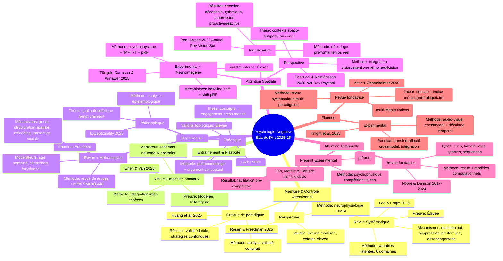
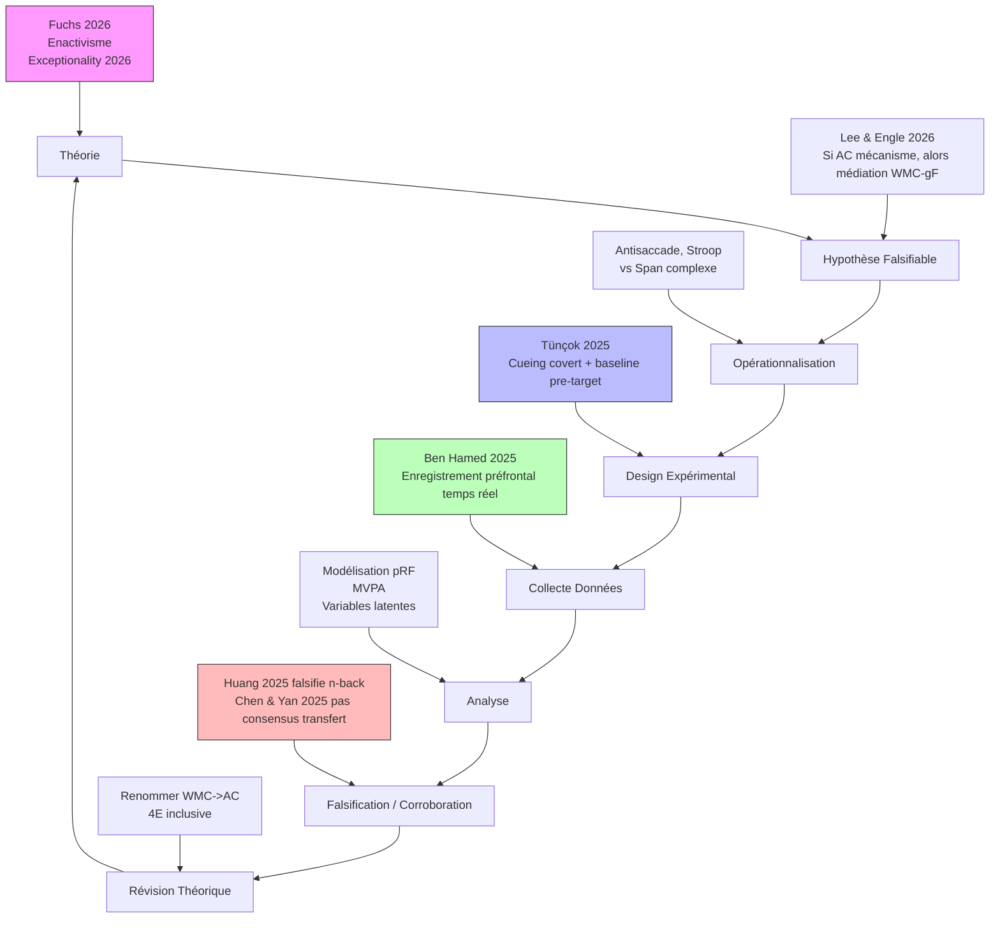
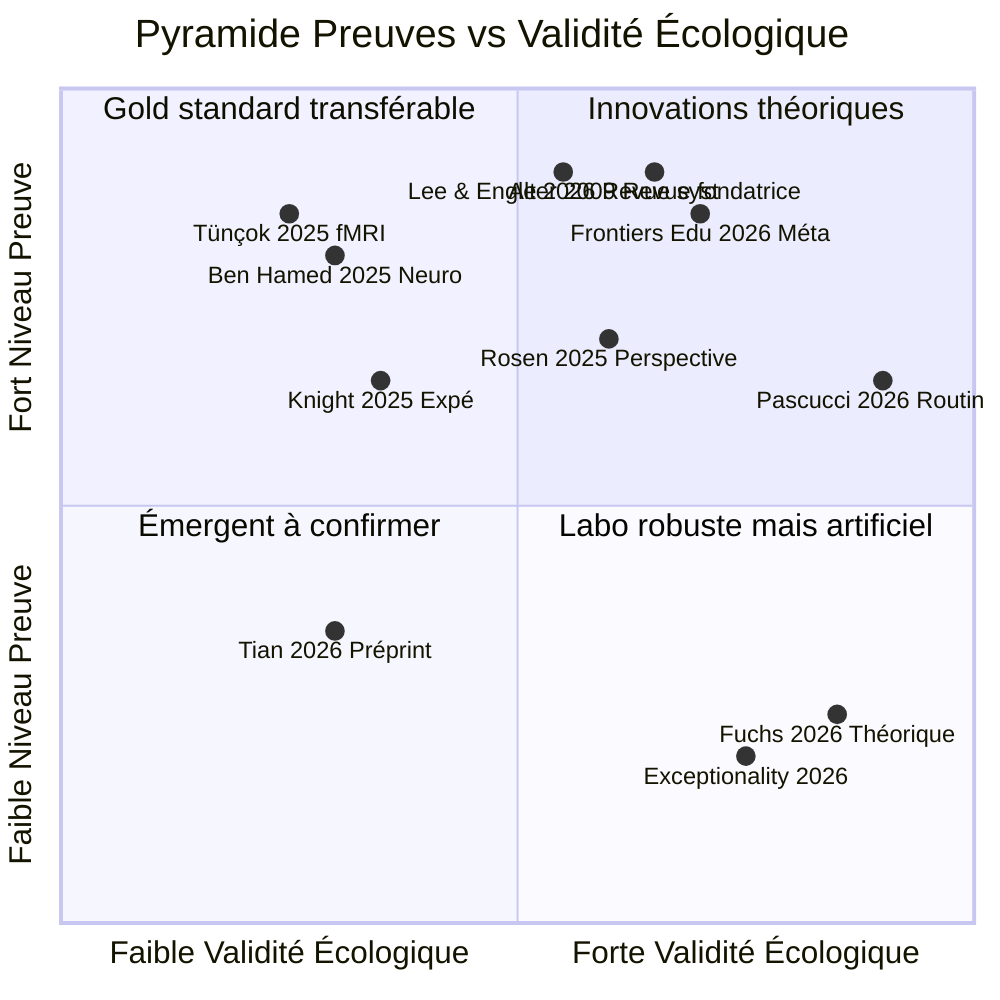
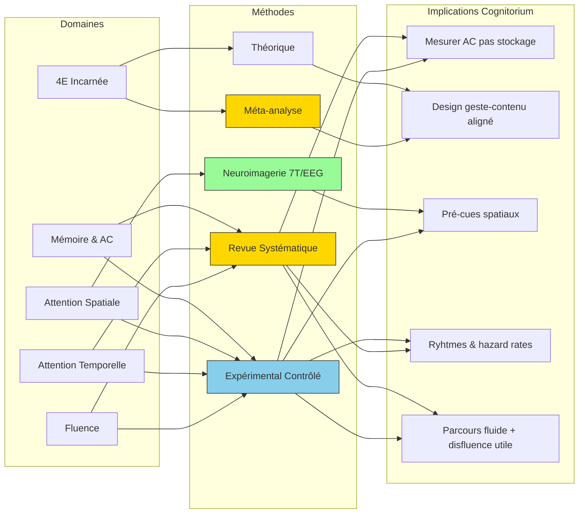

# Mindmap - État de l'Art Psychologie Cognitive (2025-2026) - Classé par Méthode Scientifique

## Version 1: Mindmap Domaines + Méthodes

## Version 2: Flowchart Méthode Scientifique

## Version 3: Matrice Méthode x Validité

## Version 4: Graphique Domaine -> Méthode -> Implication Design

