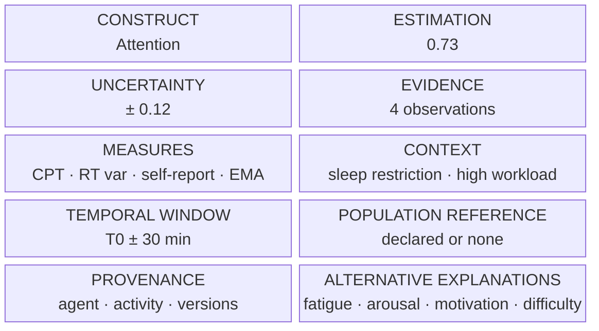

# Figure 3 — Objet Cognitive State à T0

**Statut :** `PROPOSED`  
**Message :** l'unité n'est pas un scalaire.



Forme carte (lisible hors rendu block) :

```
┌──────────────────────────────────────────────┐
│  ConstructEstimate                           │
│  construct:     attention                    │
│  value:         0.73     scale: unit_interval│
│  uncertainty:   sd = 0.12                    │
│  window:        T0 ± 30 min                  │
│  evidence:      4 observations               │
│  measures:      CPT, RT var, self-report, EMA│
│  context:       sleep restriction, workload  │
│  reference:     declared or absent           │
│  provenance:    complete                     │
│  alternatives:  fatigue, arousal,            │
│                 motivation, task difficulty  │
│  status:        estimated                    │
└──────────────────────────────────────────────┘
```

Un objet auquel il manque une ligne du cadre est **invalide**, pas « partiel mais publiable ».
