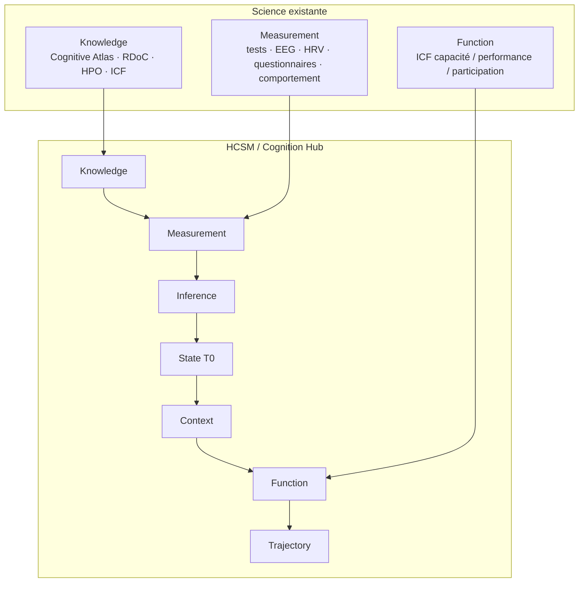

# Figure 1 — Architecture conceptuelle

**Statut :** `PROPOSED`  
**Message :** HCSM n'est pas une nouvelle science de la cognition. C'est la couche qui relie connaissance, mesure et inférence personnelle.

## Lecture

- Haut : cadres que HCSM **n'absorbe pas**.
- Bas : chaîne que HCSM **ajoute** comme objet computationnel.
- La flèche critique est `Measurement → Inference`, pas `Measurement → Score`.

## Ce que la figure interdit de lire

- HCSM au-dessus de RDoC comme un remplaçant.
- Function comme un simple export de T0.
