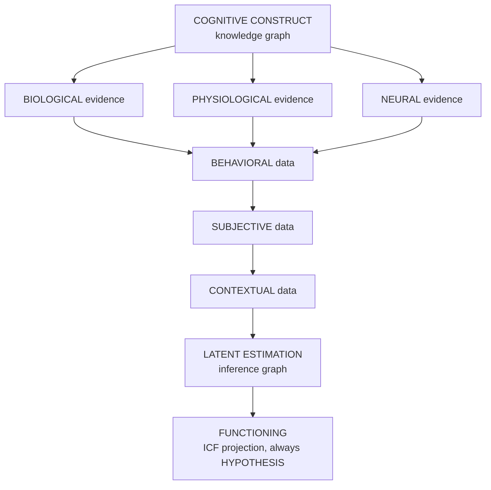
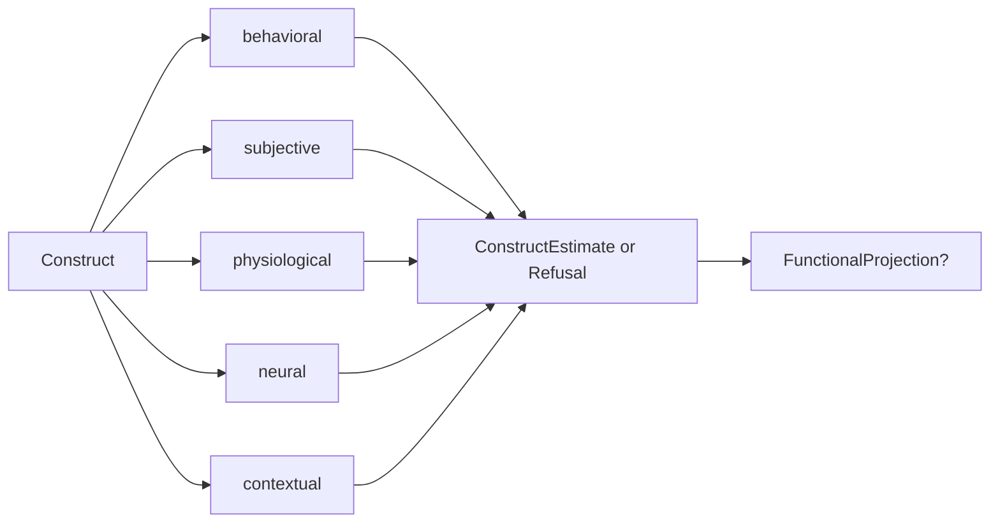

# Figure 2 — Unités d'analyse comme voies d'évidence

**Statut :** `PROPOSED` (réinterprétation de RDoC, `ESTABLISHED`)  
**Message :** il n'y a pas d'étage « neurologique » parallèle au cognitif.

Les voies biologiques moléculaires / cellulaires sont hors v0.1 mais restent des *voies*, pas des niveaux ontologiques.

Variante compacte utilisée dans le working paper :

