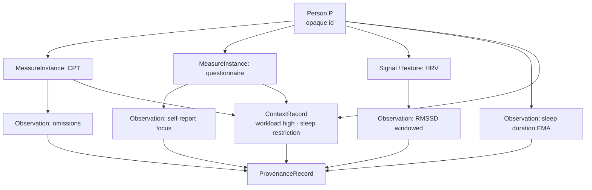

# Figure 5 — Evidence graph (extrait personne P, fenêtre T0)

**Statut :** `PROPOSED` · exemple illustratif, non empirique

```mermaid
flowchart TB
  P["Person P<br/>opaque id"]
  P --> T["MeasureInstance: CPT"]
  T --> O1["Observation: omissions"]
  P --> Q["MeasureInstance: questionnaire"]
  Q --> O2["Observation: self-report focus"]
  P --> H["Signal / feature: HRV"]
  H --> O3["Observation: RMSSD windowed"]
  P --> S["Observation: sleep duration EMA"]
  P --> C["ContextRecord<br/>workload high · sleep restriction"]
  T --> C
  Q --> C
  O1 --> PR["ProvenanceRecord"]
  O2 --> PR
  O3 --> PR
  S --> PR
  C --> PR
```

Règle visuelle : aucune étiquette `attention = …` sur une observation.
