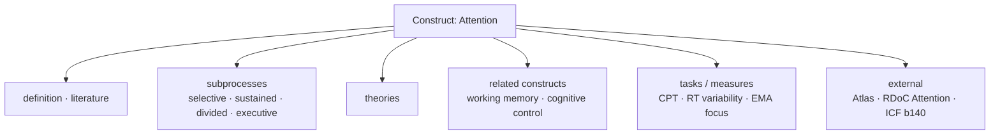

# Figure 4 — Knowledge graph (extrait Attention)

**Statut :** `PROPOSED` comme graphe HCSM ; contenu des nœuds `ESTABLISHED` / `SUPPORTED` selon sources

Règle visuelle : aucun nœud personne, aucune valeur numérique.
