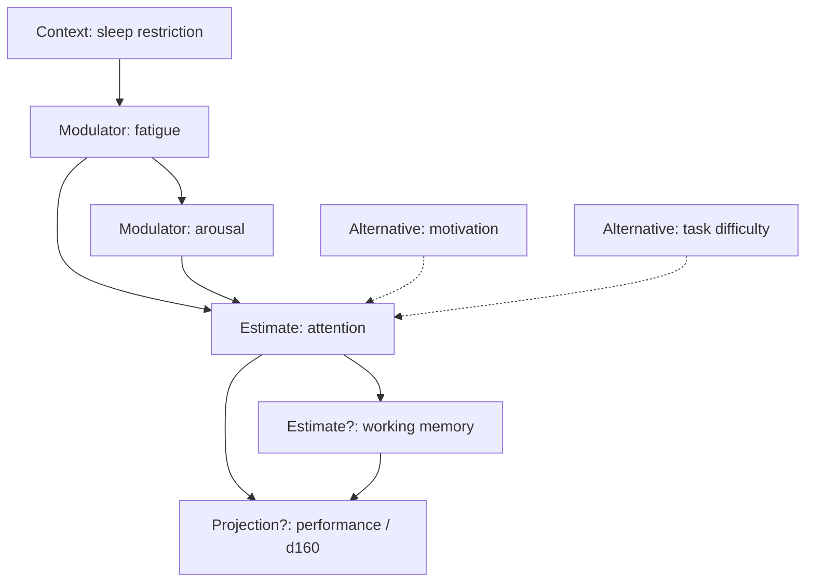

# Figure 6 — Inference graph (extrait)

**Statut :** arêtes en `HYPOTHESIS` sauf mention contraire  
**Message :** le moteur relie des hypothèses, il n'établit pas un réseau causal unique.

Lecture obligatoire :

- les flèches pleines = `modulatedBy` / `inferredFrom` proposés ;
- les pointillés = alternatives encore actives ;
- `working memory` peut être un `Refusal` si aucune mesure alignée n'est dans la fenêtre (cas du mini-scénario, docs/04).

Ce graphe n'est **pas** le knowledge graph. Fatigue n'y est pas une théorie de l'attention ; c'est une hypothèse sur *cette* personne, *cette* fenêtre.
