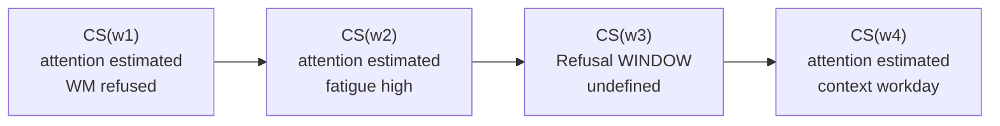

# Figure 7 — Trajectoire

**Statut :** `PROPOSED`  
**Message :** une trajectoire est une suite d'états fenêtrés, pas une courbe lissée.



```
capacity κ  ────────────────────────────────────────────  (lent)

state        ■■■■        ■■■■              ■■■■
window       w1          w2       (trou)   w4
refus              possible à chaque coupe
```

Pas d'interpolation du trou. Le trou est un résultat.
