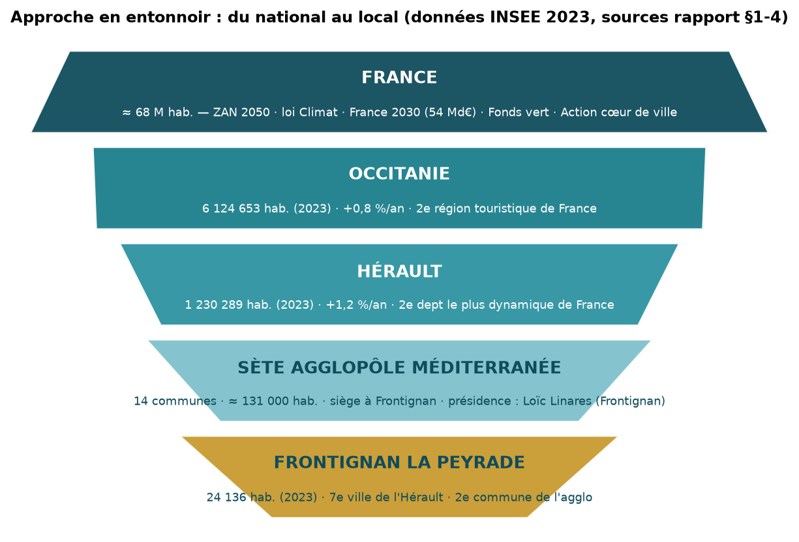
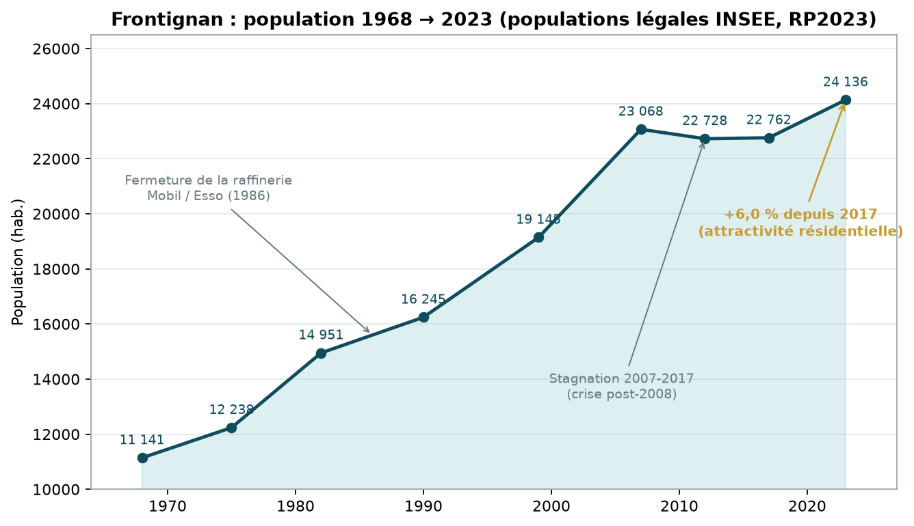
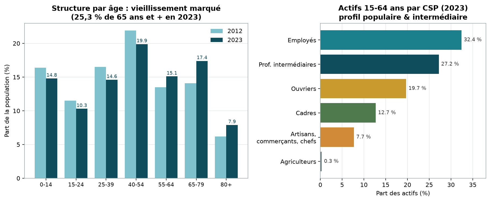
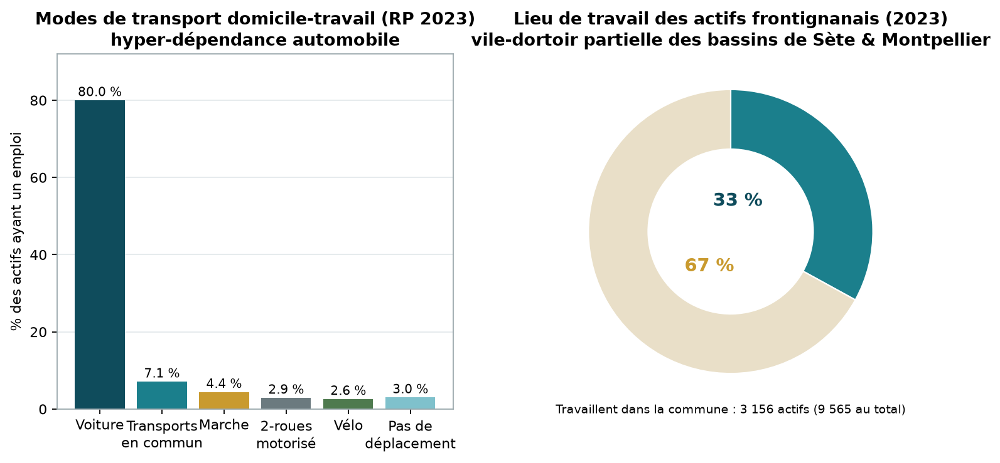
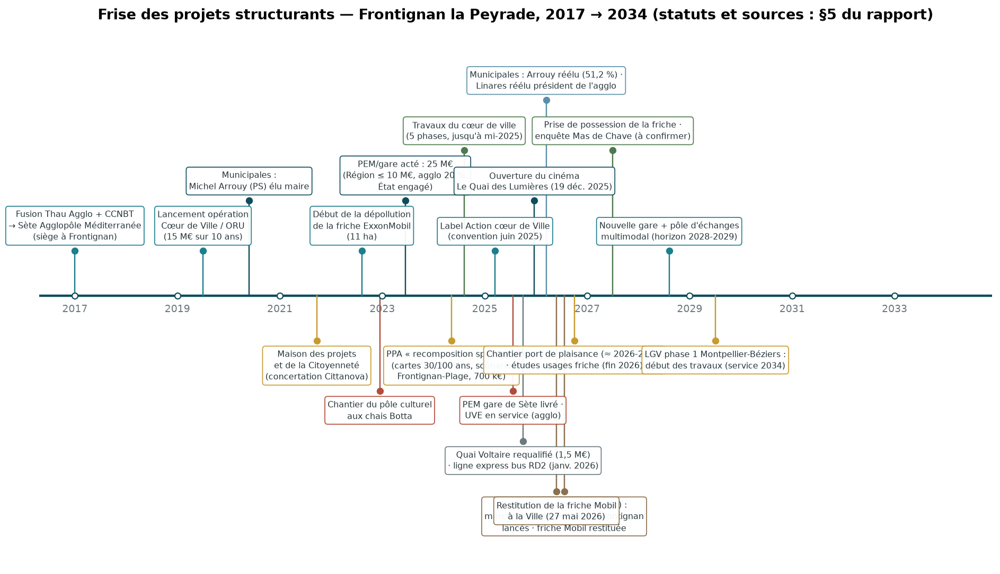
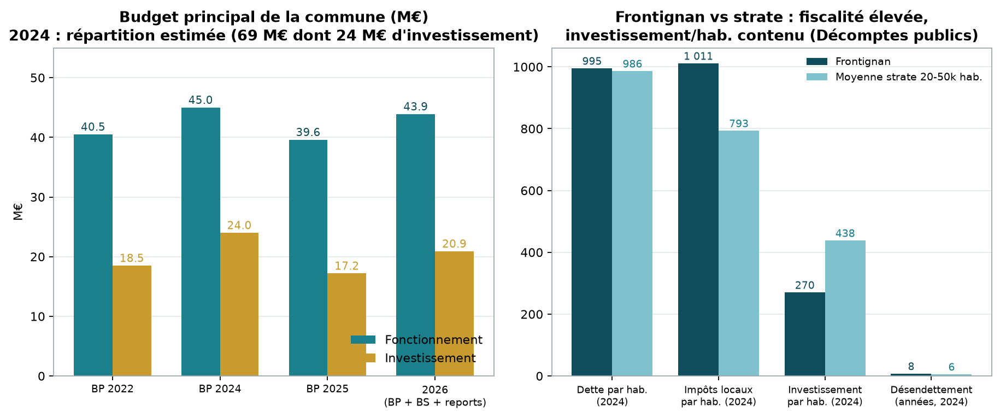
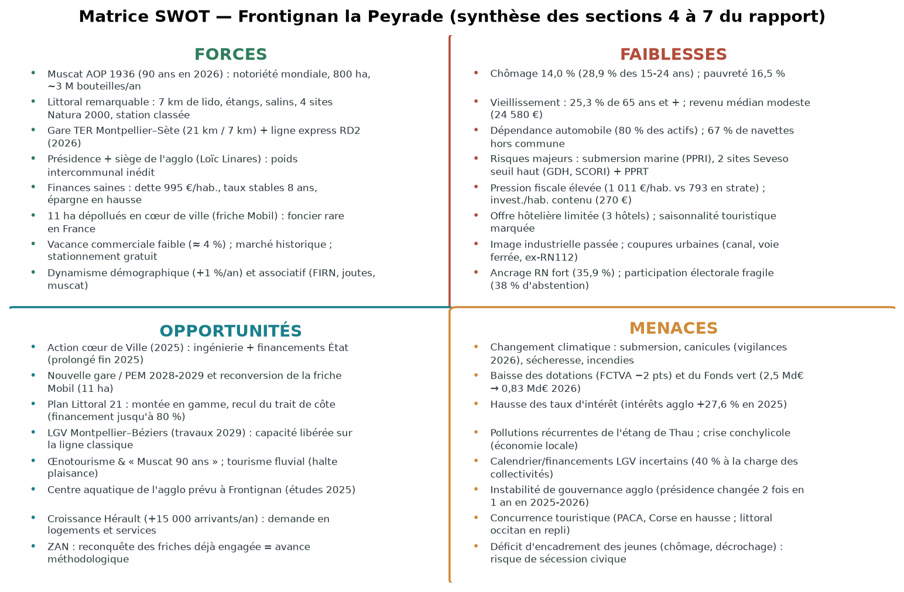
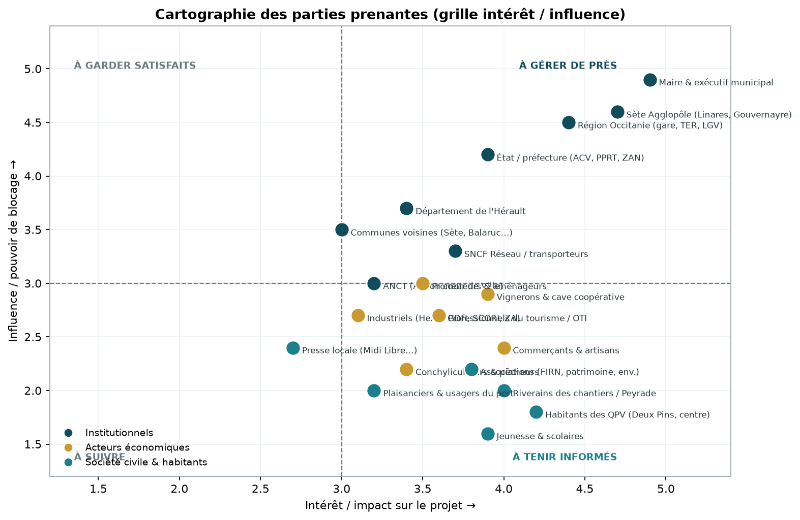
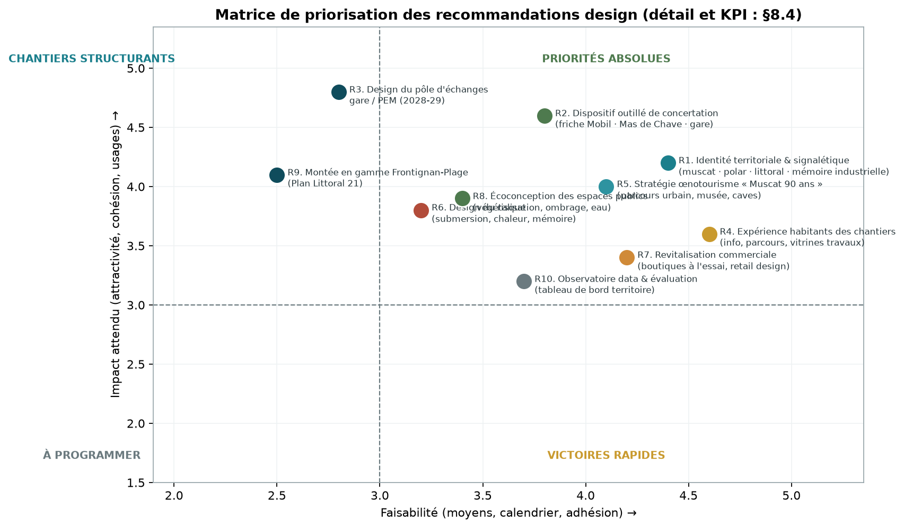

# RAPPORT D'ANALYSE TERRITORIALE MULTIMODAL
## Frontignan la Peyrade (34110, Hérault, Occitanie)

**Date d'élaboration : 8 septembre 2026** · **Destinataire : équipe de design de services / design urbain accompagnant la municipalité** · **Auteur : analyse documentaire multi-sources (voir annexe A)**

> **Positionner ce document.** Rapport d'intelligence territoriale en entonnoir (France → Occitanie → Hérault → Sète Agglopôle Méditerranée → Frontignan), conçu comme un **socle de cadrage avant mission design**. Chaque donnée clé est datée, sourcée et, quand c'est pertinent, croisée avec au moins deux sources indépendantes. Les angles morts restants sont listés en annexe B.

---

## SOMMAIRE

1. [Synthèse exécutive](#1-synthèse-exécutive)
2. [Méthodologie et grille de lecture](#2-méthodologie-et-grille-de-lecture)
3. [Cadrage macro — France](#3-cadrage-macro--france)
4. [Échelle régionale et départementale — Occitanie / Hérault](#4-échelle-régionale-et-départementale--occitanie--hérault)
5. [Échelle intercommunale — Sète Agglopôle Méditerranée](#5-échelle-intercommunale--sète-agglopôle-méditerranée)
6. [Portrait de la ville — Frontignan la Peyrade](#6-portrait-de-la-ville--frontignan-la-peyrade)
7. [Projets urbains — passés, en cours, à venir ⭐](#7-projets-urbains--passés-en-cours-à-venir-)
8. [Tissu économique et entreprises](#8-tissu-économique-et-entreprises)
9. [Budget et finances municipales](#9-budget-et-finances-municipales)
10. [Analyse stratégique pour le designer](#10-analyse-stratégique-pour-le-designer)
11. [Cartes et visuels à produire](#11-cartes-et-visuels-à-produire)
12. [Annexe A — Sources complètes et datées](#annexe-a--sources-complètes-et-datées)
13. [Annexe B — Données manquantes, estimations et contradictions](#annexe-b--données-manquantes-estimations-et-contradictions)

---

## 1. SYNTHÈSE EXÉCUTIVE

**Frontignan la Peyrade en une page.** Ville littorale de **24 136 habitants (2023)** au pied du massif de la Gardiole, entre **Sète (7 km)** et **Montpellier (21 km)**, Frontignan est la **2ᵉ commune** et le **siège** de Sète Agglopôle Méditerranée (14 communes, ≈ 131 000 hab.). Ville du **muscat** (AOP 1936, 90 ans en 2026), du **sel** (salins fermés en 1968), de la **raffinerie Mobil/Esso** (fermée en 1986) et du **Festival international du roman noir** (FIRN, depuis 1998), elle entame en 2026 un cycle de transformation urbaine sans précédent depuis les années 1970.

**Trois bascules structurent la période 2025-2026 :**

| Bascule | Fait marquant | Conséquence pour la mission design |
|---|---|---|
| **Politique** | Réélection du maire PS **Michel Arrouy** dès le 1ᵉʳ tour (15 mars 2026, 51,16 %), mais avec **35,9 % pour le RN** ; le Frontignanais **Loïc Linares** conserve la **présidence de l'agglo** (réélu 31 mars 2026) | Mandat renouvelé, majorité stable (27/35 sièges), assise intercommunale forte ; société clivée à accompagner |
| **Foncière** | **Restitution à la Ville, le 27 mai 2026, des 11 ha de l'ex-raffinerie ExxonMobil** dépollués (chantier 2022-2026, pollueur-payeur) | Le plus grand foncier renouvelable en cœur de ville ; gare nouvelle + pôle d'échanges multimodal attendus vers 2028-2029 |
| **Financière & programmatique** | Label **Action cœur de Ville** obtenu en mars 2025 ; finances communales saines (dette ≈ 995 €/hab., taux d'imposition stables depuis 8 ans) mais **pression fiscale élevée** et investissement/habitant contenu ; baisse des dotations nationales | Fenêtre de financements ouverte (ACV, Plan Littoral 21, Fonds vert en repli) mais compétitive : le design doit produire des « preuves » rapides |

**Chiffres clés à retenir (sources et nuances en §6-§9) :** population +6,0 % depuis 2017 (mais 25,3 % de 65 ans et +) ; chômage 14,0 % (28,9 % des 15-24 ans) ; niveau de vie médian 24 580 € (2023) et 16,5 % de pauvreté ; **80 % des actifs vont travailler en voiture** et **67 % travaillent hors de la commune** ; vacance commerciale faible (≈ 4 %, chiffre municipal) ; commune la plus exposée du bassin de Thau au risque de submersion (≈ 33 % des dommages estimés à aléa décennal) ; **2 sites Seveso seuil haut** (GDH, SCORI) et un PPRT. Face au risque littoral, l'agglo a signé en 2024 un **PPA « recomposition spatiale »** (cartes du recul du trait de côte à 30/100 ans, scénario dédié pour Frontignan-Plage) et flèche **13,1 M€ d'investissements 2026** contre les risques dans la lagune de Thau. Le **PEM/gare nouvelle est chiffré à 25 M€** (annonce Région 2023), le budget 2026 de l'agglo (242 M€) lance les marchés du **centre aquatique de Frontignan**, et la Ville étudie la **renaturation de la friche Lafarge** (quartier des Hierles).

**Quatre enjeux design prioritaires** (démontrés en §10) :
1. **Faire quartier avec la friche Mobil** : 11 ha à réinventer en continuité du centre-ville, autour de la future gare — projet design majeur de la décennie 2027-2035.
2. **Réparer l'expérience du chantier permanent** : le cœur de ville est en travaux depuis 2024 (ORU 15 M€/10 ans) ; commerçants et riverains en fatigue → design des transitions, de l'information et des usages provisoires.
3. **Tisser une identité territoriale lisible** : muscat, roman noir, littoral, mémoire industrielle et salinière — capital symbolique riche mais éclaté, encore peu traduit en stratégie d'expérience (signalétique, marque, parcours).
4. **Concevoir la résilience comme un usage** : submersion marine, canicule, risque industriel — transformer la contrainte réglementaire (PPRI, PPRT, recul du trait de côte) en culture du risque partagée et en projets d'espace public.

**Recommandation n°1 au designer :** démarrer par un **« atlas sensible » du territoire** (cartes, parcours, entretiens) et un dispositif de concertation outillé, avant toute proposition formelle — la ville a une culture de la concertation (riverains 2021-2022, comités habitants, budget participatif) à valoriser, et deux dossiers brûlants (friche Mobil, Mas de Chave) qui l'exigent.

---

## 2. MÉTHODOLOGIE ET GRILLE DE LECTURE

**Sources mobilisées.** Dossier complet INSEE de la commune (édition du 27 août 2026, RP2023/Filosofi 2023/Flores 2024), site officiel de la Ville (frontignan.fr, pages « élus », « Cœur de Ville », budget, projets), documents de l'agglopôle (agglopole.fr, synthèse budgétaire 2025), sites de l'État (herault.gouv.fr, prefectures-regions.gouv.fr, anct.gouv.fr, ecologie.gouv.fr, senat.fr), presse locale et régionale (Midi Libre, France Bleu Hérault, actu.fr, La Marseillaise, Hérault Tribune/Echo des Tribunes, Le Journal Toulousain, La Dépêche, L'Indépendant, Boxoffice Pro), données juridiques et financières (Pappers, Décomptes publics, Journal du Net), Wikipédia (pour la trame historique, recoupée). Liste complète en **annexe A**.

**Datation.** Les données de référence ont moins de 2 ans pour l'essentiel (recensement 2023, Flores 2024, budgets 2024-2026, élections mars 2026, faits d'actualité jusqu'à août 2026). Les données plus anciennes (ex. vacance commerciale 2019-2020, lido 2012-2013) sont signalées et traitées comme tendances.

**Balises utilisées dans le texte :**
- ✅ **Fait vérifié** : croisé ≥ 2 sources indépendantes ou source officielle primaire.
- ≈ **Estimation** : ordre de grandeur, source unique, ou calcul reconstitué.
- ❓ **Incertain / à vérifier** : contradiction entre sources ou donnée manquante (détail en annexe B).

**Ne pas confondre.** Ce rapport distingue systématiquement **commune** (Frontignan) et **intercommunalité** (Sète Agglopôle Méditerranée), ainsi que les périmètres budgétaires (budget principal / budget principal + budget supplémentaire + reports / tous budgets confondus). Attention aussi aux homonymies : ne pas confondre Frontignan (34108) avec Frontignan-de-Comminges (31) ; « La Peyrade » désigne ici le quartier nord de la ville et fait partie du nom d'usage « Frontignan la Peyrade ».

---

## 3. CADRAGE MACRO — FRANCE

*L'objectif de cette section n'est pas l'exhaustivité nationale mais d'identifier les politiques qui **conditionnent les marges de manœuvre et les financements** d'une ville moyenne littorale comme Frontignan.*

### 3.1 Le cadre contraignant : sobriété foncière et adaptation climatique

- **Loi Climat et résilience (22 août 2021)** : objectif de **réduction de moitié de la consommation d'espaces agricoles, naturels et forestiers sur 2021-2031**, puis **zéro artificialisation nette (ZAN) en 2050** ; décrets d'application publiés le 28 novembre 2023, dont un mécanisme spécifique de **recomposition des territoires exposés au recul du trait de côte** ([ecologie.gouv.fr, 28/11/2023](https://www.ecologie.gouv.fr/presse/communique-presse-zero-artificialisation-nette-publication-decrets-dapplication)). Le Sénat a depuis demandé un assouplissement de la trajectoire intermédiaire ([Assemblée des départements, 17/03/2025](https://departements.fr/zan-3-le-senat-demande-a-assouplir-les-objectifs-du-zero-artificialisation-nette-des-sols/)) — la contrainte reste néanmoins structurante pour les documents d'urbanisme. ✅
- **Conséquence directe pour Frontignan** : la commune est l'une des **31 communes maritimes engagées dans le dispositif « recul du trait de côte »** (décret du 31 juillet 2023), aux côtés de Sète, Marseillan, Villeneuve-lès-Maguelone ou Mauguio ; elle doit produire des **cartes d'exposition à 30 et 100 ans**, finançables jusqu'à 80 % via le Fonds vert ([préfecture de région Occitanie, Plan Littoral 21 « Risques littoraux »](https://www.prefectures-regions.gouv.fr/occitanie/layout/set/print/Region-et-institutions/L-action-de-l-Etat/Mer-et-littoral/Le-plan-littoral-212/Risques-littoraux)). ✅
- **Loi 3DS (février 2022)** et rationalisation intercommunale : contexte de mutualisations et de recompositions (le bassin de Thau en a été le théâtre en 2025, §5.4). ≈

### 3.2 Les leviers financiers : dispositifs nationaux mobilisables

| Dispositif | Contenu | Statut / date | Pertinence Frontignan |
|---|---|---|---|
| **Action cœur de Ville (ANCT)** | Programme national de revitalisation des cœurs de villes moyennes : habitat, commerce, mobilités, espaces publics, adaptation climatique ; phase 2 (2023-2026) élargie aux **entrées de ville et quartiers de gare** | Lancé 2018 (222 villes) ; **244 communes lauréates en 2025** ; **prolongé** au Congrès des maires (déc. 2025) ; bilan : 11,5 Md€ mobilisés, 33 000 logements réalisés, 518 commerces restructurés ([ANCT, 01/12/2025](https://anct.gouv.fr/actualites/action-coeur-de-ville-le-programme-se-poursuit)) | **Frontignan labellisée en mars 2025** (5ᵉ ville de l'Hérault après Béziers, Sète, Lunel, Agde) ; convention signée juin 2025 — **cœur de la fenêtre de financement actuelle** ✅ |
| **Petites Villes de Demain (ANCT)** | Accompagnement des communes < 20 000 hab. exerçant une centralité : 1 646 communes, 3,7 Md€ engagés fin 2024 dont 1,4 Md€ État ; prolongé au-delà de mars 2026 ([Sénat, réponse ministérielle 05/02/2026](https://www.senat.fr/questions/base/2026/qSEQ260107308.html)) | Prolongé (annonce juin 2025) | **Non éligible** (24 136 hab.) — mais utile pour les communes voisines de l'agglo ≈ |
| **Fonds vert** | Transition écologique des collectivités : rénovation énergétique, adaptation aux risques (dont inondation/submersion), décarbonation, mobilités | ≈ 2 Md€ attribués en 2023 (10 683 dossiers) ; **2,5 Md€ en 2024, 1,15 Md€ en 2025, 834 M€ en 2026** (enveloppe en forte baisse, ~1 Md€ annoncé 2027) ([bilan 2023 — budget.gouv.fr](https://www.budget.gouv.fr/documentation/file-download/28166) ; [Fonds vert 2025](https://www.charente-maritime.gouv.fr/Actions-de-l-Etat/Relations-avec-les-collectivites-locales/Les-dotations-de-l-Etat-aux-collectivites-locales/Subventions/Fonds-vert-2025) ; [guide 2026, Hellio](https://www.hellio.com/actualites/communiques/guide-fonds-vert-collectivites)) | Candidatures pertinentes : cartes recul du trait de côte (jusqu'à 80 %), rénovation énergétique bâtiments publics, aménagements cyclables — **la fenêtre se referme, urgence à instruire** ✅ |
| **France 2030 / PIA** | 54 Md€ d'investissement (lancé oct. 2021, 6ᵉ année en 2026) : décarbonation industrielle, mobilités décarbonées, énergie ([Sénat, PLF](https://www.senat.fr/rap/l24-144-317/l24-144-317_mono.html)) | En cours | Filière industrielle locale (Hexis, logistique), hydrogène/éolien flottant régional ≈ |
| **Plan Littoral 21** (voir §4.3) | Accord-cadre État-Région-Caisse des Dépôts (2017) : > 1,1 Md€ sur 2017-2027, 638 projets aidés | Prolongé/structurant | **Inscrit dans l'ADN des projets portuaires et littoraux frontignanais** (port de plaisance, montée en gamme de la station) ✅ |

### 3.3 Le contexte budgétaire des collectivités

- **Baisse tendancielle des dotations et aides** : la Ville de Frontignan elle-même documente « une baisse annoncée et prévisible des dotations et aides de l'État » et une **baisse du taux du FCTVA de 16,4 % à 14,85 %** ([frontignan.fr, débats budgétaires déc. 2024](https://www.frontignan.fr/conseil-municipal-de-frontignan-la-peyrade-des-orientations-budgetaires-realistes-et-ambitieuses/) ; [Midi Libre, 07/12/2024](https://www.midilibre.fr/2024/12/07/le-maire-michel-arrouy-et-son-equipe-debouts-pour-donner-de-lespoir-a-leurs-concitoyens-de-frontignan-12373514.php)). ✅ (fait local documentant la tendance nationale)
- **Hausse des charges** : inflation 2022-2023, point d'indice, coûts de l'énergie ; **hausse des taux d'intérêt** — l'agglo constate une hausse de ses charges d'intérêts de **+27,6 % en 2025** ([synthèse budget 2025, agglopole.fr](https://www.agglopole.fr/wp-content/uploads/2025/04/Synthese-du-budget-2025-de-Sete-agglopole-mediterranee.pdf)). ✅
- **Participation des collectivités au redressement des comptes publics** (ex. Sète : 1,96 M€ en 2025, [note de synthèse BP 2025, sete.fr](https://www.sete.fr/app/uploads/2025/03/note-de-synthese-BP-2025.pdf)) et **gel/baisse du Fonds vert** : les communes doivent « chasser » les subventions (ACV, FCTVA, dotation politique de la ville, Fonds vert, Plan Littoral 21, FEDER/FARE…) et renforcer leur autofinancement.

**Ce qu'il faut retenir pour le design :** le cadre national pousse simultanément vers (a) la **sobriété foncière** — Frontignan est bien positionnée avec sa friche de 11 ha —, (b) l'**adaptation climatique du littoral** — cartographies et projets en cours —, (c) la **compétition pour des financements en repli** — les projets devront être « prêts à candidater » et démontrer rapidement leur valeur.

---

## 4. ÉCHELLE RÉGIONALE ET DÉPARTEMENTALE — OCCITANIE / HÉRAULT

### 4.1 Dynamiques démographiques : une des régions les plus attractives de France

| Indicateur | Occitanie | Hérault | Frontignan (repère) |
|---|---|---|---|
| Population | **6 124 653 hab.** (1ᵉʳ janv. 2023) ; ≈ 6,25 M fin 2025 | **1 230 289 hab.** (2023) ; **≈ 1,26 M au 1ᵉʳ janv. 2026** | 24 136 hab. (2023) |
| Croissance annuelle 2017-2023 | **+0,8 %/an** (×2 vs France hors Mayotte) ; 3ᵉ région métropolitaine la plus dynamique | **+1,2 %/an** — 2ᵉ département le plus dynamique de France métropolitaine (avec la Haute-Garonne) | +1,0 %/an (2017-2023) |
| Moteur | Croissance **exclusivement migratoire** (solde naturel régional négatif) | +15 000 arrivants/an (étudiants, retraités, actifs) ; solde naturel passé **négatif** (−1 100 en 2025 : 10 800 naissances vs 11 900 décès) | Solde migratoire +1,1 %/an ; solde naturel −0,1 % |
| Pôles | Toulouse 514 819 hab. (+1,2 %/an) ; **Montpellier 310 240 hab. (+1,4 %/an**, croissance record parmi les grandes villes) | Montpellier, Béziers, Sète ; littoral sous pression | Dans l'**aire d'attraction de Montpellier** (commune de la couronne) et **ville-centre de l'unité urbaine de Sète** |

Sources : INSEE via [Midi Libre, 18/12/2025](https://www.midilibre.fr/2025/12/18/6-124-653-habitants-en-occitanie-pourquoi-la-population-continue-daugmenter-alors-quil-y-a-plus-de-deces-que-de-naissances-13118532.php), [France 3, 19/12/2025](https://france3-regions.franceinfo.fr/occitanie/herault/montpellier/encore-plus-d-habitants-a-montpellier-les-pyrenees-orientales-et-le-gard-toujours-dynamiques-ce-que-revele-le-dernier-recensement-de-l-insee-3269339.html), [ici.fr, 02/04/2026](https://www.ici.fr/occitanie/herault-34/moins-de-naissances-plus-d-habitants-pourquoi-l-herault-attire-t-il-autant-4984538), [Le Journal Toulousain, 18/12/2025](https://www.lejournaltoulousain.fr/occitanie/actualites-occitanie/occitanie-habitants-an-353930/). ✅

**Lecture stratégique** : Frontignan bénéficie d'une **double proximité** (couronne montpelliéraine pour l'emploi, bassin sétois pour l'identité et l'intercommunalité). La pression démographique héraultaise est un atout (demande de logements, économie présentielle) et une tension (foncier, artificialisation, risque de spéculation littorale) qui se lit directement dans les projets locaux (Mas de Chave, §7.9).

### 4.2 Économie et tourisme régional

- **2ᵉ région touristique de France** : 13 millions de touristes et **46,1 millions de nuitées** d'avril à septembre 2024, juste derrière la Nouvelle-Aquitaine ; les **campings pèsent 62 % des nuitées** (28,8 M), tirés par le haut de gamme ([INSEE Flash Occitanie, 28/11/2024](https://www.insee.fr/fr/statistiques/8289418)) ; en 2025, légère baisse (−5 % en août vs 2024, clientèle étrangère en recul) mais **taux d'occupation du littoral stable à 90 %** ([Le Journal Toulousain, 15/09/2025](https://www.lejournaltoulousain.fr/occitanie/actualites-occitanie/tourisme-occitanie-preferee-francais-vacances-aout-336076/)). ✅
- **L'Hérault, locomotive touristique départementale** : **47 millions de nuitées** de janvier à fin septembre 2025 (−4,5 % après l'année record 2024 à 57 M), **10,5 millions de touristes**, ≈ **1,7 Md€ de chiffre d'affaires annuel**, 35 700 professionnels dont 29 000 salariés et 54 000 saisonniers ; **981 000 lits touristiques dont 731 000 en résidences secondaires** ; l'**hôtellerie de plein air est le 1ᵉʳ du classement national** (10,2 M nuitées, 239 campings) et **87 % du flux se concentre sur la bande littorale** ; durée moyenne de séjour en baisse (4,5 jours) ([Midi Libre, 06/11/2025](https://www.midilibre.fr/2025/11/06/une-bonne-saison-touristique-dans-lherault-mais-des-visiteurs-qui-depensent-moins-13035569.php) ; [actu.fr, 07/11/2025](https://actu.fr/societe/bilan-2025-dans-l-herault-le-tourisme-reste-une-locomotive-malgre-une-petite-baisse_63401808.html) ; [Hérault Tribune, 11/2025](https://echo-des-tribunes.com/herault-tribune/articles/tourisme-dans-lherault-une-frequentation-en-leger-recul-en-2025-mais-toujours-au-top)). ✅ — *le positionnement exact de Frontignan dans ce flux (nuitées locales) reste une donnée manquante (annexe B).*
- **Enjeu de montée en gamme** assumé par la Région (Plan Littoral 21, hébergements, ports, mobilités douces) — exactement la trajectoire visée par Frontignan-Plage (§7.7-7.8).
- Économie régionale portée par Toulouse (aéronautique, spatial), Montpellier (santé, numérique) et des filières en émergence : **éolien flottant en Méditerranée** (grands ports voisins), hydrogène, agro/viticulture.

### 4.3 Grands projets structurants régionaux

- **Ligne nouvelle Montpellier-Perpignan (LGV, « LNMP »)** — le grand dossier régional :
  - **Phase 1 Montpellier-Béziers (60 km)** : protocole de financement validé (≈ 40 % État / 40 % collectivités / 20 % Europe), **appel d'offres ≈ 1,5 Md€ lancé fin 2026, travaux prévus à partir de 2029, mise en service visée 2034** ([La Dépêche, 08/05/2026](https://www.ladepeche.fr/2026/05/08/lgv-montpellier-perpignan-quand-est-ce-que-vont-demarrer-les-travaux-des-elus-et-habitants-sopposent-au-trace-13360891.php) ; [Midi Libre, 25/05/2025](https://www.midilibre.fr/2025/05/25/lgv-montpellier-perpignan-veritable-serpent-de-mer-le-projet-aboutira-t-il-un-jour-on-fait-le-point-sur-le-dossier-12718553.php)). ✅
  - **Phase 2 Béziers-Perpignan** : concertation publique (CNDP) du 9 avril au 19 juin 2026 (23 réunions, 2 000 participants) ; décisions sur gares nouvelles et fonctionnalités attendues **à l'automne 2026** ; ouverture à l'horizon 2040 ; coût global du projet évalué entre 5 et 6 Md€ ([ici.fr, 08/04/2026](https://www.ici.fr/emissions/l-invite-d-ici-matin-roussillon/lgv-montpellier-perpignan-une-nouvelle-concertation-17-ans-apres-car-le-territoire-a-change-8528419) ; [L'Indépendant, 07/07/2026](https://www.lindependant.fr/2026/07/07/lgv-montpellier-perpignan-2-000-citoyens-aux-consultations-publiques-gares-nouvelles-connues-a-lautomne-et-un-jalon-decisif-pose-13456959.php)). ✅
  - **Effet Frontignan** : la LGV dessaturera à terme la ligne classique Montpellier-Sète-Béziers (la plus chargée d'Occitanie) au profit des trains du quotidien — l'argumentaire de la **gare nouvelle de Frontignan** (§7.3) s'inscrit dans cette perspective ; le RN local s'y oppose, signe de la sensibilité du sujet.
- **Plan Littoral 21** (État-Région-Caisse des Dépôts, 2017 → horizon 2050) : > 1,1 Md€ mobilisés sur 2017-2027 (460 M€ décaissés à mi-2021, 638 projets aidés) autour de 3 orientations — littoral **résilient** (érosion, submersion), littoral **à énergie positive** (éolien flottant), littoral **attractif** (montée en gamme touristique, ports, mobilités douces) ([laregion.fr](https://www.laregion.fr/Du-concret-pour-le-Plan-Littoral-21) ; [Midi Libre, 04/06/2021](https://www.midilibre.fr/2021/06/04/plan-littoral-21-quel-bilan-9584643.php) ; [préfecture de région, 22/07/2022](https://www.prefectures-regions.gouv.fr/occitanie/Actualites/L-Etat-et-la-Region-accompagnent-13-projets-touristiques-durables-sur-le-littoral-d-Occitanie)). Le port de plaisance de Frontignan cite explicitement le Plan Littoral 21 comme cadre de son projet (§7.7). ✅
- **Rail et intermodalité régionale** : PEM de la gare de Sète livré à l'été 2025, requalification de la RD2 en voie de bus prioritaire et **ligne express électrique Sète-Frontignan mise en service en janvier 2026** (budget agglo 2025) — l'agglomération investit massivement dans les mobilités (§5.3).

### 4.4 Risques climatiques et environnementaux — un littoral sous surveillance

- **Submersion marine et inondation** : le bassin de Thau est identifié comme territoire prioritaire (PGRI Rhône-Méditerranée, stratégie locale à venir) ; le triangle **Sète-Frontignan-Balaruc** concentre développement et exposition ([rhone-mediterranee.eaufrance.fr](https://www.rhone-mediterranee.eaufrance.fr/sites/sierm/files/content/2022-07/202207_PGRI_vol2_littoral_languedoc.pdf)). ✅
- **Épisodes récents vécus localement** : tempête et submersion de novembre 2014 (plan communal de sauvegarde déclenché à Frontignan), épisode méditerranéen d'octobre 2019, **vigilances orange canicule répétées (été 2026)** ([frontignan.fr, août-sept. 2026](https://www.frontignan.fr/alerte-meteo-vigilance-canicule-2026/)). ✅
- **Étang de Thau** : pollutions récurrentes et mortalités conchylicoles, sujets de tension politique locale (« colères qui se profilent concernant les pollutions récurrentes de l'étang », [Plurielle, 01/04/2026](https://plurielle.info/sete-agglopole-mediterranee-reconduction-de-loic-linares/)) ; la conchyliculture représente ≈ 4 000 emplois sur le bassin ([La Tribune, 12/11/2018](https://www.latribune.fr/economie/collectivites/2018-11-12/sete-agglopole-mediterranee-un-territoire-a-fort-potentiel-797141.html)). ≈
- **Retrait-gonflement des argiles** (28 arrêtés cat-nat sur le bassin, épisode 2019), **feux de forêt** (massif de la Gardiole), **sécheresse** : cadrage complet en §6.3.

**Ce qu'il faut retenir pour le design :** l'Occitanie littorale est une région qui **gagne des habitants et des touristes tout en se repliant sur son cœur de saison** — la différenciation par la qualité (patrimoine, œnotourisme, nature, culture) et la désaisonnalisation sont des stratégies régionales explicitement financées, dans lesquelles Frontignan a des atouts spécifiques à faire valoir (muscat, roman noir, salins, étang).

---
## 5. ÉCHELLE INTERCOMMUNALE — SÈTE AGGLOPÔLE MÉDITERRANÉE

### 5.1 Identité et périmètre

La **communauté d'agglomération du Bassin de Thau**, d'usage **Sète Agglopôle Méditerranée (SAM)**, naît le **1ᵉʳ janvier 2017** de la fusion de Thau Agglo et de la communauté de communes du Nord du Bassin de Thau (CCNBT, imposée par le SDCI/loi NOTRe), avant d'être rebaptisée en septembre 2017. C'est la **2ᵉ agglomération de l'Hérault** après Montpellier Méditerranée Métropole — et son **siège est à Frontignan** (4, avenue d'Aigues). ✅ ([Wikipédia/INSEE](https://fr.wikipedia.org/wiki/Communaut%C3%A9_d'agglom%C3%A9ration_du_Bassin_de_Thau) ; [tourisme-sete.com](https://www.tourisme-sete.com/communaute-d-agglomeration-sete-agglopole-mediterranee-frontignan.html))

| Commune (pop. légale 2023) | Habitants | Poids dans l'agglo |
|---|---|---|
| **Sète** | 45 337 | 34,5 % |
| **Frontignan (siège)** | **24 136** | **18,4 %** |
| Mèze | 12 669 | 9,6 % |
| Marseillan | 8 414 | 6,4 % |
| Balaruc-les-Bains | 7 139 | 5,4 % |
| Poussan | 6 797 | 5,2 % |
| Gigean | 6 639 | 5,1 % |
| Vic-la-Gardiole | 3 428 | 2,6 % |
| Mireval | 3 301 | 2,5 % |
| Villeveyrac | 3 972 | 3,0 % |
| Balaruc-le-Vieux | 2 737 | 2,1 % |
| Loupian | 2 169 | 1,7 % |
| Montbazin | 2 877 | 2,2 % |
| Bouzigues | 1 601 | 1,2 % |
| **Total SAM** | **≈ 131 200** (129 982 en 2022) | 100 % |

Territoire de **310 km²** à plus de 80 % d'espaces naturels ou agricoles, structuré par l'étang de Thau, le lido et le massif de la Gardiole. *(Sources : INSEE, pop. légales 2023, géographie 2026 ; l'effectif de référence retenu par l'agglo varie selon les documents entre ≈ 130 000 et 132 851 hab. — voir annexe B.)*

### 5.2 Gouvernance : une bascule historique en 2025, un équilibre fragile

- **2017-2025** : présidence de **François Commeinhes** (LR), maire de Sète, dans un rapport de force classique « ville-centre dominante ».
- **Mai 2025** : condamné, François Commeinhes démissionne de la mairie de Sète (**Hervé Marquès**, son adjoint, lui succède le 12 mai 2025) ; le 13 mai 2025, **Loïc Linares (PS, élu de Frontignan) est élu président de l'agglo** à la majorité relative (24 voix contre 22 à Jean-Guy Majourel, trois tours de scrutin) — un président issu d'une commune « secondaire », fait rare, présenté comme un « rééquilibrage » du territoire ([France 3, 13/05/2025](https://france3-regions.franceinfo.fr/occitanie/herault/sete/enfant-des-hlm-ancien-adjoint-au-sport-qui-est-le-nouveau-maire-de-sete-herve-marques-3152597.html) ; [Plurielle, 14/05/2025](https://plurielle.info/la-presidence-de-sete-agglopole-mediterrannee-passe-a-gauche/)). ✅
- **31 mars 2026** : après les municipales, **Loïc Linares est réélu** président (42 voix sur 50, contre 6 au RN Sébastien Pacull) ; bureau de 15 vice-présidents dont **Hervé Marquès 1ᵉʳ vice-président** (Sète) — une co-gestion gauche-droite ; **Kelvine Gouvernayre (Frontignan) 15ᵉ vice-présidente**, chargée du tourisme et de l'attractivité, présidente de l'office de tourisme intercommunal ; **Frédéric Aloy (Frontignan)** conseiller communautaire délégué ([agglopole.fr, 02/04/2026](https://www.agglopole.fr/loic-linares-reelu-president-de-sete-agglopole-mediterranee/) ; [infoOccitanie, 01/04/2026](https://infoccitanie.fr/sete-agglopole-loic-linares-reelu-president-qui-sont-ses-adjoints/)). ✅
- **Ce que cela signifie pour Frontignan** : la ville cumule **siège + présidence + une vice-présidence tourisme** — un poids intercommunal inédit, à mettre au service des projets locaux (gare, centre aquatique, tourisme), mais qui expose aussi l'équipe municipale aux tensions agglo (pollutions de l'étang, mutualisations avec Sète, position sur la LGV, forages géothermiques d'Issanka à Balaruc) ([Midi Libre, 23/04/2026](https://www.midilibre.fr/2026/04/23/forages-a-issanka-lgv-travail-avec-herve-marques-projet-de-territoire-le-president-de-sete-agglo-loic-linares-bascule-dans-le-mandat-du-changement-13338771.php)). ≈ (lecture politique)

### 5.3 Compétences, budget et projets structurants de l'agglomération

**Compétences clés** (communauté d'agglomération) : développement économique et zones d'activités, **transports et mobilités** (réseau **SAMobilité** exploité par Keolis, DSP 2022-2030 ; versement mobilité 1,65 % depuis 2022), **déchets** (budget annexe équilibré ; **unité de valorisation énergétique en service fin octobre 2025**), **eau et assainissement** (budgets annexes), GEMAPI, **tourisme** (office de tourisme intercommunal « Archipel de Thau »), habitat (Maison de l'Habitat ouverte en avril 2025, OPAH), culture (médiathèques intercommunales), sport, politique de la ville (contrat « Quartiers 2030 », 2024-2030). ✅ (sources agglopole.fr, §5.2)

**Budget 2025 de l'agglo** ([synthèse officielle, avril 2025](https://www.agglopole.fr/wp-content/uploads/2025/04/Synthese-du-budget-2025-de-Sete-agglopole-mediterranee.pdf)) :

| Indicateur (budget principal 2025) | Valeur |
|---|---|
| Total tous budgets confondus | **245 M€** |
| Recettes réelles de fonctionnement | 92,6 M€ (dont impôts et taxes 74,1 M€) |
| Dépenses réelles de fonctionnement | 72,7 M€ (personnel 30,4 M€, soit 42 %) |
| Épargne nette | **> 14 M€** ; taux d'épargne brute ≈ 22 % |
| Investissement (tous budgets) | **82,4 M€, soit 634 €/hab.** (principal 45 M€ + assainissement 13 M€ + eau potable 2,3 M€) |
| Dette fin 2025 | **99,7 M€** ; capacité de désendettement **5 ans** |
| Fiscalité | Pas de hausse |

**Projets 2025 de l'agglo ayant un impact direct à Frontignan** : requalification de la **RD2 en voie de bus prioritaire** (12 M€) et **ligne express Sète-Frontignan** avec 3 bus électriques (1,8 M€, en service janvier 2026) ; aménagements cyclables (750 k€) et aide à l'achat de vélos (200 k€) ; **études du futur centre aquatique intercommunal « sur la commune de Frontignan »** (100 k€ en 2025) ; subventions d'équipement aux communes (2,9 M€) ; requalification des ZAE (1,5 M€) ; habitat (2 M€ parc privé + 2,1 M€ parc public). ✅

**Budget 2026 de l'agglo** (BP voté le 5 mars 2026, [agglopole.fr](https://www.agglopole.fr/le-budget-2026-de-l-agglopole-a-ete-vote/)) : **242 M€ tous budgets confondus, dont 68 M€ d'investissement** ; épargne nette 9,8 M€, taux d'épargne brute 18,4 %, capacité de désendettement 6,3 ans, **emprunt contenu à 10,1 M€**. Points clés pour Frontignan et le bassin :
- **Plan exceptionnel de soutien à la filière conchylicole** : +2,1 M€ en fonctionnement et +5,3 M€ en investissement ; au total **13,1 M€ d'investissements 2026 fléchés pour réduire les risques dans la lagune de Thau**.
- **Mobilités** : finalisation du PEM de Sète et de la **phase 1 du TCSP Sète-Balaruc**, poursuite du schéma cyclable, 3 bus électriques supplémentaires (1,65 M€).
- **Environnement** : 19 M€ assainissement, 2,7 M€ eaux pluviales, 3 M€ GEMAPI.
- **Équipements** : **lancement des marchés du centre aquatique de Frontignan** (quartier des Hierles) et du centre culturel de Mèze ; 2,8 M€ de subventions d'équipement aux communes ; 4,6 M€ habitat.
- Le budget est pour la 2ᵉ année **« tagué climat »** (méthodologie I4CE d'analyse des dépenses d'équipement). ✅

### 5.4 Coopérations et tensions

- **Sète-Frontignan** : interdépendance forte (ligne de bus express, ligne ferroviaire, bassin d'emploi commun, unité urbaine partagée) ; rivalité historique atténuée par la présidence Linares et le 1ᵉʳ VP Marquès — mais la minorité sétoise de gauche s'est déclarée « en vigilance » et la droite sétoise « continuera de peser » ([Plurielle, 01/04/2026](https://plurielle.info/sete-agglopole-mediterranee-reconduction-de-loic-linares/)). ✅
- **Syndicat mixte du Bassin de Thau (SMBT)** : le SCoT (schéma de cohérence territoriale) encadre l'urbanisme littoral, les capacités portuaires (plafond de 880 anneaux à Frontignan-Plage) et la gestion des risques ; sa fiche risques (arrêté du 15/10/2024) est la référence des chiffrages de dommages (§6.3). ✅
- **Dossiers de tension identifiés** : qualité des eaux de l'étang et filière conchylicole ; répartition des mutualisations ville/agglo (dix mois de « cohabitation-mutualisation » avec Sète en 2025-2026) ; position commune sur la LGV (l'agglo veut « se faire entendre à l'échelle nationale, voire européenne ») ; forages géothermiques d'Issanka. ≈
- **PPA « recomposition spatiale » du littoral (2024)** — l'outil climat structurant du bassin : **projet partenarial d'aménagement** signé en **mai 2024** entre l'agglo, l'**État** (Fonds vert — Sète figure parmi les tout premiers PPA « trait de côte » nationaux, aux côtés de Soulac-sur-Mer, Bidart et Guéthary), la **Banque des Territoires**, l'**EPF Occitanie**, la **Région** et le **Département** ; budget d'études **700 k€ HT**. **4 axes** : ① cartes locales du recul du trait de côte (horizons 30/100 ans, loi Climat — Sète et Frontignan inscrites en 2023 au décret-liste) ; ② **plan-guide de régénération urbaine du triangle Sète-Balaruc-Frontignan** et stratégie foncière ; ③ **conception d'un scénario de recomposition spatiale de Frontignan-Plage** ; ④ association des acteurs socio-économiques et des habitants. L'avis de l'autorité environnementale (MRAe, 20/02/2025) sur la révision du SCoT confirme ce cadre et la doctrine d'« adaptation » (les protections n'étant que temporaires, le retrait étant jugé inéluctable). Sources : [dossier de presse PPA, agglopole.fr (2024)](https://www.agglopole.fr/storage/2024/06/Dossier-de-Presse-du-Projet-Partenarial-dAmenagement.pdf) ; [MRAe Occitanie, avis 2025AO18, 20/02/2025](https://www.mrae.developpement-durable.gouv.fr/IMG/pdf/2025ao18.pdf) ; [guide juridique PPA trait de côte](https://recul-du-trait-de-cote-guide-juridique.fr/projet-partenarial-d-amenagement) ; [Banque des Territoires, 25/07/2024](https://www.banquedesterritoires.fr/projet-partenarial-damenagement-un-record-de-contractualisation-en-2023) ; [Midi Libre, 05/04/2023](https://www.midilibre.fr/2023/04/05/sete-le-prefet-de-region-en-visite-pour-parler-de-lavenir-du-littoral-mediterraneen-11113763.php). ✅ — **le PPA est le cadre dans lequel s'inscrit tout projet design sur le littoral frontignanais.**

---

## 6. PORTRAIT DE LA VILLE — FRONTIGNAN LA PEYRADE

### 6.1 Identité & histoire : « la ville muscatière » entre sel, vin et pétrole

**Repères identitaires** (croisés Wikipédia, frontignan.fr, presse locale) :

- **Le muscat**, cœur de l'identité : le **Muscat de Frontignan** est l'une des **premières AOC de France (1936)** — l'appellation fête ses **90 ans en 2026** (exposition au musée municipal « Du grain d'or au divin nectar », Fête du Muscat). Un **cépage unique** (muscat blanc à petits grains) sur sols argilo-calcaires, une **bouteille torsadée** légendaire (Hercule, dit-on, l'aurait tordue), une **cave coopérative fondée en 1904** (≈ 80 % de la production), **8 vignerons indépendants**, ≈ **800 ha** d'AOP sur Frontignan et Vic-la-Gardiole et **≈ 3 millions de bouteilles/an** ([frontignan.fr, 06/07/2026](https://www.frontignan.fr/flp-mag-51-le-dossier-muscat-90-ans-dappellation-celebres/) ; [vins-languedoc-roussillon.eu](https://www.vins-languedoc-roussillon.eu/muscat-de-frontignan/) ; [frontignan.fr, 2019](https://www.frontignan.fr/le-frontignan-1ere-appellation-muscat-de-france/)). ✅
- **Le sel** : salins exploités depuis l'Antiquité, **> 20 000 t/an à la fin du XIXᵉ siècle**, fermeture en **1968** ; le site (149 ha, étang d'Ingril) est devenu un **espace naturel protégé** — sansouïres, flamants roses, sentier des anciens salins ([Midi Libre, 25/04/2026](https://www.midilibre.fr/2026/04/25/leau-a-represente-pour-frontignan-une-ressource-economique-importante-toute-une-histoire-a-decouvrir-13341763.php) ; [Études héraultaises](https://www.etudesheraultaises.fr/publi/une-histoire-des-salins-de-lherault/)). ✅
- **Le pétrole** : la **raffinerie Mobil/Esso**, exploitée plus de 80 ans au bord du canal, **fermée et démantelée en 1986** ; quarante ans de contentieux sur la pollution, jusqu'à la dépollution 2022-2026 et la **restitution des 11 ha à la Ville le 27 mai 2026** (§7.2). Cette mémoire industrielle façonne encore la physionomie et l'image de la ville (quartier La Peyrade, zone industrialo-portuaire). ✅
- **L'eau et les ponts** : **canal du Rhône à Sète** (construit 1701-1839), tourisme fluvial, joutes (tradition nautique séto-frontignanaise, un adjoint dédié), ports de plaisance, de pêche et mytilicole. ✅
- **Le polar** : **Festival international du roman noir (FIRN)**, créé en **1998** ; 26ᵉ édition en 2023 (≈ 5 900 festivaliers au village des auteurs + 400 scolaires, ~30 auteurs ; 8 500 participants en 2016) ; **29ᵉ édition les 29-30 mai 2026** (format resserré sur 2 jours, place du Contr'un et médiathèque Montaigne) ([Midi Libre, 04/07/2023](https://www.midilibre.fr/2023/07/04/quel-est-le-bilan-de-la-26e-edition-du-firn-frontignan-11302541.php) ; [frontignan.fr, 24/04/2026](https://www.frontignan.fr/evenement/29e-festival-international-du-roman-noir/)). ✅
- **Autres marqueurs** : ville-centre de l'unité urbaine de Sète et commune de la couronne de Montpellier ; chef-lieu de **canton** (bureau centralisateur) ; 8ᵉ circonscription de l'Hérault ; **classée « Station de tourisme »** ; ≈ 700 agents municipaux ; gentilé « Frontignanais(e)s », l'adjectif local « muscatier ». ✅
- **Structure urbaine en 3 pôles** : **Frontignan-centre** (cœur médiéval, halles, remparts — tour de Joye), **La Peyrade** (quartier canal, zone d'activité) et **Frontignan-Plage** (station balnéaire, port de plaisance, lido et Aresquiers) — le PLU vise à mieux « tisser » ces centralités (§7.12). ✅

### 6.2 Démographie : croissance retrouvée, vieillissement réel

| Indicateur | Valeur (source, date) | Évolution |
|---|---|---|
| Population municipale | **24 136 hab.** (INSEE, pop. légale 2023) | +6,04 % vs 2017 ; 7ᵉ ville de l'Hérault ; densité 761 hab./km² |
| Trajectoire longue | 11 141 (1968) → 19 145 (1999) → 23 068 (2007) → **22 762 (2017)** → 24 136 (2023) | Forte croissance 1960-2007, **stagnation 2007-2017**, reprise depuis |
| Moteurs 2017-2023 | solde migratoire **+1,1 %/an**, solde naturel **−0,1 %/an** | Attractivité résidentielle, pas de moteur naturel |
| Âge | **âge médian ≈ 45 ans** ; 65 ans et + : **25,3 %** (17,4 % de 65-79 + 7,9 % de 80 ans et +) ; < 15 ans : 14,8 % | Vieillissement net (65+ = 20,3 % en 2012) |
| Ménages | 11 146 résidences principales ; **familles monoparentales 16,8 %** ; personnes seules en hausse (28,1 % des 65-79 ans) | Taille moyenne 2,1 ; solitude âgée à anticiper |
| Formation | diplômés du supérieur : **26,3 %** des 15+ (19 % en 2012) ; sans diplôme : 20,7 % | Montée en qualification, base populaire persistante |
| Revenus (Filosofi 2023) | **niveau de vie médian 24 580 €/uc** (France métrop. : 24 330 € en 2022) ; **taux de pauvreté 16,5 %** | Revenus proches de la moyenne nationale, pauvreté au-dessus |
| Électorat | 19 089 inscrits (municipales 2026) ; abstention 38,1 % | — |

Source principale : [INSEE, dossier complet COM-34108, éd. 27/08/2026](https://www.insee.fr/fr/statistiques/2011101?geo=COM-34108). ✅ sauf mentions contraires.

**Lecture design** : la ville gagne des habitants (actifs montpelliérains, retraités littoraux, familles attirées par le coût relatif du foncier) tout en vieillissant — les services publics (santé, autonomie, mobilités) et l'espace public (confort thermique, accessibilité, liaison centre ↔ plage) doivent tenir **les deux bouts de la pyramide des âges**. Le profil socioprofessionnel (employés 32 %, professions intermédiaires 27 %, ouvriers 20 %, cadres 13 %) et le taux de pauvreté imposent une attention forte aux publics fragiles (QPV Deux Pins / centre, §6.5).

### 6.3 Géographie & environnement : un capital naturel exceptionnel, des risques majeurs

**Le territoire.** 31,72 km² entre **Gardiole** (223 m) au nord, **étang d'Ingril** (685 ha) à l'est, **lido de 7 km** (plage, Aresquiers) et **étang de Thau** (7 500 ha) à l'ouest, **canal du Rhône à Sète** au sud. Quatre sites **Natura 2000**, cinq espaces protégés (bois des Aresquiers, salins de Frontignan, étang de Vic, étang des Mouettes, étangs palavasiens), dix ZNIEFF. Trois ports (plaisance, pêche « petits métiers », mytiliculture). ✅ ([Wikipédia/INSEE](https://fr.wikipedia.org/wiki/Frontignan))

**Les risques naturels** (hiérarchisés par le SCoT du Bassin de Thau et le PPRI) :

| Risque | Degré d'exposition à Frontignan | Preuves / sources |
|---|---|---|
| **Submersion marine & inondation** | **Commune la plus exposée du bassin de Thau** : ≈ 33 % des dommages estimés à aléa décennal (Q10 : 343,5 M€ sur le bassin), ≈ 26 % à aléa centennal (Q100 : 970,9 M€) ; A9 impraticable dès Q10 ; 19 % du linéaire d'infrastructures impacté | [Fiche risques SCoT Bassin de Thau, arrêté 15/10/2024](https://www.smbt.fr/storage/2020/04/3.1.9-ANNEXE-EIE-Fiche-Risques-SCOT-BASIN-DE-THAU-ARRET-15-10-24.pdf) ✅ |
| **Cadre réglementaire** | **PPRI du bassin versant de l'étang de Thau** : aléa de référence = tempête marine centennale, **PHE 2,00 m** ; zones rouges (danger) et bleues (précaution) ; **PPR mouvements de terrain** (retrait-gonflement des argiles) | [Règlement PPRI, DDTM 34](http://piece-jointe-carto.developpement-durable.gouv.fr/DEPT034A/ZonagePPRI/FRONTIGNAN/Reglement_FRONTIGNAN.pdf) ✅ |
| **Événements vécus** | Nov. 2014 (PCS déclenché, port et quartier de la plage impactés), oct. 2019 (vigilance vagues-submersion), canicules récurrentes (vigilance orange août-sept. 2026) | Midi Libre 2014/2019 ; frontignan.fr 2026 ✅ |
| **Érosion / recul du trait de côte** | Lido en érosion chronique ; commune **engagée dans le dispositif loi Climat** (cartes d'exposition 30/100 ans à produire, Fonds vert jusqu'à 80 %) | DREAL/préfecture ; §4.1 ✅ |
| **Feu de forêt, sécheresse, argiles** | Gardiole sensible ; 28 arrêtés cat-nat « argiles » sur le bassin (épisode 2019 touchant Frontignan) ; séisme zone 2 (faible) ; radon classe 1 | SCoT ; [france-cadastre.fr](https://france-cadastre.fr/risques/frontignan) ✅ |

**Les risques technologiques** : ≈ **50 ICPE** recensées ; **deux établissements Seveso seuil haut** — **GDH** (dépôt d'hydrocarbures) et **SCORI** (transit et traitement de déchets dangereux, 92 000 t/an, zone du Mas de Klé) — ce qui entraîne l'existence d'un **PPRT** encadrant l'urbanisation ; HEXIS figure aussi à l'inventaire des émissions polluantes. **Le Plan communal de sauvegarde a été actualisé en 2025.** ✅ ([PCS Frontignan 2025, PDF](https://www.frontignan.fr/contenus/uploads/2025/03/PCS-Frontignan-2025-2.pdf) ; [Wikipédia « Risque industriel dans l'Hérault »](https://fr.wikipedia.org/wiki/Risque_industriel_dans_l'H%C3%A9rault)). *Nuance importante : la friche ExxonMobil dépolluée (§7.2) est distincte du dépôt GDH, toujours en activité.*

**Lecture design** : le risque n'est pas un annexe du projet frontignanais, il en est une **colonne vertébrale** — submersion (littoral, station), chaleur (cœur de ville minéral), risque industriel (franges sud) conditionnent l'urbanisme (PLU, PPRI/PPRT), les projets publics et l'imaginaire collectif. C'est un gisement de projets design à part entière (culture du risque, signalétique, mémoires, îlots de fraîcheur).

### 6.4 Mobilités : une gare précieuse, un réseau en mutation, la voiture toujours reine

- **Ferroviaire** : gare sur la ligne **Montpellier-Sète** (TER Occitanie, axe le plus fréquenté de la région), à 21 km de Montpellier et 7 km de Sète. **Projet de déplacement de la gare et création d'un pôle d'échanges multimodal (PEM) sur la friche Mobil, annoncé pour 2028-2029 par la Région** (§7.3). ❓ (fréquentation horaire exacte de la gare : donnée non publiée — annexe B)
- **Bus** : réseau intercommunal **SAMobilité** (Keolis, DSP 2022-2030) — lignes urbaines et interurbaines desservant Frontignan : **11 et 12 (Sète-Frontignan)**, 16 (Roche Combes ↔ Saint-Eugène), 18 (Frontignan-Balaruc-le-Vieux), TAD 17 (Mireval-Frontignan) ; cars régionaux **LIO 602** Montpellier-Sète via La Peyrade ; **ligne express électrique RD2 (Sète ↔ Frontignan) en service depuis janvier 2026** (requalification de la RD2 en voie prioritaire bus, 12 M€). ✅ ([transbus.org, 02/09/2026](https://www.transbus.org/reseaux/34200.html) ; [synthèse budget agglo 2025](https://www.agglopole.fr/wp-content/uploads/2025/04/Synthese-du-budget-2025-de-Sete-agglopole-mediterranee.pdf))
- **Modes actifs** : **véloroute 8 (Cadix-Athènes)** des Aresquiers à Sète par les rives de l'étang de la Peyrade et le cœur de ville ; chemin de halage du canal réaménagé par le Département ; piste cyclable du quai Voltaire (2025) ; agglo : 750 k€ d'aménagements cyclables et 200 k€ d'aide à l'achat de vélos (2025). ✅ (PLU/PADD ; budget agglo)
- **Routier** : ex-RN112 (D612) traversant la ville, en cours de requalification en **boulevard urbain central** (« BUC », études de la tranche 8 votées au budget 2024) ; autoroute **A9/A709** (échangeur Sète-Frontignan) ; stationnement **gratuit** au centre (atout commercial, enjeu de rotation). ≈
- **Fluvial et maritime** : canal du Rhône à Sète (halte plaisance en projet, tourisme fluvial), port de plaisance (§7.7), ports lagunaires d'Ingril.
- **Réalité des usages (RP 2023)** : **80 % des actifs en voiture**, 7,1 % en transports en commun, 4,4 % à pied, 2,6 % à vélo ; **67 % des actifs travaillent hors de la commune** (double bassin Montpellier/Sète). ✅ (INSEE)

### 6.5 Gouvernance : un exécutif renouvelé mais expérimenté, une opposition RN installée

**Le résultat des municipales du 15 mars 2026** (1ᵉʳ tour, participation 61,9 % / abstention 38,1 % — 19 089 inscrits, 19 bureaux de vote) :

| Liste | Tête de liste | Voix | % | Sièges |
|---|---|---|---|---|
| « Frontignan-La Peyrade, toujours avec passion ! » (union de la gauche, sans LFI) | **Michel Arrouy (PS)** — réélu maire | 5 922 | **51,16 %** | **27** |
| « Avec Cédric Delapierre, nous sommes à vos côtés » (RN) | Cédric Delapierre | 4 152 | 35,87 % | 6 |
| « Frontignan la Peyrade d'abord » (DVD) | Thibaut Cléret-Villagordo | 1 501 | 12,97 % | 2 |

Sources : [Midi Libre, 15/03/2026](https://www.midilibre.fr/2026/03/15/resultats-des-municipales-2026-a-frontignan-le-maire-sortant-michel-arrouy-fait-le-grand-chelem-et-conserve-son-poste-13274171.php), [20 minutes](https://www.20minutes.fr/elections/resultats/herault/frontignan-34110), [Le Journal Toulousain](https://www.lejournaltoulousain.fr/elections-municipales-2026/frontignan/). ✅ *(Midi Libre évoque par erreur « 5 078 voix » dans un article ; le décompte officiel (51,16 % de 11 575 suffrages exprimés) donne 5 922 voix — voir annexe B.)*

**L'exécutif 2026-2032** (installé avril 2026, [frontignan.fr](https://www.frontignan.fr/ma-ville/elus/elus-de-la-majorite/)) ✅ :
- **Maire** : Michel Arrouy (conseiller communautaire), maire depuis 2020, réélu « au grand chelem » (les 19 bureaux remportés) sur un « bilan de six ans » et un ancrage de terrain.
- **10 adjoint·es** : Claudie Minguez (1ʳᵉ adjointe, administration générale), Youcef El Amri (insertion, formation, politique de la ville), Valérie Maillard (culture, patrimoine), Éric Bringuier (cadre de vie), Marie-Françoise De Mori (éducation, droits de l'enfant), Jean-Louis Molto (port de plaisance, espaces balnéaires et littoraux), Chantal Carrion (logement, habitat indigne), Georges Moureaux (jeunesse, égalité F/H), Françoise Taillefer (petite enfance, famille), Olivier Laurent (prévention des risques, transition énergétique).
- **Conseillères et conseillers délégués** (extraits clés pour la mission) : **Loïc Linares** (président de SAM, « ville de demain »), **Kelvine Gouvernayre** (attractivité : économie, tourisme, agriculture, muscat ; VP agglo tourisme), **Caroline Sala** (finances), **Frédéric Aloy** (urbanisme, habitat), **Sophie Colot** (démocratie participative), Christian Combes (aménagement durable, qualité architecturale), Caroline Suné (vie associative), David Jardon (sports, santé, handicap), Sylvio Cuciniello (commerces, artisanat), Nancy Subitani (numérique pour tous), Nadia Vidal-Moussaoui (festivités, joutes), Fabien Nebot (solidarités), etc.
- **Opposition** : groupe **RN** (6 élus dont 2 communautaires : C. Delapierre, J. Maurel), Thibaut Cléret-Villagordo (DVD), Delphine Reynes (indépendante) ([frontignan.fr, opposition](https://www.frontignan.fr/ma-ville/elus/elus-de-l-opposition/)). ✅

**Participation et démocratie locale** : **Maison des projets et de la Citoyenneté** (créée en septembre 2021, 100 m², angle rue Victor-Anthérieu/bd Victor-Hugo) — lieu d'information, de permanences élus/techniciens et d'ateliers mis en place pour la concertation du cœur de ville, animée alors par le bureau d'études **Cittanova** (carte collaborative en ligne, 4 balades urbaines, ateliers « Ouvrir les imaginaires » et « Désirs de ville »), toujours active en 2025 (accueil du budget participatif) ([frontignan.fr, 28/09/2021](https://www.frontignan.fr/la-concertation-citoyenne-est-lancee/) ; [Hérault Tribune, 29/09/2021](https://www.herault-tribune.com/articles/frontignan-lancement-de-la-concertation-citoyenne/)) ; 6 **comités habitants** (2022, à la place des 11 conseils de quartier), **budget participatif de 50 000 €/an**, concertations réglementaires (PLU, Mas de Chave, port), permanences d'élus référents, « ateliers du territoire » ; QPV élargis (Deux Pins + centre : Calmette, Anatole-France) dans le cadre du contrat de ville **« Quartiers 2030 »** (2024-2030). ✅ ([frontignan.fr, mars 2022](https://www.frontignan.fr/budgets-impots-citoyennete-et-cadre-de-vie-a-lordre-du-jour-du-conseil-municipal/) ; [Hérault Tribune, 2024](https://echo-des-tribunes.com/herault-tribune/articles/frontignan-la-peyrade-politique-de-la-ville-2024-appel-a-projets) ; [Midi Libre, 11/02/2025](https://www.midilibre.fr/2025/02/11/conseil-municipal-un-budget-de-56-meur-vote-et-une-taxe-fonciere-qui-ne-bouge-pas-a-frontignan-12504266.php))

**Calendrier électoral à venir** : municipales 2032 (mandat en cours) ; cantonales/départementales et régionales 2028 ; législatives 2027 (8ᵉ circonscription). Le RN à 35,9 % et l'abstention à 38 % sont des **signaux de fracture civique** que tout projet d'espace public et de participation doit prendre au sérieux.

---
## 7. PROJETS URBAINS — PASSÉS, EN COURS, À VENIR ⭐

*Section prioritaire du rapport. Statuts au 8 septembre 2026. Convention de lecture des tableaux : « budget » = coût total prévisionnel, TTC indicatif ; « financeurs » = maîtres d'ouvrage et sources de subventions identifiées dans les sources publiques ; « MŒ » = maîtrise d'œuvre.*

### 7.1 Requalification du cœur de ville (ORU « Cœur de Ville ») — le projet matriciel

| Critère | Données |
|---|---|
| **Nom** | Opération de renouvellement urbain / opération « Cœur de Ville » de Frontignan (à distinguer du label national ACV, acquis en 2025) |
| **Statut** | **En cours** (travaux depuis 2023 jusqu'à 2025+ ; rue Saint-Paul livrée, puis quai Voltaire, puis 5 phases cœur de ville 2024-mi-2025) |
| **Budget** | **15 M€ sur 10 ans** (chiffre officiel Ville) ; un article de presse (2022) évoquait « 35 M€ d'investissement sur dix ans » pour l'ensemble du programme cœur de ville — périmètres vraisemblablement différents ❓ |
| **Financeurs** | Ville + partenaires (agglo, État via ACV depuis 2025, FCTVA) — clé de répartition non publiée |
| **Calendrier** | Concertation riverains 2021-2022 → chantiers 2023-2025 (rue Saint-Paul ; places Jean-Jaurès, Hôtel de Ville, Combettes, Vieille-Poste, marché ; rues Boucarié, Pesquier, Anthérieu, Porte-de-Montpellier, Andrans, Baumelle, Clastre Vieille ; rue du Port) → suite de programme après 2025 |
| **MŒ** | **Agence Humbert & David** (paysagistes urbanistes) : plan-guide centre-ville (11 ha), maîtrise d'œuvre espaces publics, **passerelle piétonne sur le canal** ; Eva Terliska, Mireia Maso, Sylvain Jacquemet ([passagersdesvilles.fr](https://passagersdesvilles.fr/projet/frontignan/)) ✅ |
| **Contenu** | Inversion des priorités (« la voiture comme invitée »), végétalisation maximale, revêtements apaisants, habitat dégradé, revitalisation commerciale, valorisation patrimoniale (tour de Joye), parking de l'ancienne gare de marchandises, boulevard des Républicains espagnols (liaison cœur de ville ↔ écoquartier des Pielles), halte plaisance |
| **Enjeux design** | **Fatigue de chantier** des commerçants et riverains (reconnue par le maire lui-même) : information, parcours, vitrines de chantier, usages transitoires ; continuité piétonne centre ↔ La Peyrade ; lisibilité du « avant/après » ; mobilier et identité des placettes ; gestion du stationnement gratuit pendant les travaux |

Sources : [frontignan.fr — Opération Cœur de Ville](https://www.frontignan.fr/mon-quotidien/cadre-de-vie/coeur-de-ville/) ; [frontignan.fr, 16/10/2024](https://www.frontignan.fr/le-centre-ville-au-coeur-dimportants-chantiers/) ; [actu.fr, 30/10/2023](https://actu.fr/occitanie/frontignan_34108/pres-de-montpellier-frontignan-la-peyrade-le-vaste-espace-culturel-sortira-de-terre-en-2025_60263910.html). ✅ sauf mention contraire

### 7.2 Reconversion de la friche ExxonMobil (ex-raffinerie Mobil) — le projet du siècle frontignanais

| Critère | Données |
|---|---|
| **Nom** | Réhabilitation et reconversion de la friche de l'ancienne raffinerie Mobil/Esso (11 ha, bord de canal, à proximité immédiate du cœur de ville et des premières habitations) |
| **Statut** | **Dépollution achevée et site restitué à la Ville le 27 mai 2026** (propriété communale) ; programmation urbaine à définir ; usage actuel autorisé : industriel ou équivalent (arrêté de récolement) — études complémentaires en cours pour ouvrir d'autres usages (résultats attendus fin 2026) |
| **Budget** | Coût de la dépollution **à la charge de l'industriel** (Esso, repris par North Atlantic Energies, groupe pétrolier canadien) : 170 000 m³ de terres excavées, dont la moitié réutilisée sur site ; coût exact non publié ❓. Coût de l'aménagement futur : non chiffré |
| **Financeurs** | Pollueur-payeur pour la dépollution (Esso/North Atlantic via Antea Group et Séché Eco Services) ; Ville propriétaire ; aménagement futur : à instruire (État via ACV — la dépollution accélérée a été citée parmi les bénéfices du label ; agglo ; Région ; FCTVA ; France 2030 pour l'attractivité économique) |
| **Calendrier** | Raffinerie 1904-1986 → remise en état 1990s → découverte de pollutions (hydrocarbures, métaux lourds) en 2003 → chantier **août 2022 → mars 2026** (+ 3 mois de démantèlement) → **restitution 27 mai 2026** → prises de possession et études 2026-2027 → aménagements à partir de ≈ 2028 |
| **MŒ** | Dépollution : Antea Group + Séché Eco Services (pour North Atlantic) ; **maîtrise d'ouvrage urbaine à venir** ❓ |
| **Programme envisagé** | **Pas de logements** (site pollué, « mais on peut y travailler » — maire) : activités industrielles puis **tertiaires**, **future gare + pôle d'échanges multimodal**, espaces publics, loisirs, culture ; conservation du bâtiment administratif Mobil (mémoire) ; « extension du cœur de ville » ; entreprises « non délocalisables et créatrices d'emploi », transitions écologiques |
| **Enjeux design** | **LE** chantier design de la décennie : narratif d'un site symbole (du pétrole à la transition), programmation participative, articulation gare/quartier/canal/cœur de ville, trame verte et bleue, mémoire industrielle, phasage lisible pour les habitants |

Sources : [Midi Libre, 27/05/2026](https://www.midilibre.fr/2026/05/27/friche-mobil-de-frontignan-un-nouveau-quartier-va-emerger-sur-lancien-site-petrolier-13390607.php) ; [Hérault Tribune, 27/05/2026](https://echo-des-tribunes.com/herault-tribune/articles/apres-40-ans-de-friche-petroliere-lancien-site-exxonmobil-depollue) ; [Hérault Tribune, 06/01/2026](https://echo-des-tribunes.com/herault-tribune/articles/frontignan-la-depollution-du-site-exxon-mobil-entre-dans-sa-phase-finale) ; [La Marseillaise, 29/01/2026](https://www.lamarseillaise.fr/environnement/le-chantier-de-rehabilitation-de-la-mobil-a-frontignan-touche-a-sa-fin-LI19557862). ✅

### 7.3 Nouvelle gare & pôle d'échanges multimodal (PEM)

| Critère | Données |
|---|---|
| **Nom** | Déplacement de la gare de Frontignan et création d'un pôle d'échanges multimodal (PEM) sur la friche Mobil — annoncé par Carole Delga (présidente de Région) et Michel Arrouy le 8 juin 2023 |
| **Statut** | **Acté et en études opérationnelles** (lancées fin 2023) ; **livraison souhaitée en 2028** (horizon répété « 2028-2029 » par les élus en 2025-2026) ; 660 k€ inscrits au BP communal 2025 pour la Ville |
| **Budget** | **25 M€** (revu à la baisse depuis une première estimation à 41 M€, le déplacement d'aiguillage prévu initialement ayant été rendu caduc) ; études de faisabilité 2017-2023 : **1 M€** (Région 345,7 k€ ; Ville 258,8 k€ ; Département 258,8 k€ ; agglo 258,8 k€ ; État 31,7 k€ ; SNCF 17 k€) |
| **Financeurs** | **Région Occitanie : 40 % dans la limite de 10 M€** ; **agglo : 20 %** ; **État engagé** (confirmation du préfet en 2023) ; Ville ; SNCF |
| **Contenu** | Nouvelle gare SNCF, voies et arrêts de bus dédiés, parkings automobiles **gratuits** et stationnements cyclistes, aménagements piétons, espaces publics et mobilier ; **+14 trains/jour déjà ajoutés** sur l'axe, la LGV devant libérer de nouveaux sillons |
| **Enjeux design** | Porte d'entrée de ville (gare = 1ᵉʳ contact), intermodalité complète, liaison passerelle vers le pôle culturel et le parking de 150 places, qualité des accès doux vers le centre et La Peyrade ; c'est le **pivot de la couture urbaine** canal/friche/cœur de ville |
| **Sources** | [laregion.fr, 13/06/2023](https://www.laregion.fr/Mobilites-Pole-d-echanges-multimodal-de-Frontignan-une-nouvelle-gare-plus-moderne-et) ; [frontignan.fr, 06/10/2023](https://www.frontignan.fr/une-nouvelle-gare-sncf-et-un-pole-dechanges-multimodal-a-frontignan-la-peyrade-en-2028/) ; [Hérault Tribune, 10/06/2023](https://www.herault-tribune.com/articles/frontignan-carole-delga-annonce-la-creation-dune-nouvelle-gare/) ; [thau-infos, 07/02/2025](https://thau-infos.fr/index.php/commune/frontignan/206617-conseil-municipal-seance-du-jeudi-6-fevrier-2025). ✅ |

### 7.4 Pôle culturel des chais Botta — « Le Quai » : livré, en rodage

| Critère | Données |
|---|---|
| **Nom** | Pôle culturel des anciens chais Botta (1898) : cinéma « Le Quai des Lumières », brasserie, librairie, agora/espace loisirs jeunesse, école de cinéma documentaire (ouverte à partir de janvier-février 2026) |
| **Statut** | **Livré** — cinéma ouvert le **19 décembre 2025** (4 salles, 545 fauteuils : 286/150/68/44, 16 places PMR) ; brasserie ouverte ; librairie et école de cinéma en ouverture progressive début 2026 ; l'ancien cinéma mono-écran (149 fauteuils, dernière séance fin avril 2025) reconverti en salle de conférences/spectacle |
| **Budget** | Aménagement de l'espace cinéma : **2,6 M€** (2 108 m² sur 2 700 m² de bâti) ; budget global du pôle non publié (prév. 2022 : chantier démarré déc. 2022, livraison T1 2024 — **glissement de ~18 mois**) |
| **Financeurs** | Ville (maître d'ouvrage) ; exploitation cinema : groupement d'exploitants locaux dont **Véo Cinémas** (DSP, opérateur des cinémas de Sète) ; subventions non publiées ❓ |
| **Calendrier** | Réunions publiques 2022 → travaux déc. 2022 → ouverture déc. 2025 → montée en charge 2026 |
| **MŒ** | Non communiqué ❓ |
| **Enjeux design** | Activation des rez-de-chaussée et du parvis, programmation culturelle désaisonnalisante, articulation avec le quai Voltaire et l'œuvre d'Hervé di Rosa, accessibilité, image nocturne du canal |

Sources : [Boxoffice Pro, 22/12/2025](https://www.boxofficepro.fr/arrivee-en-quai-des-lumieres-a-frontignan/) ; [Midi Libre, 18/11/2022](https://www.midilibre.fr/2022/11/18/frontignan-le-chantier-de-construction-du-futur-miniplexe-va-bientot-demarrer-10811619.php) ; [actu.fr, 28/03/2022](https://actu.fr/occitanie/frontignan_34108/pres-de-montpellier-frontignan-la-peyrade-un-pole-culturel-a-l-horizon-2024_49726681.html). ✅

### 7.5 Requalification du quai Voltaire & passerelle

| Critère | Données |
|---|---|
| **Nom** | Requalification du quai Voltaire en promenade apaisée + œuvre d'Hervé di Rosa + passerelle sur le canal vers le parking paysager (150 places, ancienne raffinerie) |
| **Statut** | **Livré** (promenade apaisée achevée 2024 ; travaux cyclables/espaces verts septembre 2025) |
| **Budget** | Volet 2025 : **1,5 M€** (piste cyclable, 1 300 m² d'espaces verts, plantations) ; montant total du programme non publié |
| **Financeurs** | Ville, agglo (compétence voirie durcie ?), Département (chemin de halage) ❓ |
| **Calendrier** | 2024 (mue du quai) → sept. 2025 (compléments cyclables/paysagers) |
| **MŒ** | Humbert & David (espaces publics) ✅ |
| **Enjeux design** | Stationnement paysager « réparable », trame piétonne canalisée, lumière, usages du canal (halte plaisance en projet), mise en scène patrimoniale des chais |

Sources : [Le Moniteur, 30/05/2025](https://www.lemoniteur.fr/article/herault-des-projets-d-amenagement-urbain-a-frontignan-en-2025.2346651) ; [frontignan.fr, 16/10/2024](https://www.frontignan.fr/le-centre-ville-au-coeur-dimportants-chantiers/). ✅

### 7.6 Label Action cœur de Ville & ORU : la boîte à outils

Label acquis en mars 2025 (5ᵉ ville héraultaise ; convention signée juin 2025). Objectifs annoncés : accélérer la revitalisation (commerces, habitat), dépolluer plus vite la friche Mobil, accélérer la future salle de spectacle. Prévu : **200 M€+ déjà mobilisés dans l'Hérault par l'ACV** (chiffre préfet, mars 2025). Phase 2 nationale élargie aux entrées de ville et quartiers de gare — exactement les dossiers frontignanais. ✅ ([France Bleu, 24/03/2025](https://www.francebleu.fr/emissions/l-info-d-ici-ici-herault/frontignan-rejoint-le-dispositif-action-coeur-de-ville-pour-redynamiser-son-centre-ville-et-accelerer-les-travaux-7860422) ; [ANCT](https://anct.gouv.fr/programmes-dispositifs/action-coeur-de-ville))

### 7.7 Restructuration du port de plaisance (2026-2029)

| Critère | Données |
|---|---|
| **Nom** | Restructuration et modernisation du port de plaisance (créé 1982, régie communale à autonomie financière depuis 1996) |
| **Statut** | **Chantier lancé à l'hiver 2025-2026** (installation de chantier oct.-déc. 2025) ; travaux sur ≈ 3 ans |
| **Budget** | **≈ 4,5 M€** (4 527 811 € HT au projet 2019 ; ≈ 4,5 M€ confirmé 2026) |
| **Financeurs** | Régie Frontignan Plaisance (SPIC) + Ville ; Plan Littoral 21 (éligibilité revendiquée) ; ❓ clé de répartition |
| **Calendrier** | Enquête publique déc. 2019-janv. 2020 → concerts usagers automne 2025 → travaux 2026-2029 (avant-port d'abord : ~50 postes escale/professionnels + promenade piétonne Rive Est ; puis bassins, pontons, espace petits métiers de la pêche) |
| **Programme** | Capacité **603 → 750 anneaux** (+ ~105 postes commercialisables, sans extension d'emprise ; SCoT : plafond 880) ; dragage des bassins ; services modernisés ; **16 pinna nobilis** à déplacer (décédés avant transfert — suivi écologique) |
| **Enjeux design** | promenade Rive Est comme belvédère urbain, transition écologique portuaire (Plan Littoral 21), coexistence pêche/plaisance/tourisme, signalétique nautique et littorale |
| **Sources** | [Hérault Tribune, 02/01/2026](https://echo-des-tribunes.com/herault-tribune/articles/frontignan-lancement-des-travaux-du-port-de-plaisance) ; [dossier d'enquête publique 2019, frontignan.fr](https://www.frontignan.fr/contenus/uploads/2019/12/EP-Port-de-plaisance-Frontignan-Note-de-pre%CC%81sentation.pdf) ; [page enquête](https://www.frontignan.fr/ma-ville/democratie-participative/enquetes-publiques/modernisation-port-plaisance/) ✅ |

### 7.8 Littoral & plages : protection du lido et station

| Critère | Données |
|---|---|
| **Nom** | (a) Opération de protection et de mise en valeur du lido (7 km, du canal de Sète aux Aresquiers) ; (b) requalification des artères de Frontignan-Plage ; (c) dispositif « recul du trait de côte » (loi Climat) |
| **Statut** | (a) Travaux de défense réalisés par tranches dans les années 2010 (épis, rechargements, cordon d'arrière-plage — programme chiffré 13,5 M€ HT en AVP 2012 ; état 2026 à vérifier) ; (b) en cours par étapes (restructuration des artères, stationnement, mobilités douces — PLU) ; (c) **Frontignan engagée** (cartes d'exposition 30/100 ans à produire, Fonds vert) |
| **Budget** | (a) ≈ 13,5 M€ HT (tranches 1+2, estimation 2012) — données à actualiser ❓ ; (b)(c) non chiffrés |
| **Financeurs** | (a) État, Région, agglo/SMN (Syndicat mixte du littoral) ; (c) Fonds vert jusqu'à 80 % |
| **Calendrier** | Continu — pas de jalon public consolidé ❓ |
| **Enjeux design** | Station résiliente (eau, chaleur, accès), montée en gamme Plan Littoral 21, continuité douce Aresquiers-Sète (véloroute 8), paysage des ouvrages de défense |
| **Sources** | [DREAL Occitanie, résumé non technique 2013](https://www.herault.gouv.fr/content/download/11197/66862/file/E-1711870R5-RNT-Op) ; [PLU/PADD](https://www.registre-dematerialise.fr/5080/download/component/67063/projet-d-ame-nagement-et-de-de-veloppement-durables-padd-mis-au-de-bat-du-conseil-municipal-du-19-juin-2024.pdf) ✅/≈ |

### 7.9 Habitat / ZAC / éco-quartiers : Mas de Chave et Pielles

| Critère | Données |
|---|---|
| **Nom** | (a) **Écoquartier des Pielles** (livré/connecté au cœur de ville par le boulevard des Républicains espagnols) ; (b) **Aménagement du secteur Mas de Chave** (seule zone AU « fermée » du PLU) |
| **Statut** | (a) livré/en fin de programme ❓ ; (b) **en instruction** : déclaration de projet emportant mise en compatibilité du PLU (DPMEC) — concertation publique sept. 2025, reprise de concertation votée le 15 juillet 2026 (programme revu à la baisse), enquête publique annoncée pour 2026 **puis fragilisée** par la reprise |
| **Budget** | Programme initial : **336 logements** (dont une part significative de locatif social et d'accession sociale), **parc urbain > 2 ha**, parking, aménagements doux ; enveloppe financière non publiée |
| **Financeurs** | Ville + aménageur (à confirmer) ; promoteurs/ bailleurs ; agglo (habitat) ❓ |
| **Calendrier** | Enquête publique ≠ 2026-2027 selon issue de la concertation ; premiers chantiers au plus tôt 2028 ❓ |
| **MŒ** | **Urban Projects** (cabinet montpelliérain) pour la DPMEC ✅ |
| **Enjeux design** | Transition ville/vignoble (limite AOP muscat !), parc urbain support de biodiversité et de fraîcheur, mixité sociale réelle, concertation iterative avec les habitants de La Peyrade (mobilisés) |
| **Sources** | [Le Moniteur, 30/05/2025](https://www.lemoniteur.fr/article/herault-des-projets-d-amenagement-urbain-a-frontignan-en-2025.2346651) ; [frontignan.fr, 08/09/2025](https://www.frontignan.fr/concertation-publique-pour-lamenagement-du-secteur-mas-de-chave/) ; [Midi Libre, 20/09/2025](https://www.midilibre.fr/2025/09/20/les-habitants-de-la-peyrade-font-entendre-leur-voix-au-sujet-du-projet-durbanisation-du-mas-de-chave-a-frontignan-12939269.php) ; [montpellierimmo9, 23/07/2026](https://www.montpellierimmo9.com/actualites/urbanisme-architecture/projet-mas-de-chave-frontignan) |

### 7.10 Équipements publics : culture, sport, éducation, santé

| Équipement | Statut & contenu | Budget / échéance |
|---|---|---|
| **Salle de spectacle — Maison Mathieu (ex-Cinémistral)** | L'ancien cinéma (149 fauteuils, dernière séance fin avril 2025) devient une **salle de spectacle entièrement réaménagée (≈ 150 places)** au cœur de la Maison Mathieu ; matériel vendu aux enchères (Agorastore) jusqu'au 20 nov. 2025 ; l'ACV doit « accélérer la future salle de spectacle » (France Bleu, 03/2025) | **220 k€** inscrits au BP 2025 ; livraison 2026-2027 ❓ — [frontignan.fr, 17/11/2025](https://www.frontignan.fr/transformation-de-la-maison-mathieu-la-ville-de-frontignan-la-peyrade-met-en-vente-le-materiel-du-cinemistral/) ✅ |
| **Centre aquatique intercommunal** | **Localisé à Frontignan, quartier des Hierles** (vœux du maire, 01/2025) ; études 2025 (100 k€) ; **lancement des marchés au budget agglo 2026** (5 mars 2026) | Montant non publié ❓ ; horizon 2028-2030 — [Midi Libre, 11/01/2025](https://www.midilibre.fr/2025/01/11/voeux-a-la-population-le-maire-de-frontignan-michel-arrouy-predit-une-annee-importante-pour-sa-ville-12437220.php) ; [agglopole.fr, 2026](https://www.agglopole.fr/le-budget-2026-de-l-agglopole-a-ete-vote/) ✅ |
| **Gymnase Ferrari** (extension) | Programmé au BP 2024 | ❓ |
| **École des Terres-Blanches** | **Désimperméabilisation des cours + rénovation du groupe scolaire (765 k€)** et **rénovation thermique (2,3 M€)** — BP 2025 (cf. « cours oasis ») | ≈ 3,1 M€ — ✅ |
| **Crèche Raymond-Michel** | Travaux | 1 M€ (BP 2025) ✅ |
| **Rénovation salle de l'Aire** | Programmée au BP 2024 (lieu des meetings et events municipaux) | ❓ |
| **Aire de jeux inclusive** | 14 structures en bois, revêtement sécurisé (Le Moniteur 2025 : « parc de la Maison Mathieu » — possiblement le même site que la salle de spectacle, à confirmer) | **281 800 €**, 2025 ; 350 k€ « aires de jeux » au BP 2025 ≈ |
| **Maison de santé pluriprofessionnelle** | Récurrente des débats locaux (déficit de médecins — 23 généralistes pour 24 000 hab.) | ❓ |
| **Musée municipal** | Exposition « Du grain d'or au divin nectar — 90 ans de muscat » (2026) ; service patrimoine actif (visites guidées) | ✅ |

Sources : budget 2024 via [Midi Libre, 04/04/2024](https://www.midilibre.fr/2024/04/04/il-ny-aura-pas-daugmentation-des-impots-de-la-part-de-frontignan-11869429.php) ; [Le Moniteur, 30/05/2025](https://www.lemoniteur.fr/article/herault-des-projets-d-amenagement-urbain-a-frontignan-en-2025.2346651) ; [frontignan.fr](https://www.frontignan.fr/). ✅/≈

### 7.11 Transition écologique et énergétique

- **Adjoints délégués** dédiés (Olivier Laurent : prévention des risques et transition énergétique ; Christian Combes : aménagement durable et qualité architecturale) ; ville signataire de démarches climat (PCAET porté par l'agglo). ≈
- **Chantiers représentatifs** : rénovation énergétique des écoles (BP 2024) ; végétalisation du cœur de ville (Humbert & David) ; 8 stations de recharge VE + bornes (INSEE 2025) ; compostage partagé (agglo, 6 aires 2025) ; UVE déchets de l'agglo (2025) ; bus électriques de la ligne express (2026). ✅
- **Pistes non publiées** ❓ : photovoltaïque municipal, sobriété lumineuse, rampe scolaire — à interroger (annexe B).

### 7.12 Planification : PLU, SCoT, entrées de ville, ZAN

- **Révision générale du PLU** en cours (PADD débattu au CM du 19 juin 2024) : renouvellement urbain le long de l'ex-RN112 en **boulevard urbain central** (tranche « BUC 8 » étudiée au BP 2024), requalification des friches, confortement des 3 centralités, entrées de ville, diversification du logement. Révision allégée « espaces remarquables du littoral » approuvée en bilan de concertation le 15 juillet 2026. ✅ ([PLU/PADD 2024](https://www.registre-dematerialise.fr/5080/download/component/67063/projet-d-ame-nagement-et-de-de-veloppement-durables-padd-mis-au-de-bat-du-conseil-municipal-du-19-juin-2024.pdf) ; [frontignan.fr PLU](https://www.frontignan.fr/mon-quotidien/urbanisme/plu-plan-local-durbanisme/))
- **SCoT du Bassin de Thau** (SMBT) : encadre capacités portuaires (880 anneaux), orientations littorales, zones à urbaniser ; fiche risques 2024.
- **ORU « Quartiers 2030 »** (contrat de ville agglo 2024-2030) : QPV élargis (Deux Pins + centre : Calmette, Anatole-France, médaillon du cœur de ville) — **le centre-ville lui-même classé quartier prioritaire, configuration peu banale**, ouvrant droits à financements (ANRU, politique de la ville) et imposant une attention sociale forte. ✅ ([Hérault Tribune, 2024](https://echo-des-tribunes.com/herault-tribune/articles/frontignan-la-peyrade-politique-de-la-ville-2024-appel-a-projets))

### 7.13 Compléments : friche Lafarge, eaux pluviales, budget participatif

| Opération | Contenu | Statut / budget |
|---|---|---|
| **Friche industrielle Lafarge** (quartier des Hierles) | Aménagement en cours d'étude avec un objectif affiché de **renaturation du site et de reconnexion de La Peyrade à l'étang de Thau** — complémentaire du centre aquatique voisin ; le président d'agglo rappelle que « **30 ha de friches restent à remettre en mouvement dans le bassin** » | **En étude** (annoncée aux vœux 2025) ; montants non publiés ❓ — [Midi Libre, 11/01/2025](https://www.midilibre.fr/2025/01/11/voeux-a-la-population-le-maire-de-frontignan-michel-arrouy-predit-une-annee-importante-pour-sa-ville-12437220.php) ; [Midi Libre, 27/05/2026](https://www.midilibre.fr/2026/05/27/friche-mobil-de-frontignan-un-nouveau-quartier-va-emerger-sur-lancien-site-petrolier-13390607.php) ✅ |
| **Bassins d'écrêtement** (agglo, GEMAPI) | Bassin « Airolles » livré en **2023** ; nouveau bassin **« Claude Bernard »** lancé le 17 mars 2025 (5 000 m³ sur 9 000 m², gestion des pluies quinquennales, aménagement paysager, rejet encadré vers l'étang d'Ingril) | **232 564 € HT** (2025) — [agglopole.fr, 18/03/2025](https://www.agglopole.fr/bassin-de-retention-les-travaux-demarrent-a-frontignan/) ✅ |
| **Programmation BP 2025 (ville)** | Cœur de Ville 1 M€ ; éclairage public 375 k€ ; PEM 660 k€ ; voirie 600 k€ ; quai Voltaire prolongé 700 k€ ; aires de jeux 350 k€ ; rénovations énergétiques 950 k€ ; ZAC des Pielles 659 k€ ; ADAP 260 k€ ; littoral (tapis PMR, postes de secours) 19 k€ ; vidéoprotection 45 k€ ; acquisitions 245 k€ | BP 2025 — [thau-infos, 07/02/2025](https://thau-infos.fr/index.php/commune/frontignan/206617-conseil-municipal-seance-du-jeudi-6-fevrier-2025) ✅ |
| **Budget participatif & indemnisation commerçants** | Budget participatif annuel (50 k€ ; lauréats type « formés à sauver des vies » 30 k€ 2022/23) ; **32 694 € d'indemnisation de commerçants** impactés par les travaux (2025) ; **508 150 € de subventions à 100+ associations** | 2025 ✅ |
| **Usages transitoires & réemploi** | Vente aux enchères du matériel du Cinémistral « pour favoriser le réemploi » (2025) ; expérimentation de piétonnisation du quai Voltaire (2021) avant travaux | ✅ |

**Synthèse §7 (à retenir pour la mission)** : la ville cumule **un projet achevé de référence** (pôle culturel Botta, à activer), **un grand chantier en cours** (cœur de ville + port), **un dossier exceptionnel fraîchement ouvert** (friche Mobil + gare/PEM 25 M€, horizon 2028-2029), **un dossier sensible** (Mas de Chave) et **deux gisements d'avenir** (friche Lafarge à renaturer, PPA de recomposition du littoral). Le design de service a un rôle évident sur : la narration et la concertation de la friche, l'expérience des chantiers, l'identité du pôle gare/quartier, la transition touristique de la station et la montée en gamme culturelle autour du muscat et du FIRN.

---

## 8. TISSU ÉCONOMIQUE ET ENTREPRISES

### 8.1 Panorama (INSEE, Flores fin 2024)

| Indicateur | Valeur |
|---|---|
| Établissements actifs | **2 263** (dont 671 employeurs, 2 076 unités légales) |
| Emplois salariés localisés | **6 311 postes** (hors défense, particuliers employeurs) |
| Répartition des emplois | **Admin. publique, enseignement, santé, action sociale 39,9 %** (dont 1 290 postes ≥ 100 salariés) ; commerce/transports/services 37,3 % ; **industrie 16,4 %** (1 035 postes, dont 366 postes ≥ 100 salariés) ; construction 4,6 % ; agriculture/pêche 1,8 % |
| Sphères | présentielle 67 % des emplois / productive 33 % |
| Créations d'établissements | ≈ 470/an (2024) ; taux de création ≈ 15 % (villesavivre.fr) |
| Grandes unités | **18 établissements de 50 salariés et +**, dont 3 de 100+ dans l'industrie |

Source : [INSEE, dossier complet, Flores 2024](https://www.insee.fr/fr/statistiques/2011101?geo=COM-34108). ✅

**Lecture** : Frontignan est une **économie résidentielle et publique** (santé/social, éducation, services à la personne) avec un **socle industriel réel** — rare pour une ville de cette taille sur le littoral — concentré sur la **Z.A. de La Peyrade** (15,4 ha, 55 entreprises : **Hexis** — films adhésifs et revêtements, ≈ 200 salariés sur site ; Id Logistics ; Boyauderie des Alpes ; Cafés Richard ; Eiffage Route Grand Sud…) ([simplanter.fr](https://simplanter.fr/zone-activites/z-a-la-peyrade-frontignan) ; [dossier ICPE Hexis, herault.gouv.fr](https://www.herault.gouv.fr/content/download/17437/133995/file/HEXIS)). ✅/≈

### 8.2 Principaux employeurs et pôles d'activité

| Acteur / pôle | Secteur | Repère |
|---|---|---|
| **Secteur public & sanitairesocial** | Administration, santé, action sociale | ≈ 2 500 emplois (39,9 % de 6 311) ; CH de Sète et Montpellier à proximité |
| **Hexis** (Z.A. La Peyrade) | Industrie chimique fine (films, adhésifs) | ≈ 194 salariés sur site (dossier ICPE) ; usine en croissance (ligne Jumbo Cast, +8 emplois) |
| **Logistique & industrie de La Peyrade** | Logistique, agro (Boyauderie des Alpes, Cafés Richard…), BTP | 55 entreprises sur la ZA |
| **GDH (dépôt hydrocarbures), SCORI (traitement déchets)** | Énergie, déchets | Seveso seuil haut ; emplois qualifiés mais image |
| **Viticulture — Muscat** | AOP Muscat de Frontignan | Cave coopérative **Frontignan Muscat** (SCA, fondée 1904, ≈ 150-200 coopérateurs, 540-620 ha, 80 % de l'AOP, ≈ 2,5-3 M bouteilles, ≈ 9 M€ de CA) ; **8 vignerons indépendants** (Domaine Peyronnet, Mas de Madame…) ; ≈ 800 ha AOP, ≈ 10 000-20 000 hl/an selon années |
| **Conchyliculture & pêche** | Moules/huîtres de Thau, petits métiers | Port mytilicole ; filière sous tension (mortalités, qualité des eaux) |
| **Port de plaisance & tourisme nautique** | Services portuaires | 603→750 anneaux ; > 1 000 navires/an |
| **Commerce & artisanat** | Centre-ville, La Peyrade, plage | ≈ 180 commerces ; CA commerce de détail ≈ 69 M€ (2017) |

Sources : Pappers ([Frontignan Muscat](https://www.pappers.fr/entreprise/frontignan-muscat-775998230)) ; [frontignan.fr](https://www.frontignan.fr/le-frontignan-1ere-appellation-muscat-de-france/) ; [cavescooperatives.com](https://www.cavescooperatives.com/frontignan-muscat/) ; [Hachette Vins](https://www.hachette-vins.com/guide-vins/producteurs/5630/sca-frontignan-muscat-2/). ✅/≈

### 8.3 Commerce de centre-ville

- **Vacance commerciale ≈ 4 %** — chiffre municipal récurrent (2019-2025), « bien inférieur à la moyenne nationale des villes de même strate (≈ 12 %) » ; à noter : données antérieures à 2025, à réactualiser (annexe B). ✅ (source unique)
- Atouts : marché de plein air historique, stationnement **gratuit**, commerces de proximité denses (18 boulangeries-pâtisseries, 12 épiceries, 4 grandes surfaces… — INSEE BPE 2025), vacance résidentielle faible (2,9 %).
- Fragilités reconnues par la Ville : « l'équilibre est fragile », habitat dégradé, paupérisation possible du centre (PADD) ; la création de **boutiques à l'essai** est étudiée avec l'agglo. ✅

### 8.4 Tourisme : de la station saisonnière à la destination « Archipel de Thau »

| Indicateur | Valeur (date) |
|---|---|
| Capacité hôtelière | **3 hôtels, 130 chambres** (2× deux étoiles + 1 non classé) — offre **très limitée** (1/01/2026) |
| Campings | **6 campings, 508 emplacements**, dont 1 cinq étoiles (240 empl.) et 1 quatre étoiles — cœur de l'offre (1/01/2026) |
| Autres hébergements | 1 résidence de tourisme (28 lits) ; **≈ 3 000 résidences secondaires** (20,6 % du parc de logements !) |
| Fréquentation | Station classée ; l'agglo revendique ≈ 1,5 M de touristes/an sur le territoire (2018, à confirmer) ; frontignanais : pas de chiffre public ❓ |
| Saisonnalité | Très marquée (estivale) ; office de tourisme intercommunal « Archipel de Thau » (présidée par K. Gouvernayre) ; bureaux Frontignan-centre (toute l'année) et Frontignan-Plage (saisonnier) |
| Atouts produits | plages des Aresquiers, sentier des anciens salins (flamants), œnotourisme muscat (90 ans AOP en 2026), tourisme fluvial (halte plaisance en projet), FIRN, joutes, patrimoine |

Sources : INSEE (TOU T1-T3, 2026) ✅ ; [frontignan-tourisme.com](https://www.frontignan-tourisme.com/) ; [frontignan.fr — Office de tourisme centre](https://www.frontignan.fr/service/office-de-tourisme-centre/) ✅ ; agglo ❓.

### 8.5 Emploi et navettes

- **Chômage (recensement)** : **14,0 % des actifs en 2023** (1 524 chômeurs), en net recul depuis 2017 (16,0 %) mais très au-dessus de la moyenne nationale (≈ 8-9 %) ; **28,9 % pour les 15-24 ans** ; fort gradient par diplôme (26,2 % pour les sans-diplôme vs 6,9 % pour bac+5). ✅ (INSEE RP2023)
- **Emploi** : 64,8 % des 15-64 ans ont un emploi (en hausse) ; 85,7 % de salariés ; **temps partiel féminin 24,3 %**.
- **Navettes** : **67 % des 9 565 actifs travaillent hors de la commune** (Sète, Montpellier, bassin) ; **80 % en voiture** (§6.4). Frontignan n'offre qu'environ **1 emploi pour 1,5 actifs** résidents (6 311 postes / 9 565 actifs occupés) — profil de **ville d'habitat à renforcer en emplois locaux**, précisément l'ambition de la friche Mobil (« entreprises non délocalisables et créatrices d'emploi »). ✅ (calcul INSEE)

---

## 9. BUDGET ET FINANCES MUNICIPALES

*Attention aux périmètres : cette section traite du **budget principal de la commune** (pas de l'agglo, §5.3). Les chiffres 2024-2026 combinent budget primitif (BP), budget supplémentaire (BS) et reports.*

### 9.1 Trois derniers exercices (budget principal)

| Exercice | Fonctionnement | Investissement | Total | Taux d'imposition | Notes |
|---|---|---|---|---|---|
| **BP 2022** | 40,5 M€ | 18,5 M€ (dont ≈ 10 de grands projets) | **59,1 M€** | stables | [frontignan.fr, 21/03/2022](https://www.frontignan.fr/budgets-impots-citoyennete-et-cadre-de-vie-a-lordre-du-jour-du-conseil-municipal/) ✅ |
| **BP 2024** | ≈ 45 M€ *(répartition estimée)* | 24 M€ | **69 M€** | stables (7ᵉ année) | épargne nette 2023 ≈ 3 M€ ; [Midi Libre, 04/04/2024](https://www.midilibre.fr/2024/04/04/il-ny-aura-pas-daugmentation-des-impots-de-la-part-de-frontignan-11869429.php) ≈ |
| **BP 2025** (voté dès le 6 févr. 2025, sans reprise des résultats 2024) | **39 553 032 € (70 %)** | **17 179 220 € (30 %)** | **56 232 252 €** | stables (**8ᵉ année**) | ventilation : aménagement 3,6 M€ (Cœur de Ville 1 M€, PEM 660 k€, quai Voltaire 700 k€…), éducation/petite enfance 4 M€ (Terres-Blanches 3,1 M€, crèche 1 M€), équipements 2,3 M€ ; subventions associations **508 150 €** ; indemnisation commerçants 32 694 € — [FLP Mag #36](https://www.frontignan.fr/flp-mag-36-le-dossier-un-financement-au-cordeau/) ; [thau-infos, 07/02/2025](https://thau-infos.fr/index.php/commune/frontignan/206617-conseil-municipal-seance-du-jeudi-6-fevrier-2025) ; [Midi Libre, 11/02/2025](https://www.midilibre.fr/2025/02/11/conseil-municipal-un-budget-de-56-meur-vote-et-une-taxe-fonciere-qui-ne-bouge-pas-a-frontignan-12504266.php) ✅ |
| **CA 2025** (compte administratif) | dépenses 37,3 M€ / recettes 45 M€ → **excédent 8,2 M€** | déficit brut 6,2 M€ (4,2 M€ après reports) | — | stables | épargne nette ≈ **1,4 M€** (objectif 1,2 ; double de 2024) ; taux d'autofinancement 73 % ; [Midi Libre, 06/06/2026](https://www.midilibre.fr/2026/06/06/budget-de-la-ville-de-frontignan-rigueur-epargne-et-investissements-au-rendez-vous-13403954.php) ✅ |
| **2026 (BP + BS + reports)** | 43,9 M€ | 20,9 M€ | **64,9 M€** | stables (9ᵉ année) | vote anticipé au CM du 13 janvier 2026 (BP 52 M€, complété en juin) ; [actudirect24, 15/01/2026](https://actudirect24.fr/frontignan-budget-taxes-elus/) ✅/≈ |

**Budget annexe du port de plaisance** (régie à autonomie financière) : BS 2026 arrêté à **768 505 €**, après un **excédent d'exploitation 2025 de 607 505 €** — le port est une source de revenus propre pour la commune, et non une charge ([frontignan.fr, CM du 4 juin 2026](https://www.frontignan.fr/budget-amenagement-du-territoire-commerce-et-jeunesse-ce-quil-faut-retenir-du-conseil-municipal-du-4-juin/)). ✅

### 9.2 Structure et indicateurs de gestion

| Indicateur (données 2024 sauf mention) | Frontignan | Moyenne strate 20-50 000 hab. | Lecture |
|---|---|---|---|
| Dette par habitant (fin 2024) | **995 €** (≈ 23,9 M€ ; stock ≈ 21 M€ selon CM janv. 2026 ❓) | 986 € | dans la moyenne ; **dette en baisse de 12,9 % sur 3 ans** (strate : −0,9 %) |
| Annuité de la dette | ≈ 3,0 M€ (126 €/hab.) | ≈ 3,9 M€ | sous la moyenne |
| **Capacité de désendettement** | **7,5 ans** | 5,5 ans | dégradation à surveiller, liée à une épargne encore convalescente |
| Impôts locaux par habitant | **1 011 €** | 793 € | **pression fiscale élevée** (E) — produit de taux historiquement hauts |
| Charges de personnel/hab. | 946 € | 849 € | au-dessus (≈ 700 agents) |
| Investissement/hab. | **270 €** | 438 € | **effort d'investissement contenu** (E) — l'épargne reconstituée doit permettre de relever |
| Pression fiscale (indice) | 188 | 128 | élevée |
| Rigidité structurelle | 66 % | 56 % | structure de charges rigide |

Sources : [Décomptes publics (comptes 2024)](https://www.decomptes-publics.fr/villes/34108-34110-frontignan) ; [Journal du Net — dette 2024](https://journaldunet.com/management/ville/frontignan/ville-34108/budget). ✅

### 9.3 Subventions etfinancements externes identifiés

- **Action cœur de Ville** (label 2025) : ingénierie ANCT, accès renforcé aux dispositifs (Fonds vert, DSIL…).
- **Politique de la ville / Quartiers 2030** (QPV centre + Deux Pins) : crédits d'intervention et appels à projets annuels.
- **FCTVA** (en baisse de taux : 16,4 % → 14,85 %), **dotation d'équipement** — mouvements nationaux.
- **Plan Littoral 21 / Région** : port de plaisance, littoral, mobilités (ligne express RD2 co-financée agglo/Région).
- **Département** : chemin de halage, collèges (3 collèges sur la commune), routes (RD2, RD600E).
- **Fonds vert** : candidatures recul du trait de côte (80 %), rénovation énergétique.
- **UE** : FEDER/Interreg Méditerranée (possibles, non documentés publiquement ❓).
- Détail des subventions obtenues par exercice : **données manquantes** (annexe B) — à demander en DAF/DEC.

### 9.4 Comparaison de strate et lecture

Avec ≈ **60-70 M€ de budget principal**, ≈ 700 agents et une dette/hab. dans la moyenne, Frontignan présente des **comptes sains mais contraints** : une **fiscalité déjà élevée** qui interdit de financer l'investissement par l'impôt, et une **épargne en reconstruction** (1,4 M€ nets en 2025, en hausse) qui doit maintenant financer un programme d'investissement exceptionnel (friche Mobil, gare, équipements). La stratégie visible est donc : **chercher toutes les subventions** (ACV, politique de la ville, PL21, Fonds vert), **stabiliser les taux**, **maîtriser les charges** (effectifs, énergie) et **recourir mesurément à l'emprunt** (2,3 M€ en 2025). Pour un designer, cela signifie : **des projets à fort effet de levier, phasés, avec des livrables rapides à faible coût**, et une exigence de démonstration de valeur (évaluation, storytelling budgétaire) pour aider la Ville à documenter ses demandes de subventions.

---
## 10. ANALYSE STRATÉGIQUE POUR LE DESIGNER

### 10.1 SWOT de la ville

| | **Positif / interne** | **Négatif / interne** |
|---|---|---|
|---|---|---|
| **FORCES** | ① Muscat AOP 1936 : marque mondiale, 800 ha, ~3 M bouteilles, cave coop centenaire, 90 ans fêtés en 2026 ; ② Littoral et nature exceptionnels (7 km de lido, Aresquiers, salins, 4 Natura 2000, station classée) ; ③ Position bi-polaire Montpellier (21 km, gare) / Sète (7 km) ; ④ Poids intercommunal maximal (siège + présidence agglo + VP tourisme) ; ⑤ Finances maîtrisées (dette 995 €/hab., taux stables 9 ans, épargne en hausse) ; ⑥ **11 ha dépollués en cœur de ville** — foncier rarissime ; ⑦ Vacance commerciale faible (≈ 4 %), marché, stationnement gratuit ; ⑧ Culture & identité : FIRN (29ᵉ éd.), joutes, muscat, nouvelle salle de cinéma ; ⑨ Équipe municipale expérimentée et réélue, adjointes/adjoints aux portefeuilles design-pertinents (cadre de vie, patrimoine, attractivité, participation) | **FAIBLESSES** | ① Chômage 14 % (29 % des jeunes), pauvreté 16,5 %, CSP populaires ; ② Vieillissement (25 % de 65+), solde naturel négatif ; ③ Hyper-dépendance automobile (80 %), 67 % de navetteurs, offre TC encore fine ; ④ Risques majeurs multipliés : submersion (1ʳᵉ commune exposée du bassin), 2 Seveso seuil haut + PPRT, canicules ; ⑤ Pression fiscale élevée (1 011 €/hab.), investissement/hab. contenu (270 €) ; ⑥ Offre hôtelière quasi inexistante (3 hôtels), forte saisonnalité, 20,6 % de résidences secondaires ; ⑦ Image industrielle passée, friches et coupures urbaines (canal, rail, ex-RN112) ; ⑧ Ancrage RN très fort (35,9 %), abstention 38 % — fracture civique ; ⑨ Offre de soins sous tension (23 généralistes) |
| **OPPORTUNITÉS** | ① Action cœur de Ville (2025, prolongé fin 2025) : ingénierie + financements ; ② Friche Mobil + gare/PEM 2028-29 : projet urbain de rang métropolitain ; ③ Plan Littoral 21 & dispositif « recul du trait de côte » (Fonds vert 80 %) ; ④ LGV Montpellier-Béziers (travaux 2029) : dessaturation de la ligne classique, argument gare nouvelle ; ⑤ Œnotourisme en boom, « Muscat 90 ans », tourisme fluvial (halte plaisance) ; ⑥ Centre aquatique de l'agglo à Frontignan ; ⑦ Croissance héraultaise (+15 000 hab./an) : demande résidentielle et présentielle ; ⑧ ZAN : la ville a déjà fait son « martyr » foncier (friches) — avance stratégique ; ⑨ Écosystème culturel montpelliérain accessible (di Rosa, MIAM à Sète) | **MENACES** | ① Changement climatique : submersion, canicules (vigilances 2026), sécheresse, feux de Gardiole ; ② Baisse des dotations (FCTVA −2 pts) et du Fonds vert (2,5 Md€ → 0,83 Md€) ; ③ Hausse des taux d'intérêt (intérêts agglo +27,6 %) ; ④ Pollutions de l'étang de Thau et crise conchylicole (économie et image) ; ⑤ Calendriers et financements LGV incertains (40 % collectivités) ; ⑥ Instabilité de gouvernance agglo (présidence changée 2 fois en un an en 2025-2026) ; ⑦ Concurrence touristique (PACA, Corse en hausse, littoral occitan en repli) ; ⑧ Spéculation et gentrification littorale possibles (pression montpelliéraine) |

### 10.2 Cartographie des parties prenantes

| Groupe | Acteurs clés | Intérêt / influence | Posture à adopter |
|---|---|---|---|
| **Institutionnels** | Maire Michel Arrouy ; adjoints *cadre de vie* (Bringuier), *culture-patrimoine* (Maillard), *attractivité-muscat* (Gouvernayre), *urbanisme* (Aloy), *participation* (Colot), *risques-transition* (Laurent), *finances* (Sala) ; **Loïc Linares** (président agglo & élu local) ; Région (gare, TER, PL21) ; Département (halage, RD2) ; État/préfecture (ACV, PPRI/PPRT, ZAN) ; ANCT ; SMBT (SCoT) ; SNCF Réseau | Très fort | **Co-construction** : le design doit s'inscrire dans les PLU/SCoT/contrats existants et les calendriers électoraux (mandat frais 2026-2032 = fenêtre 2026-2029) |
| **Acteurs économiques** | Cave coopérative Frontignan Muscat + 8 vignerons ; Hexis et industriels de La Peyrade (Seveso inclus) ; commerçants du centre (vacance 4 % mais fatigue travaux) ; conchyliculteurs et pêcheurs ; office de tourisme intercommunal ; plaisanciers ; promoteurs/aménageurs (Urban Projects…) ; exploitation cinématographique Véo/Le Quai | Fort / moyen | **Alliances gagnant-gagnant** : œnotourisme (90 ans), boutiques à l'essai, activation port, réindustrialisation friche |
| **Société civile & habitants** | 6 comités habitants + budget participatif (50 k€) ; associations (FIRN, joutes, patrimoine, environnement — sentier des salins) ; habitants des QPV (Deux Pins, centre/Calmette/Anatole-France) ; riverains des chantiers et de La Peyrade (mobilisés sur Mas de Chave) ; jeunesse (chômage 29 %) ; seniors (25 % de la population) ; presse locale (Midi Libre, Hérault Tribune, Plurielle) ; opposition RN (6 élus) — représente aussi une partie de l'électorat | Moyen / fort sur l'usage | **Écoute & preuve** : dispositifs de concertation outillés, retours visibles rapides (« quick wins »), vigilance à ne pas concentrer la parole sur les habitants les plus organisés |

**Dynamiques à surveiller** : (a) le couple agglo/ville (les deux exécutifs se recoupent — le design doit éviter les doublons de communication) ; (b) la relation Sète-Frontignan (collaborative mais sous tension historique) ; (c) le risque d'un clivage « centre historique / La Peyrade / Plage » dans l'accès aux projets ; (d) la fatigue démocratique (abstention) qui peut casser la légitimité des concertations.

### 10.3 Enjeux design identifiés

1. **Espaces publics & chantiers** — la ville est un chantier à ciel ouvert depuis 2023 (cœur de ville) et le sera jusqu'en 2029+ (port, gare, friche) : design des **transitions** (signalétique chantier, parcours piétons/cyclistes déviés, vitrines d'information, usages temporaires des lieux libérés), design des **matériaux et du mobilier** (cohérence Humbert & David), conception des **placettes** comme scènes d'usages (marché, joutes, FIRN).
2. **Identité de marque territoriale** — capital symbolique riche (muscat, polar, sel, canal, flamants, mémoire industrielle) mais **non fédéré** : plateforme de marque, signalétique et wayfinding (3 pôles urbains + gare + plage), design des entrées de ville (BUC), identité numérique (le site municipal existe ; le « Ville Internet @@ » date de 2010).
3. **Participation citoyenne** — outils existants (comités habitants, budget participatif 50 k€, concertations) à **augmenter par le design** : cartographie participative, ateliers friche Mobil, maisons du projet itinérantes (centre/Peyrade/plage), protocoles d'inclusion (jeunes, non-inscrits, QPV).
4. **Services aux habitants** — numériques (démarches, info chantiers/travaux, alertes risques) et physiques (guichet unique, accessibilité PMR — 16 places au cinéma en témoignent, services seniors, santé), médiation des données publiques.
5. **Signalétique & info patrimoniale** — musée, tour de Joye, salins, halage, vitrine du muscat : parcours interprétatifs reliant les trois pôles.
6. **Design du risque** — culture de la submersion et du risque industriel : repères de crue « sensibles », campagnes d'appropriation du PCS (actualisé 2025), îlots de fraîcheur cartographiés et conçus (canicules 2026) — en s'appuyant sur le **PPA « recomposition spatiale »** (cartes 30/100 ans, scénario Frontignan-Plage, plan-guide du triangle Sète-Balaruc-Frontignan) comme cadre méthodologique et financier.
7. **Design de service touristique** — parcours œnotouristique « 90 ans », halte plaisance / tourisme fluvial, désaisonnalisation (FIRN mai, muscat juillet, polar…), montée en gamme Plan Littoral 21.

### 10.4 Recommandations priorisées (impact / faisabilité)

| # | Recommandation | Contenu opérationnel | Impact | Faisabilité | Calendrier suggéré | KPI de succès |
|---|---|---|---|---|---|---|
| **R1** | **Plateforme d'identité territoriale & signalétique** | Atelier marque (muscat · polar · sel · littoral · transition), charte, signalétique des 3 pôles + gare + plage, entrées de ville | ★★★★★ | ★★★★ | 6-12 mois | cohérence signalétique ; notoriété (sondage) ; satisfaction usagers |
| **R2** | **Dispositif de concertation outillé « friche Mobil & Mas de Chave »** | Maison du projet itinérante, cartographie participative, ateliers programmation (usages tertiaires, gare, espaces publics), expos des scénarios | ★★★★★ | ★★★★ | 2026-2027 (fenêtre études) | participation (niveaux, diversité) ; légitimité des arbitrages |
| **R3** | **Design du pôle d'échanges gare/PEM (2028-29)** | Étude d'usage intermodal, parcours, identité « porte de ville », articulation passerelle/canal/pôle culturel | ★★★★★ | ★★★ (dépend Région/SNCF) | 2026-2028 | intégration design dans programmation Région |
| **R4** | **Programme « bien vivre les chantiers »** | Kit signalétique chantier, info temps réel, parcours doux garantis, commerce-relais, fêtes d'étapes | ★★★★ | ★★★★★ | immédiat | satisfaction riverains/commerçants ; CA commerces en travaux |
| **R5** | **Stratégie expérientielle « Muscat 90 ans → 100 ans »** | Parcours urbain du muscat (cave, musée, vignes, Gardiole), design de boutique, events désaisonnalisants | ★★★★ | ★★★★ | 2026-2028 | fréquentation œnotouristique ; retombées cave/vignerons |
| **R6** | **Design du risque (submersion, chaleur, industriel)** | Repères sensibles, maquette participative du PCS, îlots de fraîcheur, « saison du risque » dans les écoles | ★★★★ | ★★★ | 12-24 mois | culture du risque (enquête) ; usages des îlots de fraîcheur |
| **R7** | **Revitalisation commerciale & retail design** | Boutiques à l'essai (idée déjà étudiée avec l'agglo), rénovation de façades (ACV/OPAH), vitrines temporaires, nuitée commerce | ★★★★ | ★★★★ | 2027 | vacance < 5 % ; ouvertures ; animation |
| **R8** | **Écoconception des espaces publics** | Référentiel matériaux/végétation/ombrage/eau pour tous les projets (cœur de ville, BUC, friche, plage) | ★★★★ | ★★★ | 12 mois (référentiel) | part de surfaces ombragées/perméables |
| **R9** | **Montée en gamme de Frontignan-Plage** | Étude station résiliente (PL21) : mobilités douces, eau, ombre, services saisonniers, identité station | ★★★★ | ★★ (fonciers privés, copropriétés) | 2027-2030 | occupation estivale ; satisfaction ; investissements privés |
| **R10** | **Observatoire du territoire & design d'information** | Tableau de bord public (démographie, emplois, chantiers, environnement), valorisation données (INSEE, SCoT), médiation | ★★★ | ★★★★ | 6-12 mois | réutilisation des données ; décisions documentées |

**Séquence proposée** : T1 2027 → R4 (quick win chantiers) + R1 (identité, phase diagnostic) ; 2027 → R2 + R5 + R10 ; 2027-2029 → R3, R6, R7, R8 ; 2028+ → R9. Les montants engagés par la collectivité peuvent rester modestes (le design y est un levier de financements), mais **R2 et R3 conditionnent la qualité d'un investissement public de plusieurs dizaines de M€** — c'est là que la valeur du design est la plus élevée.

### 10.5 Questions à poser au maire lors du premier rendez-vous

**Cadrage & volonté politique**
1. Quels sont les **3 chantiers** que vous voulez avoir avancés avant 2029 (milieu de mandat) — et celui que vous voulez avoir **inauguré** ?
2. Comment voyez-vous le rôle du design : « habiller » des projets déjà cadrés, ou **co-construire les usages dès la programmation** (friche Mobil, gare, centre aquatique) ?
3. Quelle place pour l'**opposition et les habitants non-engagés** (abstention 38 %, RN 36 %) dans les dispositifs participatifs ?

**Projets & calendriers**
4. **Friche Mobil** : où en sont les études d'usage (résultats attendus fin 2026) ? Quelle gouvernance de projet (aménageur public ? SPL ?,) et quel rôle pour la Ville dans la programmation ?
5. **Gare/PEM (25 M€ actés en 2023 : Région 40 % dans la limite de 10 M€, agglo 20 %, État engagé)** : où en sont les études opérationnelles lancées fin 2023 et le phasage 2028-2029 ? Quel rôle pour la Ville dans la maîtrise d'ouvrage et le design du pôle (parvis, passerelle, espaces publics) ?
6. **Mas de Chave** : après la reprise de concertation de juillet 2026, quel scénario programme (nombre de logements, part sociale, parc) et quel calendrier d'enquête publique ?
7. **Cœur de ville** : quel bilan tirez-vous des travaux 2023-2025 (fréquentation, commerces, stationnement) et quelles suites sont budgétées (ORU tranche suivante, BUC 8) ?

**Moyens & partenaires**
8. Quelles **subventions** sont déjà acquises (ACV, PL21, Fonds vert, politique de la ville) et pour quels montants ? Quelles candidatures préparez-vous pour 2027 ?
9. Quels moyens internes (DGS/DEC, communication, service patrimoine, service urbanisme) peut-on mobiliser, et souhaitez-vous un **chef de projet design** adossé à l'existant ?
10. Comment articulez-vous vos projets avec l'agglo (centre aquatique, RD2, habitat) sans doublon — et quel rapport entretenez-vous avec Sète sur les dossiers communs (Thau, gare, tourisme) ?

**Sensibilités**
11. Comment parle-t-on du **risque** (submersion, Seveso) sans effrayer ni nier — avez-vous une doctrine de communication ?
12. Quel héritage pour **2028** (90 ans de l'AOP déjà en 2026, 100 ans du FIRN en 2098 !, 40 ans de la restitution Mobil en 2066) — et quelle « marque » voulez-vous laisser dans l'histoire de la ville ?

---

## 11. CARTES ET VISUELS À PRODUIRE

Pour la suite de la mission, les visuels suivants sont recommandés (les 9 figures de ce rapport — entonnoir, population, âges/CSP, budget, frise projets, SWOT, priorisation, parties prenantes, mobilités — sont fournies dans `figures/` et réutilisables) :

1. **Carte de synthèse territoriale** (fond OpenStreetMap/IGN) : les 3 pôles (centre, La Peyrade, plage), canal, gare actuelle et future, friche Mobil (11 ha), port, QPV, ZA La Peyrade, Seveso/PPRT, PPRI (zones rouges/bleues), Natura 2000 et salins. *Données : PLU géoportail, Géoportail, DDTM.*
2. **Carte des projets** (frise spatialisée) : chaque projet §7 localisé, statut (livré/en cours/programmé) et budget proportionnel.
3. **Plan d'accessibilité & mobilités douces** : véloroute 8, halage, gaps réseau (centre ↔ plage ↔ Aresquiers), arrêts bus/ligne express RD2, gare.
4. **Carte de chaleur et de fraîcheur** (îlots de chaleur urbains) : croisement occupation du sol / canopée / populations sensibles (seniors, QPV) — base pour R6 et R8.
5. **Série photographique « frontieres & coutures »** : canal, ex-RN112/BUC, entrées de ville, franges ZA/ville — diagnostic qualitatif.
6. **Persona & parcours utilisateurs** : (a) habitante du centre retraitée sans voiture ; (b) famille de La Peyrade ; (c) jeune du QPV en recherche d'emploi ; (d) touriste estival ; (e) commerçante en travaux ; (f) navetteur montpelliérain.
7. **Maquette de signalétique** (R1) : famille typographique, pictogrammes (muscat, joutes, submersion, chantier), applications gare/plage/centre.
8. **Dashboard « observatoire »** (R10) : indicateurs démographiques/emploi/budget/environnement mis à jour annuellement.

---

## ANNEXE A — SOURCES COMPLÈTES ET DATÉES

### A.1 Sources officielles (institutionnelles)

| Source | Contenu utilisé | Date de consultation |
|---|---|---|
| [frontignan.fr — Élus de la majorité](https://www.frontignan.fr/ma-ville/elus/elus-de-la-majorite/) | Composition de l'exécutif 2026-2032, délégations | 08/09/2026 |
| [frontignan.fr — Élus de l'opposition](https://www.frontignan.fr/ma-ville/elus/elus-de-l-opposition/) | Groupes d'opposition | 08/09/2026 |
| [frontignan.fr — Accueil](https://www.frontignan.fr/) | Actualités (canicule 2026, rentrée, saison culturelle) | 08/09/2026 |
| [frontignan.fr — Opération Cœur de Ville](https://www.frontignan.fr/mon-quotidien/cadre-de-vie/coeur-de-ville/) | ORU 15 M€/10 ans, programme | 08/09/2026 |
| [frontignan.fr — Concertation Mas de Chave](https://www.frontignan.fr/concertation-publique-pour-lamenagement-du-secteur-mas-de-chave/) (08/09/2025) | DPMEC, étapes | 08/09/2026 |
| [frontignan.fr — PLU](https://www.frontignan.fr/mon-quotidien/urbanisme/plu-plan-local-durbanisme/) | Orientations PLU, BUC | 08/09/2026 |
| [frontignan.fr — Conseil municipal 2022 (budget)](https://www.frontignan.fr/budgets-impots-citoyennete-et-cadre-de-vie-a-lordre-du-jour-du-conseil-municipal/) (21/03/2022) | BP 2022, comités habitants, budget participatif | 08/09/2026 |
| [frontignan.fr — Orientations budgétaires](https://www.frontignan.fr/conseil-municipal-de-frontignan-la-peyrade-des-orientations-budgetaires-realistes-et-ambitieuses/) (06/12/2024) | Doctrine budgétaire, baisse FCTVA | 08/09/2026 |
| [frontignan.fr — Dossier enquête publique port](https://www.frontignan.fr/contenus/uploads/2019/12/EP-Port-de-plaisance-Frontignan-Note-de-pre%CC%81sentation.pdf) (2019) | Programme port (4,53 M€, +105 anneaux, PL21) | 08/09/2026 |
| [frontignan.fr — PCS 2025](https://www.frontignan.fr/contenus/uploads/2025/03/PCS-Frontignan-2025-2.pdf) (03/2025) | Risques, Seveso (GDH, SCORI, Hexis), PPRT | 08/09/2026 |
| [frontignan.fr — Fête du muscat / FLP Mag #51](https://www.frontignan.fr/flp-mag-51-le-dossier-muscat-90-ans-dappellation-celebres/) (06/07/2026) | AOP 90 ans, 800 ha, 3 M bouteilles | 08/09/2026 |
| [frontignan.fr — Le Frontignan, 1ʳᵉ appellation muscat](https://www.frontignan.fr/le-frontignan-1ere-appellation-muscat-de-france/) (2019) | Cave coop, vignerons, chiffres filière | 08/09/2026 |
| [frontignan.fr — FIRN 29ᵉ édition](https://www.frontignan.fr/evenement/29e-festival-international-du-roman-noir/) (24/04/2026) | Dates, lieux, format | 08/09/2026 |
| [frontignan.fr — Office de tourisme centre](https://www.frontignan.fr/service/office-de-tourisme-centre/) (2026) | OTI, horaires | 08/09/2026 |
| [INSEE — Dossier complet COM-34108](https://www.insee.fr/fr/statistiques/2011101?geo=COM-34108) (éd. 27/08/2026) | Population, ménages, logement, emploi, CSP, diplômes, établissements, tourisme, électeurs | 08/09/2026 |
| [INSEE — Comparateur de territoires](https://www.insee.fr/fr/statistiques/1405599?geo=COM-34108) | Niveau de vie 24 580 €, pauvreté 17 % (2023) | 08/09/2026 |
| [INSEE Flash — saison touristique été 2024 Occitanie](https://www.insee.fr/fr/statistiques/8289418) (28/11/2024) | Fréquentation régionale | 08/09/2026 |
| [agglopole.fr — Linares réélu](https://www.agglopole.fr/loic-linares-reelu-president-de-sete-agglopole-mediterranee/) (02/04/2026) | Gouvernance agglo, bureau | 08/09/2026 |
| [agglopole.fr — Synthèse budget 2025](https://www.agglopole.fr/wp-content/uploads/2025/04/Synthese-du-budget-2025-de-Sete-agglopole-mediterranee.pdf) (04/2025) | Budget agglo, projets 2025 (centre aquatique, RD2…) | 08/09/2026 |
| [agglopole.fr — Le budget 2026 voté](https://www.agglopole.fr/le-budget-2026-de-l-agglopole-a-ete-vote/) (03/2026) | Budget agglo 2026 (242 M€/68 M€ inv.), conchyliculture, centre aquatique, TCSP | 08/09/2026 |
| [agglopole.fr — Dossier de presse PPA](https://www.agglopole.fr/storage/2024/06/Dossier-de-Presse-du-Projet-Partenarial-dAmenagement.pdf) (2024) | PPA recomposition spatiale (axes, partenaires, 700 k€) | 08/09/2026 |
| [MRAe Occitanie — avis 2025AO18](https://www.mrae.developpement-durable.gouv.fr/IMG/pdf/2025ao18.pdf) (20/02/2025) | Avis SCoT Thau, cadre PPA, exposition du triangle Sète-Frontignan-Balaruc | 08/09/2026 |
| [Guide juridique PPA trait de côte](https://recul-du-trait-de-cote-guide-juridique.fr/projet-partenarial-d-amenagement) | PPA SAM (mai 2024, 700 k€, 4 axes) | 08/09/2026 |
| [laregion.fr — PEM de Frontignan](https://www.laregion.fr/Mobilites-Pole-d-echanges-multimodal-de-Frontignan-une-nouvelle-gare-plus-moderne-et) (13/06/2023) | PEM : annonce, études 1 M€, financement | 08/09/2026 |
| [frontignan.fr — Nouvelle gare et PEM en 2028](https://www.frontignan.fr/une-nouvelle-gare-sncf-et-un-pole-dechanges-multimodal-a-frontignan-la-peyrade-en-2028/) (06/10/2023) | PEM : programme, parking 150 places, passerelle | 08/09/2026 |
| [frontignan.fr — CM du 6 février 2025 (BP 2025)](https://www.frontignan.fr/conseil-municipal-compte-rendu-de-la-seance-du-jeudi-6-fevrier/) (07/02/2025) | BP 2025 : ventilation de l'investissement | 08/09/2026 |
| [frontignan.fr — CM du 4 juin 2026](https://www.frontignan.fr/budget-amenagement-du-territoire-commerce-et-jeunesse-ce-quil-faut-retenir-du-conseil-municipal-du-4-juin/) (05/06/2026) | BS 2026 budget annexe port, excédent 2025 (607,5 k€) | 08/09/2026 |
| [frontignan.fr — Transformation Maison Mathieu](https://www.frontignan.fr/transformation-de-la-maison-mathieu-la-ville-de-frontignan-la-peyrade-met-en-vente-le-materiel-du-cinemistral/) (17/11/2025) | Salle de spectacle 150 places (ex-Cinémistral) | 08/09/2026 |
| [frontignan.fr — La concertation citoyenne est lancée](https://www.frontignan.fr/la-concertation-citoyenne-est-lancee/) (28/09/2021) | Maison des projets, Cittanova, ateliers | 08/09/2026 |
| [agglopole.fr — Bassin de rétention Claude Bernard](https://www.agglopole.fr/bassin-de-retention-les-travaux-demarrent-a-frontignan/) (18/03/2025) | GEMAPI Frontignan, bassin Airolles 2023 | 08/09/2026 |
| [ANCT — Action cœur de ville](https://anct.gouv.fr/programmes-dispositifs/action-coeur-de-ville) & [poursuite du programme](https://anct.gouv.fr/actualites/action-coeur-de-ville-le-programme-se-poursuit) (01/12/2025) | Programme ACV, chiffres, prolongation | 08/09/2026 |
| [Sénat — réponse ministérielle PVD](https://www.senat.fr/questions/base/2026/qSEQ260107308.html) (05/02/2026) | Bilan et avenir PVD | 08/09/2026 |
| [ecologie.gouv.fr — décrets ZAN](https://www.ecologie.gouv.fr/presse/communique-presse-zero-artificialisation-nette-publication-decrets-dapplication) (28/11/2023) | ZAN, recul du trait de côte | 08/09/2026 |
| [budget.gouv.fr — PLF (Fonds vert)](https://www.budget.gouv.fr/documentation/file-download/28166) | Bilan Fonds vert 2023 | 08/09/2026 |
| [charente-maritime.gouv.fr — Fonds vert 2025](https://www.charente-maritime.gouv.fr/Actions-de-l-Etat/Relations-avec-les-collectivites-locales/Les-dotations-de-l-Etat-aux-collectivites-locales/Subventions/Fonds-vert-2025) | Enveloppe 2025, mesures | 08/09/2026 |
| [senat.fr — PLF 2025/2026 France 2030](https://www.senat.fr/rap/l24-144-317/l24-144-317_mono.html) | 54 Md€, état du plan | 08/09/2026 |
| [préfecture Occitanie — Plan Littoral 21 / risques littoraux](https://www.prefectures-regions.gouv.fr/occitanie/layout/set/print/Region-et-institutions/L-action-de-l-Etat/Mer-et-littoral/Le-plan-littoral-212/Risques-littoraux) | Recul du trait de côte, 31 communes, Fonds vert 80 % | 08/09/2026 |
| [préfecture Occitanie — 13 projets touristiques](https://www.prefectures-regions.gouv.fr/occitanie/Actualites/L-Etat-et-la-Region-accompagnent-13-projets-touristiques-durables-sur-le-littoral-d-Occitanie) (22/07/2022) | Orientations PL21 | 08/09/2026 |
| [laregion.fr — Plan Littoral 21](https://www.laregion.fr/Du-concret-pour-le-Plan-Littoral-21) (06/07/2022) | Accord-cadre, orientations 2050 | 08/09/2026 |
| [DDTM 34 — Règlement PPRI Frontignan](http://piece-jointe-carto.developpement-durable.gouv.fr/DEPT034A/ZonagePPRI/FRONTIGNAN/Reglement_FRONTIGNAN.pdf) | PPRI Thau, PHE 2 m | 08/09/2026 |
| [herault.gouv.fr — dossier ICPE Hexis](https://www.herault.gouv.fr/content/download/17437/133995/file/HEXIS) | Effectifs, procédés | 08/09/2026 |
| [herault.gouv.fr — lido de Frontignan (2013)](https://www.herault.gouv.fr/content/download/11197/66862/file/E-1711870R5-RNT-Op) | Programme lido 13,5 M€ | 08/09/2026 |
| [SMBT — fiche risques SCoT](https://www.smbt.fr/storage/2020/04/3.1.9-ANNEXE-EIE-Fiche-Risques-SCOT-BASIN-DE-THAU-ARRET-15-10-24.pdf) (2024) | Dommages Q10-Q100, exposition | 08/09/2026 |
| [Registre dématérialisé — PADD PLU Frontignan](https://www.registre-dematerialise.fr/5080/download/component/67063/projet-d-ame-nagement-et-de-de-veloppement-durables-padd-mis-au-de-bat-du-conseil-municipal-du-19-juin-2024.pdf) (19/06/2024) | PADD : centralités, BUC, commerce, tourisme | 08/09/2026 |
| [sete.fr — note de synthèse BP 2025](https://www.sete.fr/app/uploads/2025/03/note-de-synthese-BP-2025.pdf) | Contexte budgétaire comparatif (Sète) | 08/09/2026 |
| [rhone-mediterranee.eaufrance.fr — PGRI](https://www.rhone-mediterranee.eaufrance.fr/sites/sierm/files/content/2022-07/202207_PGRI_vol2_littoral_languedoc.pdf) | Triangle Sète-Frontignan-Balaruc | 08/09/2026 |

### A.2 Presse & médias (par date décroissante)

| Médium | Article | Date |
|---|---|---|
| Midi Libre | [Budget de la Ville de Frontignan : rigueur, épargne et investissements](https://www.midilibre.fr/2026/06/06/budget-de-la-ville-de-frontignan-rigueur-epargne-et-investissements-au-rendez-vous-13403954.php) | 06/06/2026 |
| Midi Libre | [Friche Mobil : un nouveau quartier va émerger](https://www.midilibre.fr/2026/05/27/friche-mobil-de-frontignan-un-nouveau-quartier-va-emerger-sur-lancien-site-petrolier-13390607.php) | 27/05/2026 |
| Hérault Tribune | [Après 40 ans de friche pétrolière, l'ancien site ExxonMobil dépollué](https://echo-des-tribunes.com/herault-tribune/articles/apres-40-ans-de-friche-petroliere-lancien-site-exxonmobil-depollue) | 27/05/2026 |
| Midi Libre | [L'eau, ressource économique de Frontignan](https://www.midilibre.fr/2026/04/25/leau-a-represente-pour-frontignan-une-ressource-economique-importante-toute-une-histoire-a-decouvrir-13341763.php) | 25/04/2026 |
| Midi Libre | [Linares bascule dans « le mandat du changement d'ère »](https://www.midilibre.fr/2026/04/23/forages-a-issanka-lgv-travail-avec-herve-marques-projet-de-territoire-le-president-de-sete-agglo-loic-linares-bascule-dans-le-mandat-du-changement-13338771.php) | 23/04/2026 |
| montpellierimmo9 | [Mas de Chave : projet revu à la baisse](https://www.montpellierimmo9.com/actualites/urbanisme-architecture/projet-mas-de-chave-frontignan) | 23/07/2026 |
| actudirect24 | [Budget 2026 & 41ᵉ conseil municipal](https://actudirect24.fr/frontignan-budget-taxes-elus/) | 15/01/2026 |
| Hérault Tribune | [Dépollution ExxonMobil : phase finale](https://echo-des-tribunes.com/herault-tribune/articles/frontignan-la-depollution-du-site-exxon-mobil-entre-dans-sa-phase-finale) | 06/01/2026 |
| Hérault Tribune | [Lancement des travaux du port de plaisance](https://echo-des-tribunes.com/herault-tribune/articles/frontignan-lancement-des-travaux-du-port-de-plaisance) | 02/01/2026 |
| La Marseillaise | [Le chantier de réhabilitation de la Mobil touche à sa fin](https://www.lamarseillaise.fr/environnement/le-chantier-de-rehabilitation-de-la-mobil-a-frontignan-touche-a-sa-fin-LI19557862) | 29/01/2026 |
| Le Moniteur | [Des projets d'aménagement urbain à Frontignan en 2025](https://www.lemoniteur.fr/article/herault-des-projets-d-amenagement-urbain-a-frontignan-en-2025.2346651) | 30/05/2025 |
| Boxoffice Pro | [Arrivée en Quai des Lumières à Frontignan](https://www.boxofficepro.fr/arrivee-en-quai-des-lumieres-a-frontignan/) | 22/12/2025 |
| L'Indépendant | [LGV : 2 000 citoyens aux consultations](https://www.lindependant.fr/2026/07/07/lgv-montpellier-perpignan-2-000-citoyens-aux-consultations-publiques-gares-nouvelles-connues-a-lautomne-et-un-jalon-decisif-pose-13456959.php) | 07/07/2026 |
| La Dépêche | [LGV : quand les travaux vont-ils démarrer ?](https://www.ladepeche.fr/2026/05/08/lgv-montpellier-perpignan-quand-est-ce-que-vont-demarrer-les-travaux-des-elus-et-habitants-sopposent-au-trace-13360891.php) | 08/05/2026 |
| ici.fr | [LGV : une nouvelle concertation](https://www.ici.fr/emissions/l-invite-d-ici-matin-roussillon/lgv-montpellier-perpignan-une-nouvelle-concertation-17-ans-apres-car-le-territoire-a-change-8528419) | 08/04/2026 |
| Plurielle | [SAM : reconduction de Loïc Linarès](https://plurielle.info/sete-agglopole-mediterranee-reconduction-de-loic-linares/) | 01/04/2026 |
| infoOccitanie | [Sète Agglopôle : Linares réélu, qui sont ses adjoints ?](https://infoccitanie.fr/sete-agglopole-loic-linares-reelu-president-qui-sont-ses-adjoints/) | 01/04/2026 |
| Midi Libre | [Municipales 2026 : Michel Arrouy fait le grand chelem](https://www.midilibre.fr/2026/03/15/resultats-des-municipales-2026-a-frontignan-le-maire-sortant-michel-arrouy-fait-le-grand-chelem-et-conserve-son-poste-13274171.php) | 15/03/2026 |
| Hérault Tribune | [Carole Delga annonce la création d'une nouvelle gare (PEM 25 M€)](https://www.herault-tribune.com/articles/frontignan-carole-delga-annonce-la-creation-dune-nouvelle-gare/) | 10/06/2023 |
| Midi Libre | [Vœux : « 2025 sera une année qui couronne les projets » (Lafarge, Hierles)](https://www.midilibre.fr/2025/01/11/voeux-a-la-population-le-maire-de-frontignan-michel-arrouy-predit-une-annee-importante-pour-sa-ville-12437220.php) | 11/01/2025 |
| Midi Libre | [Conseil municipal : un budget de 56 M€ voté, taxe foncière stable](https://www.midilibre.fr/2025/02/11/conseil-municipal-un-budget-de-56-meur-vote-et-une-taxe-fonciere-qui-ne-bouge-pas-a-frontignan-12504266.php) | 11/02/2025 |
| thau-infos | [Conseil municipal du 6 février 2025 (BP 2025 détaillé)](https://thau-infos.fr/index.php/commune/frontignan/206617-conseil-municipal-seance-du-jeudi-6-fevrier-2025) | 07/02/2025 |
| Hérault Tribune (2) | [Budget primitif 2025 de 56,2 M€ voté](https://www.herault-tribune.com/articles/frontignan-le-budget-primitif-2025-de-562-millions-deuros-vote-au-conseil-municipal/) | 07/02/2025 |
| Midi Libre | [Une bonne saison touristique dans l'Hérault (47 M nuitées, 1,7 Md€)](https://www.midilibre.fr/2025/11/06/une-bonne-saison-touristique-dans-lherault-mais-des-visiteurs-qui-depensent-moins-13035569.php) | 06/11/2025 |
| actu.fr | [Bilan 2025 : dans l'Hérault, le tourisme reste une locomotive](https://actu.fr/societe/bilan-2025-dans-l-herault-le-tourisme-reste-une-locomotive-malgre-une-petite-baisse_63401808.html) | 07/11/2025 |
| France Bleu | [L'ancien cinéma de Frontignan met en vente son mobilier (Cinémistral → Maison Mathieu)](https://www.francebleu.fr/occitanie/herault-34/frontignan/fauteuils-rouges-ecran-enceintes-lunettes-3d-l-ancien-cinema-de-frontignan-met-en-vente-son-mobilier-2907943) | 17/11/2025 |
| Midi Libre | [Sète : le préfet de région évoque le PPA « recul du trait de côte » (Fonds vert)](https://www.midilibre.fr/2023/04/05/sete-le-prefet-de-region-en-visite-pour-parler-de-lavenir-du-littoral-mediterraneen-11113763.php) | 05/04/2023 |
| SA Équipement | [Sète aménage ses friches pour rester vertueuse (PPA, SCoT, ZAC)](https://www.sa-equipement.fr/sete-amenage-ses-friches-pour-rester-vertueuse/) | 07/03/2025 |
| Banque des Territoires | [PPA : un record de contractualisation en 2023 (Sète parmi les PPA trait de côte)](https://www.banquedesterritoires.fr/projet-partenarial-damenagement-un-record-de-contractualisation-en-2023) | 25/07/2024 |
| Midi Libre | [Comment Arrouy a conservé son siège](https://www.midilibre.fr/2026/03/16/municipales-2026-a-frontignan-comment-michel-arrouy-que-lon-disait-menace-a-t-il-fait-pour-conserver-son-siege-des-le-premier-tour-13275263.php) | 16/03/2026 |
| 20 minutes | [Résultats municipales 2026 Frontignan](https://www.20minutes.fr/elections/resultats/herault/frontignan-34110) | 2026 |
| Le Journal Toulousain | [Élections municipales 2026 Frontignan](https://www.lejournaltoulousain.fr/elections-municipales-2026/frontignan/) | 18/03/2026 |
| ici.fr | [L'Hérault attire : +15 000 arrivants/an](https://www.ici.fr/occitanie/herault-34/moins-de-naissances-plus-d-habitants-pourquoi-l-herault-attire-t-il-autant-4984538) | 02/04/2026 |
| Midi Libre | [6 124 653 habitants en Occitanie](https://www.midilibre.fr/2025/12/18/6-124-653-habitants-en-occitanie-pourquoi-la-population-continue-daugmenter-alors-quil-y-a-plus-de-deces-que-de-naissances-13118532.php) | 18/12/2025 |
| France 3 | [Recensement INSEE : Occitanie](https://france3-regions.franceinfo.fr/occitanie/herault/montpellier/encore-plus-d-habitants-a-montpellier-les-pyrenees-orientales-et-le-gard-toujours-dynamiques-ce-que-revele-le-dernier-recensement-de-l-insee-3269339.html) | 19/12/2025 |
| France Bleu | [Frontignan rejoint Action cœur de Ville](https://www.francebleu.fr/emissions/l-info-d-ici-ici-herault/frontignan-rejoint-le-dispositif-action-coeur-de-ville-pour-redynamiser-son-centre-ville-et-accelerer-les-travaux-7860422) | 24/03/2025 |
| France Bleu | [Le futur pôle culturel va métamorphoser le centre-ville](https://www.radiofrance.fr/francebleu/podcasts/l-invite-du-7-8/invite-le-maire-de-frontignan-le-futur-pole-culturel-va-metamorphoser-le-centre-ville-1286954) | 02/11/2023 |
| France 3 | [Hervé Marquès, nouveau maire de Sète](https://france3-regions.franceinfo.fr/occitanie/herault/sete/enfant-des-hlm-ancien-adjoint-au-sport-qui-est-le-nouveau-maire-de-sete-herve-marques-3152597.html) | 13/05/2025 |
| Plurielle | [La présidence de SAM passe à gauche](https://plurielle.info/la-presidence-de-sete-agglopole-mediterrannee-passe-a-gauche/) | 14/05/2025 |
| Midi Libre | [Pas d'augmentation des impôts 2024](https://www.midilibre.fr/2024/04/04/il-ny-aura-pas-daugmentation-des-impots-de-la-part-de-frontignan-11869429.php) | 04/04/2024 |
| Midi Libre | [Le maire et son équipe « debouts » (ROB 2025)](https://www.midilibre.fr/2024/12/07/le-maire-michel-arrouy-et-son-equipe-debouts-pour-donner-de-lespoir-a-leurs-concitoyens-de-frontignan-12373514.php) | 07/12/2024 |
| Midi Libre | [Bilan FIRN 26ᵉ édition](https://www.midilibre.fr/2023/07/04/quel-est-le-bilan-de-la-26e-edition-du-firn-frontignan-11302541.php) | 04/07/2023 |
| actu.fr | [Le vaste espace culturel sortira de terre](https://actu.fr/occitanie/frontignan_34108/pres-de-montpellier-frontignan-la-peyrade-le-vaste-espace-culturel-sortira-de-terre-en-2025_60263910.html) | 30/10/2023 |
| actu.fr | [Un pôle culturel à l'horizon 2024](https://actu.fr/occitanie/frontignan_34108/pres-de-montpellier-frontignan-la-peyrade-un-pole-culturel-a-l-horizon-2024_49726681.html) | 28/03/2022 |
| Midi Libre | [Le chantier du miniplexe va bientôt démarrer](https://www.midilibre.fr/2022/11/18/frontignan-le-chantier-de-construction-du-futur-miniplexe-va-bientot-demarrer-10811619.php) | 18/11/2022 |
| Midi Libre | [Mas de Chave : les habitants de la Peyrade](https://www.midilibre.fr/2025/09/20/les-habitants-de-la-peyrade-font-entendre-leur-voix-au-sujet-du-projet-durbanisation-du-mas-de-chave-a-frontignan-12939269.php) | 20/09/2025 |
| frontignan.fr (actu) | [Le centre-ville au cœur d'importants chantiers](https://www.frontignan.fr/le-centre-ville-au-coeur-dimportants-chantiers/) | 16/10/2024 |
| Le Journal Toulousain | [Tourisme : Occitanie 2ᵉ région préférée des Français](https://www.lejournaltoulousain.fr/occitanie/actualites-occitanie/tourisme-occitanie-preferee-francais-vacances-aout-336076/) | 15/09/2025 |
| La Tribune | [SAM, un territoire à fort potentiel](https://www.latribune.fr/economie/collectivites/2018-11-12/sete-agglopole-mediterranee-un-territoire-a-fort-potentiel-797141.html) | 12/11/2018 |
| Le Journal des Entreprises | [Esso lance la réhabilitation de l'ex-raffinerie](https://www.lejournaldesentreprises.com/breve/esso-lance-la-rehabilitation-de-lex-raffinerie-de-frontignan-2049326) | 16/11/2022 |

### A.3 Données juridiques, financières et encyclopédiques

| Source | Usage |
|---|---|
| [Décomptes publics — Frontignan](https://www.decomptes-publics.fr/villes/34108-34110-frontignan) | Ratios 2024 vs strate (dette, impôts, investissement) |
| [Journal du Net — budget Frontignan](https://journaldunet.com/management/ville/frontignan/ville-34108/budget) | Encours dette 2024 (23,9 M€), annuités, désendettement 7,5 ans |
| [Pappers — Frontignan Muscat SCA](https://www.pappers.fr/entreprise/frontignan-muscat-775998230) | Cave coopérative (SIREN 775 998 230, effectif, dirigeants) |
| [societe.com — Frontignan Muscat](https://www.societe.com/societe/frontignan-muscat-775998230.html) | Dirigeance (président William Juan, 2024) |
| [Wikipédia — Frontignan](https://fr.wikipedia.org/wiki/Frontignan) | Géographie, patrimoine naturel, histoire, unité urbaine (recoupé) |
| [Wikipédia — Sète Agglopôle Méditerranée](https://fr.wikipedia.org/wiki/Communaut%C3%A9_d'agglom%C3%A9ration_du_Bassin_de_Thau) | Composition agglo, pop. 2023 |
| [Wikipédia — Risque industriel dans l'Hérault](https://fr.wikipedia.org/wiki/Risque_industriel_dans_l'H%C3%A9rault) | Sites Seveso (GDH, SCORI) |
| [transbus.org — SAMobilité](https://www.transbus.org/reseaux/34200.html) | Réseau bus, VM 1,65 %, population desservie |
| [passagersdesvilles.fr — Frontignan](https://passagersdesvilles.fr/projet/frontignan/) | MŒ Humbert & David, plan guide 11 ha, passerelle |
| [simplanter.fr — Z.A. La Peyrade](https://simplanter.fr/zone-activites/z-a-la-peyrade-frontignan) | 55 entreprises ZA |
| [cavescooperatives.com](https://www.cavescooperatives.com/frontignan-muscat/), [Hachette Vins](https://www.hachette-vins.com/guide-vins/producteurs/5630/sca-frontignan-muscat-2/), [vins-languedoc-roussillon.eu](https://www.vins-languedoc-roussillon.eu/muscat-de-frontignan/) | Vignoble muscat (622-800 ha, production) |
| [frontignan-tourisme.com](https://www.frontignan-tourisme.com/) | Offre touristique |
| [france-cadastre.fr — risques Frontignan](https://france-cadastre.fr/risques/frontignan) | 50 ICPE, PPRT, radon, sismicité |
| [bien-dans-ma-ville.fr](https://www.bien-dans-ma-ville.fr/frontignan-34108/), [villesavivre.fr](https://www.villesavivre.fr/frontignan-34108/), [linternaute.com](https://www.linternaute.com/ville/frontignan/ville-34108) | Contre-vérifications (population, revenus, chômage) |

---

## ANNEXE B — DONNÉES MANQUANTES, ESTIMATIONS ET CONTRADICTIONS

### B.1 Contradictions détectées et traitement retenu

| Sujet | Conflit | Traitement dans ce rapport |
|---|---|---|
| Voix liste Arrouy 2026 | Midi Libre (« 5 078 voix ») vs résultats officiels cumulés (5 922 voix, 51,16 % de 11 575 exprimés — 20min/JT/bienpublic) | **5 922 retenues** (3 sources officielles agrégées) ; l'article ML semble compter différemment (électeurs vs exprimés) |
| Population agglo | 129 982 (2022, Wikipédia/INSEE) vs « ≈ 125 000 » (tourisme-sete) vs 132 851 (transbus, 2024?) vs 131 033 (pop. légales 2023, calcul propre) | ≈ **131 000 hab. (2023)** retenu ; à confirmer avec le bilan annuel agglo |
| Budget « cœur de ville » | 15 M€/10 ans (site Ville) vs 35 M€/10 ans (actu.fr 2022) | 15 M€ = périmètre ORU espaces publics ; 35 M€ probablement périmètre élargi (habitat, équipements) — signalé ❓ |
| Dette communale | 23,9 M€ / 995 €/hab. (fin 2024, JDN/Décomptes publics) vs « stock ≈ 21 M€ » (CM janvier 2026, actudirect24) | Les deux sont plausibles (évolution 2024→2026, remboursement ~2,3 M€/an) ; écart signalé ❓ |
| Budget 2026 communal | « 52 M€ » (BP voté 13/01/2026, actudirect24) vs « 52,4 M€ » (reprise de draft externe) vs « 64,9 M€ » (BP + BS + reports, juin 2026) | Périmètres différents explicités (§9.1) ; **52 M€ (BP) et 64,9 M€ (consolidé) retenus**, le « 52,4 M€ » n'ayant pas été vérifié à la source |
| PPA agglo | « budget études > 1 M€ » (draft externe) vs **700 k€ HT** (dossier de presse agglo 2024 / guide juridique) | **700 k€ HT retenus** (sources primaires) |
| Coût du PEM | 41 M€ (premières ébauches) vs **25 M€** (annonce officielle Région, juin 2023) | **25 M€ retenus** ; la révision est documentée (suppression du déplacement d'aiguillage) |
| Superficie vignoble AOP | 650 ha (Ville, 2019) vs 622-640 ha (cave coop) vs 800 ha (Ville 2026, vins-LR) | **800 ha (2026)** retenu (source la plus récente), fourchette signalée |
| Fréquentation FIRN | 5 876 (2023) vs 8 500 (2016) vs « sur-gonflés » (critique d'opposition citée par ML) | Chiffres organique/communiqués : à considérer comme ordres de grandeur |
| Aire de jeux / Maison Mathieu | « Aire de jeux inclusive, parc de la Maison Mathieu, 281 800 € » (Le Moniteur) vs « transformation de la Maison Mathieu en salle de spectacle, 220 k€ » (BP 2025, frontignan.fr) | **Deux opérations distinctes possibles sur le même site** — à clarifier avec la Ville ❓ |

### B.2 Données manquantes (à demander à la Ville / à l'agglo)

1. **Fréquentation de la gare** de Frontignan (entrées/sorties annuelles, SNCF/Région) et **avancement des études opérationnelles du PEM** (lancées fin 2023, livrables, calendrier consolidé 2028-2029) — le financement (25 M€, Région ≤ 10 M€ / agglo 20 % / État engagé) est désormais documenté, pas la programmation détaillée. **Point d'angle mort n°1**.
2. **Budgets consolidés** : répartition précise BP 2025/2026 (fonctionnement/investissement), montant des subventions reçues par exercice et par financeur, dette fine 2025, PPI (programmation pluriannuelle des investissements).
3. **Détail des financements** de l'ORU cœur de ville, du pôle culturel Botta, du port (clé Ville/agglo/État/Région/PL21).
4. **Étude d'usage / programmation de la friche Mobil** (résultats fin 2026) et gouvernance d'aménagement prévue.
5. **Vacance commerciale actualisée** (4 % = donnée municipale datant de 2019-2020 ; demander l'observatoire ACV 2026).
6. **Fréquentation touristique frontignanaise** (taxe de séjour, nuitées, office de tourisme) — seule la capacité d'hébergement est publique.
7. **Plan climat-air-énergie territorial (PCAET)** de l'agglo et déclinaison communale ; sobriété lumineuse, photovoltaïque municipal.
8. **Zonage PPRI/PPRT cartographié** (geoportail) et état d'avancement des cartes « recul du trait de côte » 30/100 ans.
9. **Effectifs et périmètres QPV** exacts (population couverte, géographie — cartographie INSEE 2024).
10. **Bilan des concertations** (comités habitants, budget participatif : participation, projets lauréats).
11. **Centre aquatique des Hierles** : budget, programme (bassins, équipements associés), calendrier de chantier et maîtrise d'œuvre — les marchés sont lancés (budget agglo 2026) mais aucun chiffrage public n'est disponible.
12. **Friche Lafarge** : études d'aménagement (contenu, financement, calendrier de renaturation) et articulation avec le centre aquatique voisin.
13. **Contenus du PPA** : cartes locales d'exposition 30/100 ans (livrées ?), plan-guide du triangle Sète-Balaruc-Frontignan, scénario de recomposition de Frontignan-Plage, stratégie foncière (EPF Occitanie).

### B.3 Points de vigilance méthodologique

- **Périmètres** : toujours distinguer commune / agglo / SMBT ; budget principal / tous budgets ; population municipale / population totale.
- **Dates** : les chiffres INSEE « 2023 » sont des enquêtes de recensement 2021-2023 ; Filosofi 2023 ; Flores fin 2024 ; tourisme au 01/01/2026.
- **Sources partisanes** : les chiffres donnés par des élus (vacance, fréquentations) sont utiles mais à recouper ; la presse locale (Midi Libre) est la source principale de l'actualité — d'où l'importance des recoupements institutionnels.
- **Nomenclatures** : « ORU » frontignanaise ≠ programme national ANRU ; « Cœur de Ville » local ≠ label ACV (2025).
- **Confusions à éviter** : Frontignan (34) ≠ Frontignan-de-Comminges (31) ; lido de Frontignan ≠ plages des Aresquiers (Villeneuve-lès-Maguelone en partie) ; dépôt GDH (actif) ≠ friche ExxonMobil (dépolluée) ; agglo SAM ≠ SMBT (SCoT).

---

*Fin du rapport — 8 septembre 2026. Document de cadrage destiné à préparer une mission de design de services / design urbain pour la Ville de Frontignan la Peyrade. Toutes les données sont publiques et sourcées ; les jugements stratégiques (SWOT, recommandations) sont de la responsabilité de l'auteur du rapport et doivent être confrontés au terrain.*
