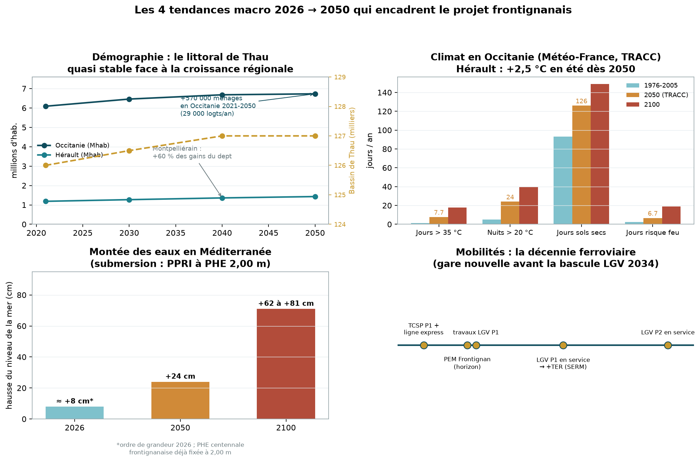
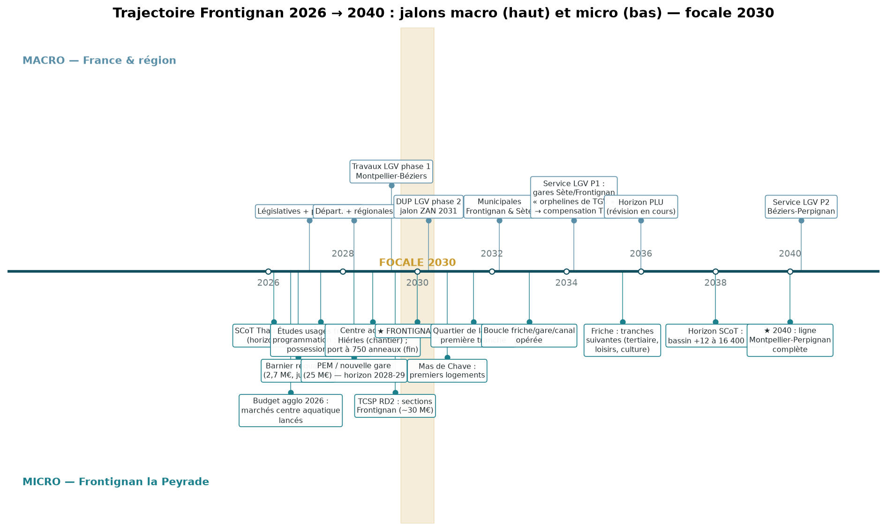
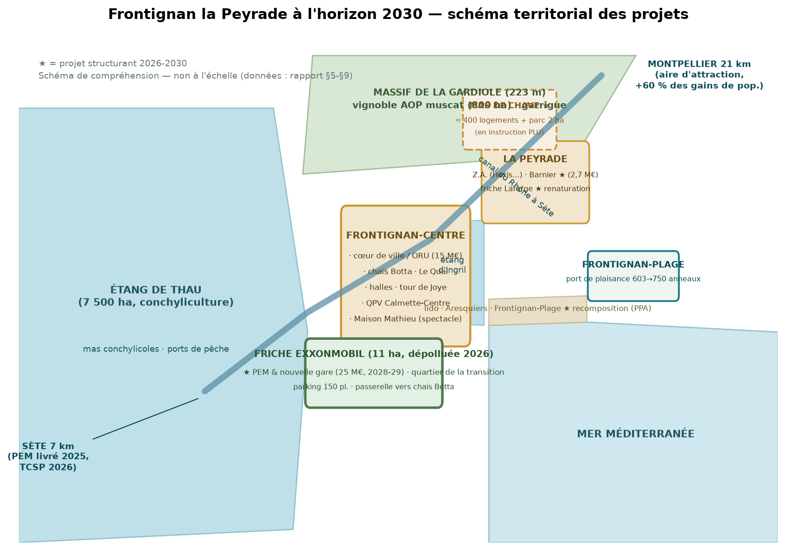
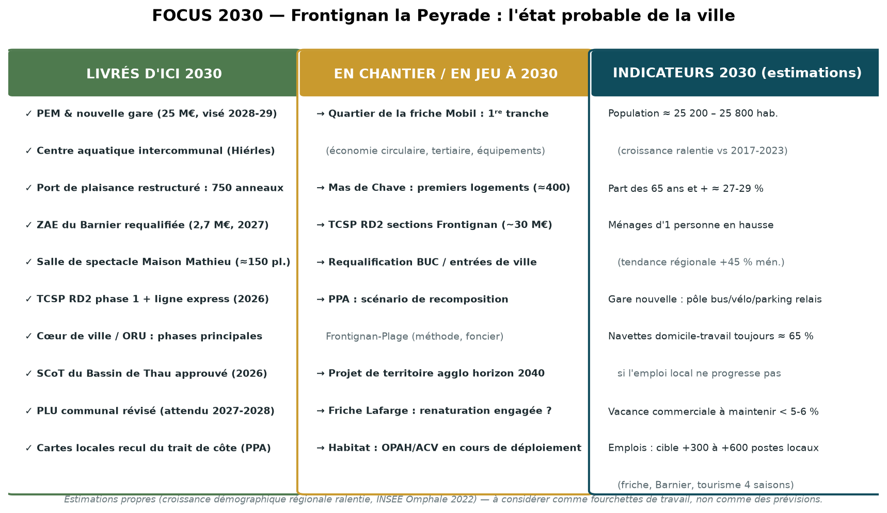
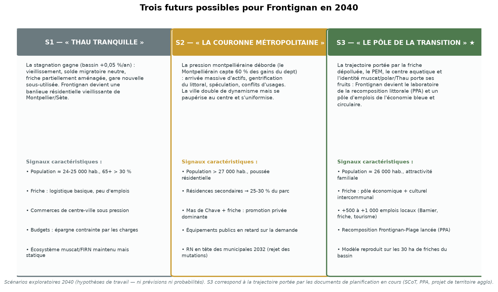

# FRONTIGNAN LA PEYRADE — VISION TERRITORIALE 2026 → 2040
### Focale 2030 · Document prospectif complémentaire au rapport d'analyse territoriale (sept. 2026)

> **Objet.** Ce document prolonge le rapport d'analyse territoriale (sept. 2026) par une lecture **prospective** : où va Frontignan la Peyrade entre 2026 et 2040, qu'est-ce qui sera décidé — et visible — **autour de 2030**, et quelles sont les trajectoires alternatives à 2040. Il est conçu pour un designer accompagnant la municipalité : chaque jalon est une **porte d'entrée design**.
>
> **Statut des éléments.** Les jalons 2026-2030 s'appuient sur des documents engageants (budgets votés, études lancées, décisions publiques). Les jalons 2030-2040 relèvent de la **tendance annoncée** (LGV, SCoT, PPA). Les scénarios 2040 sont des **hypothèses de travail**. Balises : ✅ engagé · 📅 annoncé · 🔮 tendance · ⚠️ incertain.

---

## 1. LA TRAME MACRO 2026-2050 : QUATRE FORCES QUI CADRENT LE JEU LOCAL

### 1.1 Démographie — la croissance régionale, la stagnation du bassin de Thau

- **Occitanie** : +640 000 habitants et **+570 000 ménages** entre 2021 et 2050 (INSEE Omphale 2022, scénario central) ; besoin estimé à **29 000 logements/an** ; les personnes seules (45 % des ménages en 2050, bascule **dès 2035**) dépasseront les couples. ✅
- **Hérault** : **1 430 000 habitants en 2050** (+245 000 vs 2020), +170 000 ménages dont **la moitié dans le Montpelliérain** ; le Montpelliérain capterait **60 % des gains de population** du département ; +10 500 hab./an jusqu'en 2035 puis +5 900. ✅
- **Territoire « Étang de Thau »** (INSEE) : **+0,05 %/an seulement** — la plus faible croissance des territoires héraultais, soit ≈ **127 000 habitants en 2050**, quasi-stagnation. La croissance frontignanaise récente (+1,0 %/an, 2017-2023) repose quasi entièrement sur le **solde migratoire**, donc sur l'attractivité résidentielle — une variable réversible. 🔮
- **Ce que cela signifie** : Frontignan est à la charnière d'un **système à deux vitesses** — un Montpelliérain en forte croissance (pression sur le littoral, demande résidentielle) et un bassin de Thau démographiquement quasi stable et vieillissant. Le projet local consiste à **capter une part de la croissance métropolitaine sans y perdre son identité ni ses équilibres sociaux**.

### 1.2 Climat — un littoral sous contrainte croissante, mais à vitesse connue

- Projections **Météo-France (TRACC)** pour l'Occitanie : **+2,2 °C à l'horizon 2050** (+2,5 °C en été dans l'Hérault) ; **jours > 35 °C : 1,3 → 7,7/an en 2050** (17,8 en 2100) ; **nuits tropicales : 5 → 24/an** ; jours de sols secs : 93 → 126 ; risque feu ×2,5 ; pluies estivales −15 % mais fortes pluies +8 %. ✅
- **Mer** : **+24 cm en 2050**, +62 à +81 cm en 2100 (Méditerranée) ; le PPRI de Frontignan retient déjà une PHE centennale de **2,00 m** — les cartes d'exposition 30/100 ans du PPA (attendues 2026-2027) transformeront cette donnée en **front d'urbanisme**. ✅
- **Conchyliculture** : crise sanitaire majeure (suspension 28 jours fin décembre 2025, norovirus après fortes pluies) ; l'agglo a investi **120 M€ en 10 ans** dans l'assainissement et flèche **13,1 M€ en 2026** contre les risques dans la lagune (+ plan conchylicole 2,1 + 5,3 M€). La qualité de l'eau de Thau est **l'indicateur vital du territoire** à l'horizon 2030-2040. ✅

### 1.3 Mobilités — la décennie ferroviaire 2026-2034

| Jalon | Date | Statut |
|---|---|---|
| TCSP RD2 **phase 1** (Sète) + nouveau réseau bus + ligne express Balaruc-Sète | **5 janvier 2026** | ✅ en service |
| **Sections TCSP sur Frontignan, Balaruc-les-Bains, Balaruc-le-Vieux** | ≈ 2027-2030 | 📅 ≈ **30 M€ de travaux supplémentaires** annoncés |
| **PEM & nouvelle gare de Frontignan** (25 M€ : Région ≤ 10 M€, agglo 20 %, État, Ville) | horizon **2028-2029** | 📅 études opérationnelles lancées fin 2023 |
| **Travaux LGV phase 1 Montpellier-Béziers** | 2029 → service **2034** | 📅 appel d'offres ≈ 1,5 Md€ lancé fin 2026 |
| LGV phase 2 Béziers-Perpignan | DUP ≈ 2030, service **≈ 2040** | ⚠️ concertation 2026-2028 en cours |
| **Effet 2034** : gares de Sète et Frontignan « orphelines de la plupart des TGV » → **compensation par les TER** (SERM : amplitude 5 h-23 h, jusqu'à **un train/10 min aux heures de pointe** Sète-Montpellier, cars express Montpellier-Poussan) | 2034+ | 🔮 tendance portée par la Région |

**Lecture** : la gare nouvelle frontignanaise sera livrée **juste avant** la bascule LGV de 2034 — elle est conçue pour un monde « trains du quotidien ». Le PDU agglo 2020-2030 (~154 M€ programmés) et sa relance annoncée par L. Linares (parkings relais, intermodalité, réseau vélo « en étoile ») fixent le cadre d'usage.

### 1.4 Finances publiques & foncier — l'ère de la rareté maîtrisée

- Fonds vert national : 2,5 Md€ (2024) → 1,15 Md€ (2025) → **834 M€ (2026)** ; dotations sous tension (FCTVA −2 pts à Frontignan) ; taux d'intérêt en hausse (intérêts agglo +27,6 % en 2025). ✅
- **ZAN** : −50 % de consommation d'espaces en 2031, ZAN 2050 ; le **SCoT du Bassin de Thau révisé** traduit cela localement : **−54 % d'artificialisation** vs SCoT précédent, objectif **≈ 1 000 logements/an** sur le bassin, développement dans l'enveloppe urbaine et par les **friches** (30 ha encore à remobiliser dans le bassin selon L. Linares). ✅
- **Action cœur de Ville prolongé** (déc. 2025), politique de ville « Quartiers 2030 » (2024-2030), appels à projets friches de la Région (2 sessions/an) : les financements existent mais se **gagnent par dossier**.

---

## 2. LE BASSIN DE THAU 2026-2043 : LA RÈGLE DU JEU COLLECTIVE

- **SCoT du Bassin de Thau révisé** — après arrêt du projet (oct. 2024), avis de l'autorité environnementale (MRAe, févr. 2025), reprise du document (juillet 2025) et consultation réouverte (févr.-mars 2026), l'approbation définitive est attendue **fin 2026**. Contenu structurant : accueil de **+12 000 à 16 400 habitants à l'horizon 2043-2045** (contre +40 500 prévus à 2030 dans l'ancienne version — un **rabot démographique assumé**), priorité au renouvellement urbain, protection de la lagune, adaptation au recul du trait de côte. ✅
- **Projet de territoire de l'agglo** — le document de 2018 visait l'horizon **2040** ; Loïc Linares en prépare la refonte (« mandat du changement d'ère », 2025-2027) : « reconstruire la ville sur la ville », économie bleue et verte, dialogue territorial, réinvestissement des **10-15 M€ de compensations LGV** (renaturation de friches, revalorisation d'Issanka), montée en puissance des TER et du fret. 📅
- **PPA « recomposition spatiale »** (mai 2024, 700 k€, État-Banque des Territoires-EPF-Région-Département-agglo) : cartes locales 30/100 ans, **plan-guide de régénération du triangle Sète-Balaruc-Frontignan**, **scénario de recomposition de Frontignan-Plage**, association des habitants. C'est **le** cadre méthodologique et financier pour penser la station à 30-100 ans. ✅
- **Gouvernance** : cohabitation constructive Linares (PS, Frontignan) / Marquès (droite, Sète, 1ᵉʳ VP) ; municipales 2032 = échéance de re-lecture possible.

---

## 3. FRONTIGNAN 2026-2040 : LE CALENDRIER OPÉRATIONNEL

### 3.1 Bloc 2026-2030 — « tout se joue maintenant »

| Chantier | 2026 | 2027 | 2028 | 2029 | 2030 |
|---|---|---|---|---|---|
| **Friche ExxonMobil (11 ha)** | Études d'usages (résultats fin 2026) ; ville propriétaire | **Programmation** du quartier (MOA/MOE à définir) | Pré-opérationnel, premiers travaux d'aménagement | Aménagement tranche 1 | ★ Premiers usages livrés |
| **PEM / gare nouvelle (25 M€)** | Études opérationnelles | Études, dossier IA (travaux) | **Livraison visée 2028** | Mise en vitesse, services | ★ Pôle en régime de croisière |
| **Centre aquatique Hiérles** | **Marchés lancés** (budget agglo 2026) | Chantier | Chantier | Livraison probable ⚠️ | ★ Équipement en service |
| **Port de plaisance (4,5 M€)** | Chantier (avant-port, promenade Rive Est) | Pontons, bassins | Pêche/petits métiers | **Fin des travaux (≈ 750 anneaux)** | ★ Port en configuration finale |
| **Mas de Chave (≈ 400 logts)** | Concertation reprise (juil. 2026) | Enquête publique ⚠️ + déclaration de projet | Dépôt des premières autorisations | Chantiers | ★ Premiers logements |
| **TCSP RD2 — sections Frontignan** | Sécurisation carrefour RD2/Av. d'Aigues | Études/travaux sections manquantes (≈ 30 M€) | Travaux | Travaux | ★ Continuité Balaruc-Sète-Frontignan |
| **SCoT / PLU / PPA** | SCoT approuvé ⚠️ ; PLU : bilan concertation littoral | **PLU révisé approuvable** ; cartes PPA 30/100 ans | Déclinaison locale (OZ, secteurs) | Règlement PPA → premiers arbitrages plage | ★ Règles 2030 figées |
| **Barnier / économie** | Requalification ZAE (2,7 M€) | **Livraison juin 2027** | Commercialisation foncier | Implantations | ★ Emplois locaux |
| **Culture / social** | Maison Mathieu en travaux ; saison « Muscat 90 ans » ; appel à projets Quartiers 2030 | **Salle de spectacle ≈150 pl.** ; ACV en régime | Librairie/école de cinéma du Quai en pleine exploitation | — | ★ Pôle culturel en attractivité |

*Légende : ★ = jalon visible attendu ; ⚠️ = calendrier fragile (documenté au §6).*

### 3.2 Bloc 2030-2034 — le temps des preuves

- **Municipales de mars 2032** : le bilan 2026-2031 (gare livrée ? friche engagée ? piscine ouverte ? plage : quel scénario ?) fera l'élection. La mandature 2026-2032 est donc une **mandature d'exécution**, la suivante (2032-2038) sera une **mandature d'achèvement ou de correction**.
- **LGV phase 1 en service en 2034** : bascule de la desserte — moins de TGV à Sète/Frontignan, plus de TER (« un train/10 min aux heures de pointe » visé par le SERM), gares recalibrées en pôles de mobilité du quotidien. Le PEM frontignanais, livré 2028-2029, aura **5 ans d'avance** sur cette bascule : atout si l'offre TER suit, risque si elle ne suit pas. 🔮
- Montée en charge du quartier de la friche (tranches successives), saturation possible de l'ORU cœur de ville (fin du programme 10 ans ≈ 2029-2030), premières décisions PPA sur Frontignan-Plage (relocalisations sélectives, renaturation du lido, reconversion d'équipements).

### 3.3 Bloc 2034-2040 — la maturité

- **2040** : LGV complète Montpellier-Perpignan ; le bassin de Thau arrive à l'horizon de son SCoT (+12 à 16 400 hab.) ; Frontignan-Plage entre dans la phase opérationnelle de recomposition si le PPA a abouti ; le quartier de la friche est construit pour l'essentiel ; la question 2040 est celle du **littoral** : quelle part de la station est encore défendable, quelle part est recomposée.
- **Horizon PPA 100 ans (≈ 2120)** : les décisions prises 2026-2040 engagent le très long terme — c'est précisément l'horizon de la démarche design proposée.

---

## 4. FOCUS 2030 — L'ÉTAT PROBABLE DE LA VILLE

**En 2030, si les calendriers engagés tiennent**, Frontignan présente ce visage :

1. **Une nouvelle porte ferroviaire** : gare/PEM en service depuis 1 à 2 ans, parking relais, passerelle vers les chais Botta — le train du quotidien (Montpellier en ~20 min, Sète en ~5) comme colonne vertébrale.
2. **Un cœur de ville requalifié** : ORU achevée dans ses phases principales (places, rues, halage, quai Voltaire), salle de spectacle à la Maison Mathieu, pôle culturel du Quai en exploitation, vacance commerciale contenue (< 5-6 %) — le label ACV aura soutenu habitat et commerces.
3. **Un front de Thau réinventé en chantier** : les 11 ha de la friche en première tranche (économique + équipements publics + espaces publics), la ville propriétaire du foncier, la programmation issue des études 2026-2027.
4. **Une offre d'équipements intercommunale renforcée** : centre aquatique des Hiérles ouvert, ZAE du Barnier modernisée (2027), TCSP continu Sète-Balaruc-Frontignan.
5. **Une station balnéaire sous doctrine** : cartes d'exposition 30/100 ans publiées, scénario de recomposition de Frontignan-Plage en débat public, port à 750 anneaux, premières mesures d'adaptation (ombrage, accès, gestion du sable).
6. **Une démographie en croissance ralentie** : ≈ **25 200-25 800 habitants** (estimation propre : prolongement d'une croissance de +0,4 à +0,8 %/an), vieillissement continu (65+ ≈ 27-29 %), pression sur la santé et l'autonomie.
7. **Des finances sous tension maîtrisée** : dette ≈ dans la moyenne de strate, fiscalité stable si le cap est tenu, mais chaque grand projet (friche, plage, écoles) dépendra des **cofinancements** (ACV, Fonds vert résiduel, Région, agglo, Europe).

**Les cinq conditions de succès à 2030** (autant d'indicateurs à suivre) : ① le PEM livré dans les temps et **desservi** ; ② une programmation de la friche **validée et financée** ; ③ l'emploi local en progression mesurable (+300 à +600 postes) ; ④ la qualité de l'eau de Thau en amélioration (fin des suspensions sanitaires récurrentes) ; ⑤ une trajectoire démographique maintenue sans gentrification du centre (loyers, vacance, mixité).

---

## 5. TROIS SCÉNARIOS 2040

| | **S1 — Thau tranquille** | **S2 — Couronne métropolitaine** | **S3 — Pôle de la transition ★** |
|---|---|---|---|
| **Moteur** | Stagnation du bassin (+0,05 %/an INSEE) ; friche sous-aménagée ; PEM sous-utilisé | Débordement du Montpelliérain (+60 % des gains dept) ; spéculation littorale | Friche + PEM + identité (muscat, FIRN, Thau) = renaissance économique et culturelle |
| **Population 2040** | ≈ 24-25 000 (65+ > 30 %) | > 27 000, résidences secondaires 25-30 % | ≈ 26 000, attractivité familiale |
| **Paysage urbain** | Banlieue résidentielle vieillissante ; friche en logistique basique | Mas de Chave + friche en promotion privée dominante ; centre en gentrification | Quartier de la transition (économique + culturel intercommunal) ; recomposition engagée à la plage |
| **Économie** | Emplois publics/services ; muscat statique | Économie résidentielle ; emplois précaires saisonniers | +500 à +1 000 emplois (friche, Barnier, œnotourisme, économie bleue) |
| **Risque politique** | Abstention, RN, déclin des services | Conflits d'usages, sécession sociale, municipales 2032 clivées | Fatigue participative si les promesses 2026-2030 ne tiennent pas |

**Signaux faibles à surveiller (2026-2030)** : cadence des TER après 2034 (SERM) ; vitesse d'instruction du PLU/Mas de Chave ; prix du foncier et part des résidences secondaires ; taux de remplissage du cinéma du Quai et de la future salle ; taux d'abstention aux municipales 2032 ; nombre de jours de fermeture sanitaire de Thau par an ; autorefina­cement communal.

---

## 6. POINTS DE FRAGILITÉ DU CALENDRIER (à traiter en priorité)

| Fragilité | Détail | Parade design/projet |
|---|---|---|
| **Enquête publique Mas de Chave** | Reprise de concertation en juillet 2026 (projet ramené à ≈ 400 logements) fragilise l'enquête annoncée « 2026 » | Co-construction fine avec les habitants de La Peyrade ; scénarios comparés |
| **Études d'usages de la friche** | L'arrêté de récolement n'autorise qu'un usage industriel ; les usages tertiaires/culturels dépendent d'études complémentaires (résultats fin 2026) ⚠️ | Anticiper les scénarios à usages conditionnels ; usages transitoires dès 2027 |
| **Desserte TER post-2034** | La compensation « SERM » n'est pas contractée à ce jour | Mobilisation agglo/Région ; le design du PEM doit rendre la gare « prête à tout » |
| **Calendrier LGV phase 2** | DUP ≈ 2030, service ≈ 2040, contentieux probable | Ne pas caler le modèle économique local sur la LGV ; miser sur le train du quotidien |
| **Approbation du SCoT** | Procedure resserrée (reprise 2025, consultation réouverte 2026) ; approbation attendue fin 2026 ⚠️ | Veille réglementaire ; PLU à synchroniser |
| **Financement du centre aquatique** | Marchés lancés en 2026 mais coût public non publié | Transparence budgétaire, phasage |
| **Thau sanitaire** | Suspensions récurrentes possibles tant que les réseaux ne sont pas au niveau | Communication de crise, design de la confiance (données ouvertes sur l'eau) |

---

## 7. IMPLICATIONS DESIGN PAR HORIZON

**Dès 2026-2027 (le « maintenant »)** : design de la concertation friche/PEM/Mas de Chave (maison du projet itinérante, cartographie participative, scénarios exposés) ; identité territoriale et signalétique ; « kit transitions » des chantiers (port, TCSP, gare) ; visualisation des cartes PPA pour rendre le risque discutable ; saison « Muscat 90 ans » comme banc d'essai d'expérience visiteur.

**2028-2030 (le « cœur du réacteur »)** : design du pôle gare/quartier (parvis, passerelle, fronts urbains, espaces publics de la 1ʳᵉ tranche) ; identité et usages du centre aquatique ; activation de la salle de spectacle ; parcours muscat/polar/canal ; conception des premiers aménagements de recomposition de la plage (ombrage, accès, services saisonniers) ; tableau de bord public « Frontignan 2030 » (indicateurs du §4).

**2032-2040 (le « long terme »)** : stratégie d'usage et de mémoire du quartier de la transition achevé (mémoire industrielle, éco-systèmes) ; programme de recomposition Frontignan-Plage (PPA opérationnel) ; désaisonnalisation touristique (offre culturelle 4 saisons, tourisme fluvial) ; design des services aux publics vieillissants (autonomie, santé, mobilité) ; bilan & réécriture du projet de territoire agglo (2040).

---

## 8. SOURCES DE LA VISION (en complément de l'annexe A du rapport)

| Source | Contenu | Date |
|---|---|---|
| [INSEE Analyses Occitanie n°115 — ménages Occitanie 2050](https://www.insee.fr/fr/statistiques/8568012) | +640k hab./+570k ménages, 29 000 logts/an, solos 45 % en 2050 | 15/05/2025 |
| [INSEE Analyses — 170 000 ménages de plus dans l'Hérault](https://www.insee.fr/fr/statistiques/8283176) | Hérault 1,43 M hab. 2050 ; Étang de Thau +0,05 %/an, 127 000 hab. | 14/11/2024 |
| [La Gazette de Montpellier](https://www.lagazettedemontpellier.fr/societe/2024-11-21-demographie-245-000-heraultais-de-plus-en-2050/) | +245 000 Héraultais en 2050 | 21/11/2024 |
| [Météo-France — Quel climat futur en Occitanie ?](https://meteofrance.com/changement-climatique/quel-climat-futur-en-occitanie) | TRACC : +2,2 °C 2050 / +3,5 °C 2100 ; jours > 35 °C ; mer +24 cm | 13/05/2026 |
| [L'Indépendant](https://www.lindependant.fr/2026/07/02/aude-et-pyrenees-orientales-24-c-en-2050-un-rechauffement-plus-fort-quailleurs-en-france-selon-les-projections-de-meteo-france-13446986.php) | Hérault +2,5 °C été ; indicateurs détaillés | 02/07/2026 |
| [agglopole.fr — Budget 2026](https://www.agglopole.fr/le-budget-2026-de-l-agglopole-a-ete-vote/) | TCSP phase 1 en service ; sections Frontignan ≈ 30 M€ | 12/01/2026 |
| [agglopole.fr — TCSP RD2](https://www.agglopole.fr/les-projets/transports/la-requalification-de-la-rd2-en-voie-de-bus-prioritaire/) | Subvention 2,54 M€, phases, réseau bus 2026 | 2026 |
| [thau-infos — TCSP/Pem Sète](https://thau-infos.fr/index.php/commune/agglo-bassin-de-thau/206268-mobilite-lancement-des-travaux-pour-le-tcsp-sur-la-rd2) | PEM Sète ≈ 19 M€ (FEDER, Région, Dépt, agglo), parking 180 pl. | 18/10/2024 |
| [Midi Libre — SERM et le bassin de Thau](https://www.midilibre.fr/2024/05/27/serm-de-montpellier-comment-le-futur-plan-de-mobilite-impactera-sete-et-le-bassin-de-thau-11975273.php) | Gares « orphelines de TGV » 2034, TER/10 min, cars express | 27/05/2024 |
| [Wikipédia — Ligne nouvelle Montpellier-Perpignan](https://fr.wikipedia.org/wiki/Ligne_nouvelle_Montpellier_-_Perpignan) | CNDP 04/02/2026 ; service 2034/2040 | 2026 |
| [madeinperpignan](https://madeinperpignan.com/lgv-train-perpignan-montpellier-nouvelle-concertation-2026/) | DUP phase 2 ≈ 2030, concertations 2026-2028 | 10/02/2026 |
| [SMBT — SCoT de Thau](https://www.smbt.fr/blog/2024/11/26/nouvellephasescotdethau/) | +16 400 hab. horizon 2043 (vs +40 500 à 2030 avant révision) | 26/11/2024 |
| [SMBT — révision du SCoT](https://www.smbt.fr/blog/2026/02/06/revision-du-scot-du-bassin-de-thau/) | Reprise 2025, consultation réouverte 2026 | 06/02/2026 |
| [montpellierimmo9 — SCoT 2026](https://www.montpellierimmo9.com/actualites/urbanisme-architecture/bassin-de-thau-scot-2026) | −54 % artificialisation, 1 000 logements/an | 31/03/2026 |
| [Midi Libre — interview L. Linares](https://www.midilibre.fr/2025/10/17/il-faut-en-finir-avec-les-cubes-qui-sempilent-les-uns-sur-les-autres-le-president-de-sete-agglo-loic-linares-trace-sa-ligne-12995958.php) | Projet de territoire, compensations LGV 10-15 M€, PDU, SCoT +12-14 500 hab. | 17/10/2025 |
| [agglopole.fr — Le projet de territoire](https://www.agglopole.fr/l-agglo-pole/le-territoire-2/le-projet-de-territoire/) | Document 2018, priorisation à l'horizon 2040 | 2026 |
| [occitanie-tribune — crise conchylicole](https://www.occitanie-tribune.com/amp/55040/bassin-de-thau-thau-en-crise-la-conchyliculture-frappee-de-plein-fouet-la-mobilisation-est-generale) | Suspension 28 jours (30/12/2025), plan agglo 2026 | 06/01/2026 |
| [dis-leur — conchyliculture](https://dis-leur.fr/conchyliculture-experimenter-tous-les-procedes-pour-se-premunir-du-virus-de-la-gastro/) | 120 M€/10 ans assainissement, Oxyvir/Coldep | 05/01/2025 |
| [gesteau.fr — SAGE Thau](https://www.gesteau.fr/sage/thau) | Objectifs qualité des eaux | 18/02/2025 |
| [Midi Libre — municipales : friche Mobil](https://www.midilibre.fr/2026/02/20/municipales-2026-a-frontignan-avenir-de-la-friche-mobil-urbanisme-securite-sports-les-candidats-prennent-position-13233817.php) | Positions Arrouy/Delapierre/Cléret sur la friche | 20/02/2026 |
| [La Lettre M — ZAE du Barnier](https://www.lalettrem.fr/actualites/27-meu-pour-la-requalification-de-la-zae-du-barnier-frontignan) | 2,7 M€, SPL Bassin de Thau, livraison juin 2027 | 15/06/2026 |
| [montpellierimmo9 — Mas de Chave](https://www.montpellierimmo9.com/actualites/urbanisme-architecture/projet-mas-de-chave-frontignan) | 400 logements, étapes restantes | 23/07/2026 |
| [frontignan.fr — Quartiers 2030](https://www.frontignan.fr/appel-a-projets-dans-le-cadre-du-contrat-de-ville-quartiers-2030-les-candidatures-sont-ouvertes-jusquau-5-janvier-2026/) | Contrat de ville 2024-2030, QPV Calmette | 27/11/2025 |
| [MRAe Occitanie — avis 2025AO18](https://www.mrae.developpement-durable.gouv.fr/IMG/pdf/2025ao18.pdf) | PPA, doctrine d'adaptation, triangle Sète-Frontignan-Balaruc | 20/02/2025 |

*Les estimations propres (population 2030, emplois, indicateurs) sont des fourchettes de travail construites par prolongement des tendances INSEE — elles ne constituent pas des prévisions officielles.*
